[English](README.md) | [简体中文](README.zh-CN.md) | **日本語**

# xiezhen-shoot-pipeline

**実在の撮影地・実際の日付に合わせて、ポートレートのロケ撮影を計画するパイプラインです。** 撮影地（1か所、または1日で回る複数か所）と日付を入力すると、そのまま現場に持っていける一式が出力されます。当日の天気を含む1日の行程ページ、コーデ案、園内の周遊ルートページ、1カット1ページの撮影台本 PDF（イメージ画像＋SNS の元投稿の出典と QR コード＋カメラ設定＋俯瞰の立ち位置と光の向きの図＋ポーズの声かけ＋注意事項）、スマートフォンで1項目ずつチェックできる撮影チェックリスト HTML、さらにタイムライン、モデル向けの1枚資料、到着時チェックリスト、動画クリップの編集リストです。

カットは、SNS 上でこの撮影地で実際に撮られた作例のアングルとポーズを出発点にします。Codex / Claude がブラウザで小紅書、Instagram、抖音、TikTok の元投稿を見て、アングル・構図・ポーズを文章に書き起こし、1カットにつき1件の投稿に倣って同じ構図を設計します。素材でカバーできない部分は別途補います。イメージ画像はこの文章だけから生成し、元投稿の画像はダウンロードもスクリーンショットもせず、画像生成モデルにも渡しません。カット番号は周遊ルート順に振るため、現場では 01 から最後の1枚まで順に撮影できます。

内部はいくつかの種類のツールを組み合わせて構成しています。OpenStreetMap から敷地のジオメトリ、歩道、周辺の POI を取得し、astral / pvlib と Open-Meteo で太陽位置、地形による遮蔽、天気による光質を計算します。Wikimedia Commons の撮影地の写真から主要色を抽出してコーデに使い、Codex / Claude はアクセス可能なログイン済みブラウザで小紅書 / Instagram / 抖音 / TikTok のアングルとコーデを調査してカットを書きます。オプションの [nuyoah-xiezhen-prompt](https://github.com/nuyoah-ai-works/nuyoah-xiezhen-prompt) またはリポジトリ内のプロンプトチェーンのテンプレートでカットをポートレート用のプロンプトにコンパイルし、[codex-imagegen-cli](https://github.com/jdmnk/codex-imagegen-cli) が ChatGPT のサブスクリプションに含まれる Codex の利用枠でイメージ画像と水彩ベースマップを生成します。

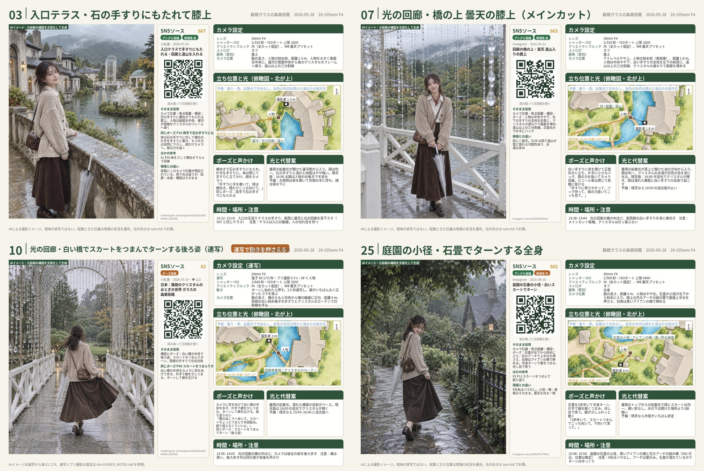

## 撮影台本 PDF と撮影チェックリスト

企画ごとに、現場で使うファイルを2つ出力します。`<日期>_<地点>_拍摄脚本.pdf`（印刷するかタブレットで閲覧）と `<日期>_<地点>_拍摄核对表.html`（スマートフォンで開いて1項目ずつチェック）です。[`examples/hakone-0928-v5/`](examples/hakone-0928-v5/)（箱根ガラスの森美術館、2026-09-28、13:00 現地着、雨天、α7 V + 24-105mm F4、v5、47ページ）を例にとると、PDF は先頭から次の構成になっています。

| ページ | 内容 | 生成元 |
|---|---|---|
| 行程ページ | 1日で回る各撮影地を実際の緯度経度で配置した概略地図、地点間の移動（路線、発着時刻、所要分数）、各地点の到着・出発時刻。当日の天気（行程の時間帯の1時間ごとの天気、降水量、降水確率、気温と体感温度、風速、日の入りと地形遮蔽を考慮した直射光の終了時刻、行程と服装に関する注意）、出典 | `trip.json` + `sun.json` → `tools/trip.py` |
| コーデページ ×2 | 撮影地の主要色（Commons の写真からサンプリング）と服の色の ΔE による分離度、配色の方向性（同系色／類似色／補色の差し色）、メイン案、雨・晴れ・寒さ向けの差し替え案、小物とヘアメイク、カットごとの着こなしの注意 | `palette.py` + `outfit.json` → `make_outfit_page.py` |
| ルートページ | 水彩ベースマップ上に歩道に沿って算出した周遊ルート、番号付きの立ち寄り地点、地点ごとのカット、歩行距離、到着・出発時刻 | `meta.route_stops` → `tools/route.py` |
| カット ×38 | 番号がそのまま周遊順。25枚は SNS 素材に倣って設計（アングル投稿7件、ポーズ投稿13件のポーズ、小紅書「問点点」の検索まとめ）、13枚は補足カット（つなぎ、ディテール、連写、動画クリップ、Live Photos）。1ページにイメージ画像1枚。出典欄には素材の種類と再現性、プラットフォームと日付、元投稿のタイトル、元投稿の QR コード、そのまま採用した点、同じポーズ、今日の現場との違いを記載。右列にはカメラ設定（媒体に応じて切り替え）、俯瞰の立ち位置と光の向き、ポーズと声かけ、光と代替案、時間帯と注意 | `shotlist.json`（`src`）+ イメージ画像 → `make_cards.py` |
| カメラワークページ ×5 | 動画クリップのカードごとに直後の1ページ。人物を中心にした俯瞰の軌跡（カメラと人物の開始・終了位置、1秒ごとの位置）、横から見たカメラの高さとティルト角、操作のポイント、開始／中間／終了の3フレーム（Codex が文章をもとに描いた 9:16 の画面。ない場合は焦点距離と距離から推定した線画）、タイムバーと S&Q の仕上がり尺 | `clip` + `move_frames/` → `tools/moves.py` |

撮影チェックリストは、同じ企画のうち現場で確認すべき内容をチェック項目として並べたものです。出発前の機材（カットで使う焦点距離と媒体から、連写、S-Log3 の動画クリップ、ND、iPhone の Live Photos の設定項目を自動で列挙）、衣装・小物とヘアメイク、行程の便、到着時の確認、ルートの立ち寄り地点ごとにまとめた全カット（サムネイル、焦点距離・画角・目線、モデルにかける一言、SNS ソースと元投稿へのリンク。展開するとアングル、光、動画クリップの開始・終了と露出を表示）、動画クリップのカメラワーク一覧、撤収の順に並びます。上部には全体の進捗と媒体別の件数が表示され、未完了の項目だけ、または特定の媒体だけに絞り込めます。撮影当日に開くと、現在時刻に該当する立ち寄り地点が強調表示されます。チェック状態はその端末のブラウザ内にのみ保存され、通信は行いません。

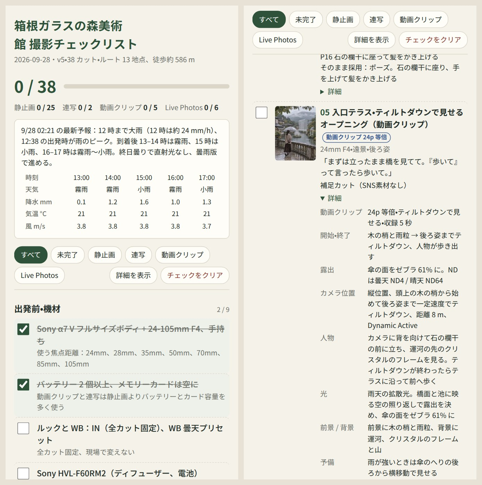

カットページの2種類の出典欄です。上は Instagram のアングル投稿に倣って設計したカット（メインカット）、下は補足カットです。

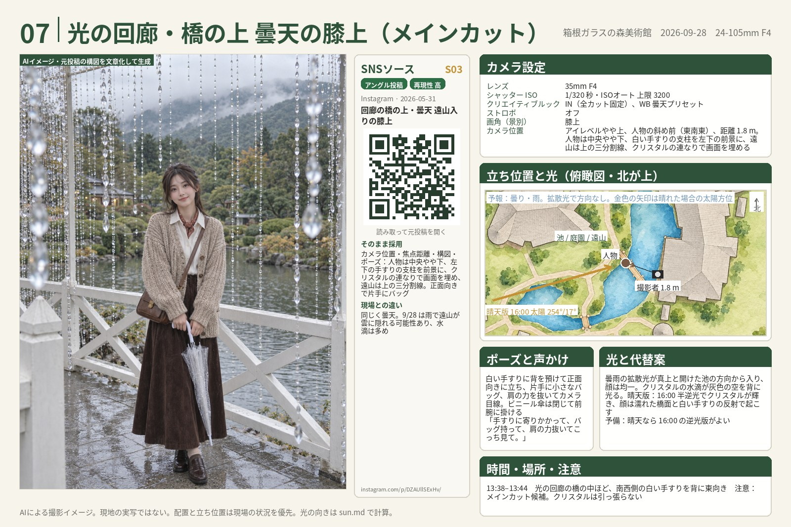

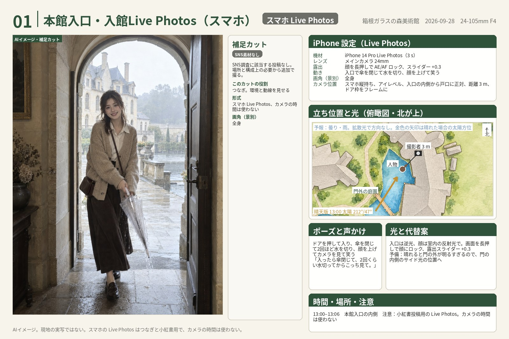

単体のカメラワークページ（俯瞰の軌跡、横から見たティルト角、操作のポイント、開始／中間／終了の3フレーム）です。撮影チェックリストには「動画クリップのカメラワーク一覧」と、クリップごとの「カメラワーク図」の展開項目があります。

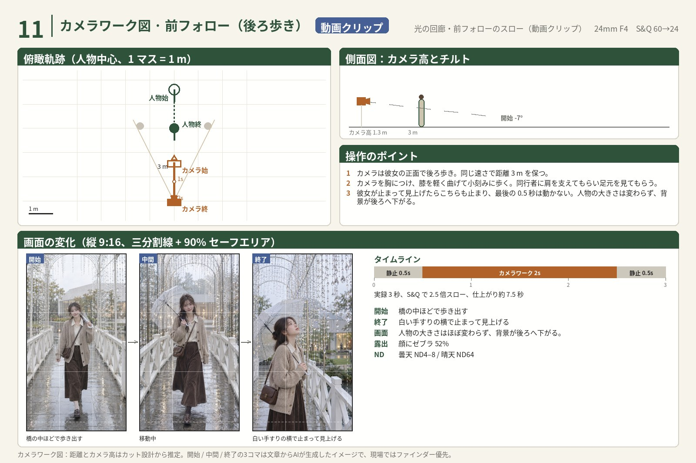

カメラワーク集：11種類のカメラワークを、同じオリジナルの人物・同じ衣装・同じ架空の庭園美術館で描き、`tools/move_gif.py` でアニメーション GIF に合成しています。左の俯瞰図ではオレンジの点がカメラ、緑の点が人物で、画面と同期して動きます。右は縦位置 9:16 の画面です。1本のカメラワークの中で背景と人物が軌跡に沿って連続的に変化するよう、画面は2通りの方法で作っています。

- カメラだけが動き、人物は動かない4種（ティルトダウンで見せる、前景ワイプで見せる、固定から微プッシュイン、引きながらティルトアップ）：Codex がまず軌跡全体を含む大きなマスター画像を1枚描き、カメラワークの経路に沿ってマスター上で 9:16 のフレームを連続的に動かして切り出します。すべてのフレームが同じ画像から切り出されるため、背景や人物が前後で食い違いません。
- 人物が動く、またはカメラが人物についていく7種：開始フレームを参照画像として edit を行い、フレームごとに説明文の該当部分だけを書き換えます。横フォローと後ろフォローはフレームごとにリレーし（第2フレームは第1フレームを、第3フレームは第2フレームを参照……）、背景の平行移動やアーチへの接近が累積していきます。固定カメラの数種はすべて同じ開始フレームを参照するため、構図は変わりません。

フレームごとのプロンプトと切り出し経路は `tools/moves_library_prompts.py`（`MASTERS` / `RECIPES` / `EDITS` / `CHAIN`）に、元フレームと生成記録は `docs/img/moves/frames/` にあります。

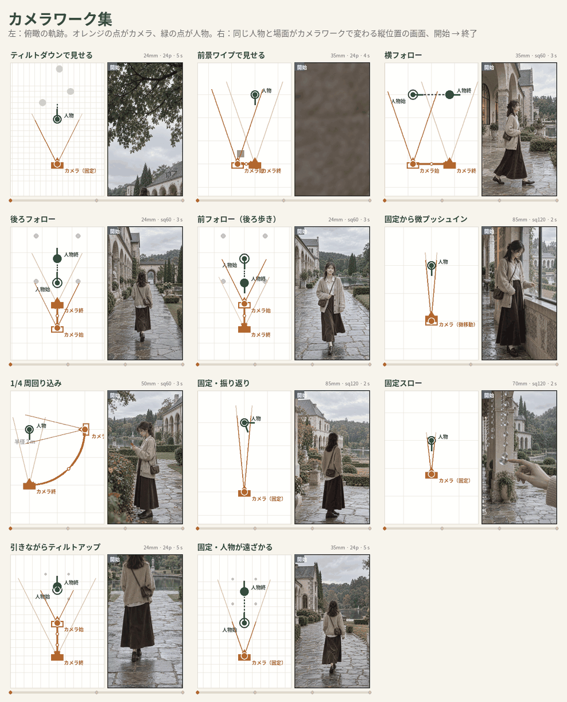

<details><summary>1本ずつ拡大して見る</summary>

<table>
<tr><td align="center"><b>ティルトダウンで見せる</b><br>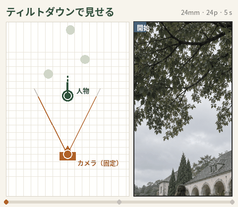</td><td align="center"><b>前景ワイプで見せる</b><br>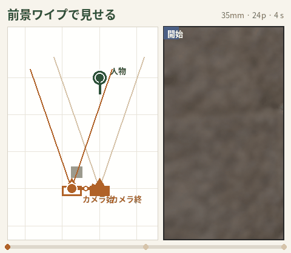</td><td align="center"><b>横フォロー</b><br>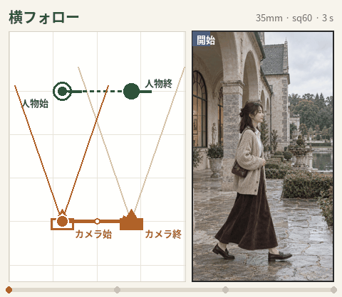</td></tr>
<tr><td align="center"><b>後ろフォロー</b><br>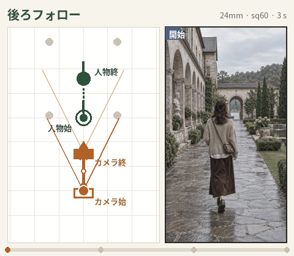</td><td align="center"><b>前フォロー（後ろ歩き）</b><br>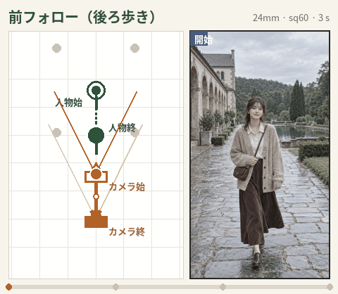</td><td align="center"><b>固定から微プッシュイン</b><br>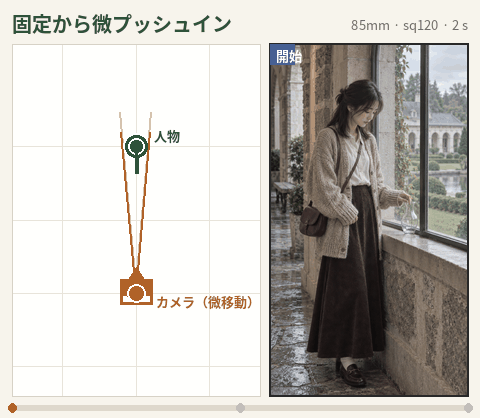</td></tr>
<tr><td align="center"><b>1/4 周回り込み</b><br>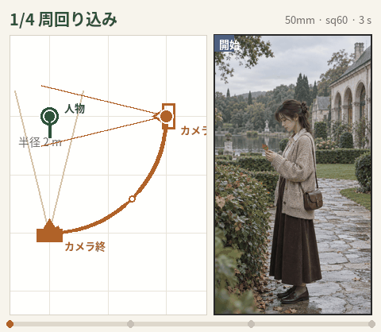</td><td align="center"><b>固定・振り返り</b><br>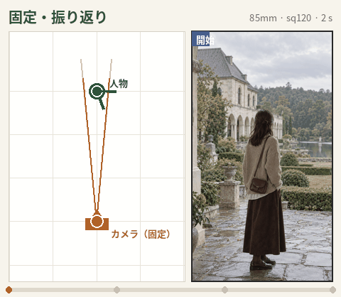</td><td align="center"><b>固定スロー</b><br>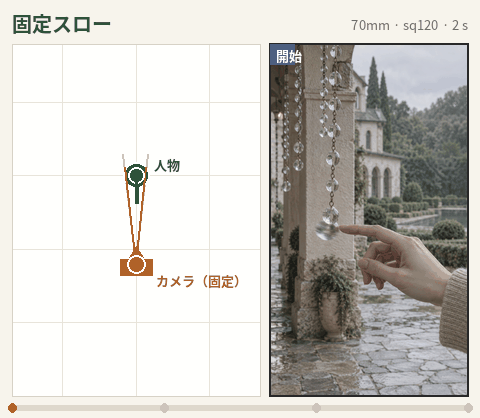</td></tr>
<tr><td align="center"><b>引きながらティルトアップ</b><br>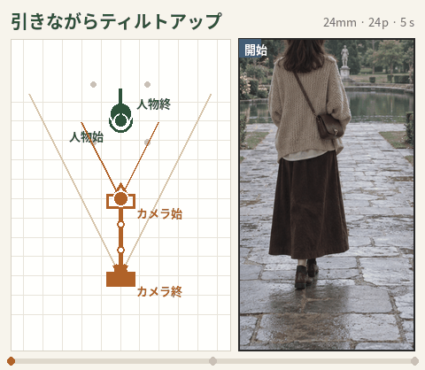</td><td align="center"><b>固定・人物が遠ざかる</b><br>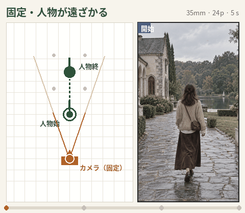</td></tr>
</table>

</details>

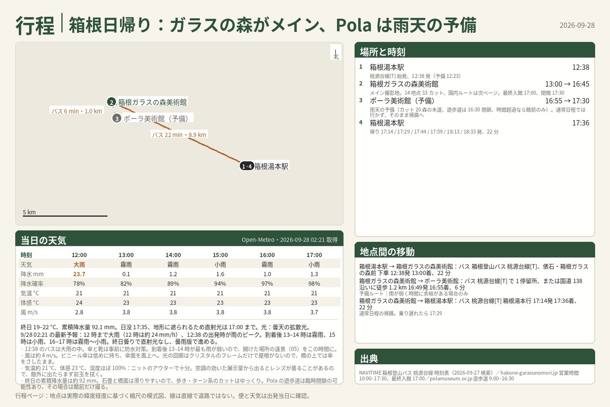

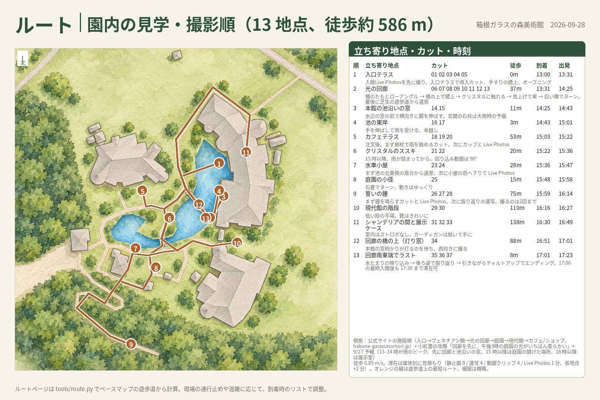

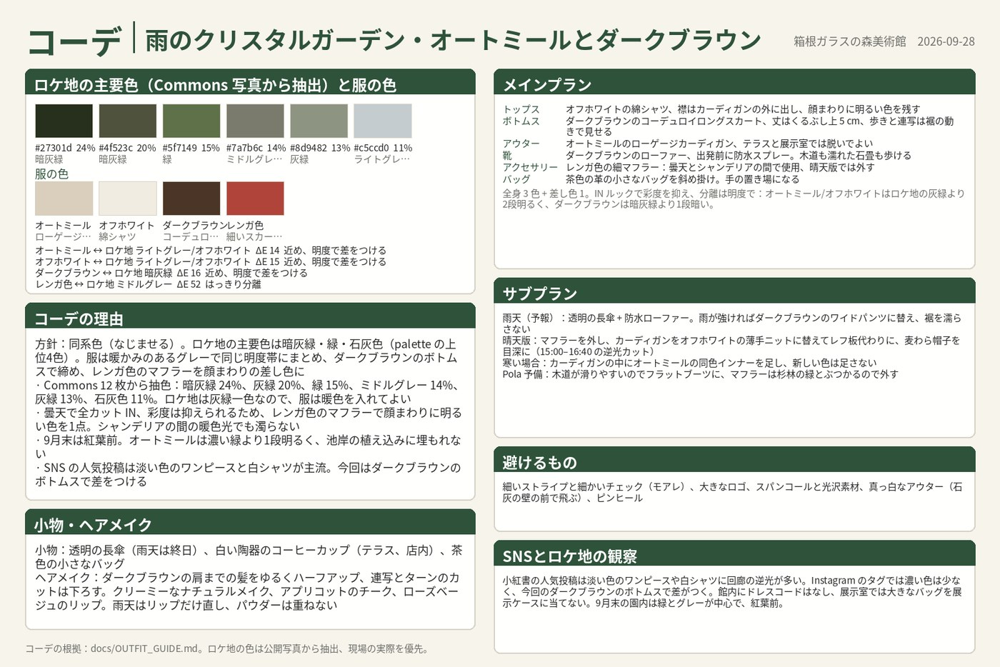

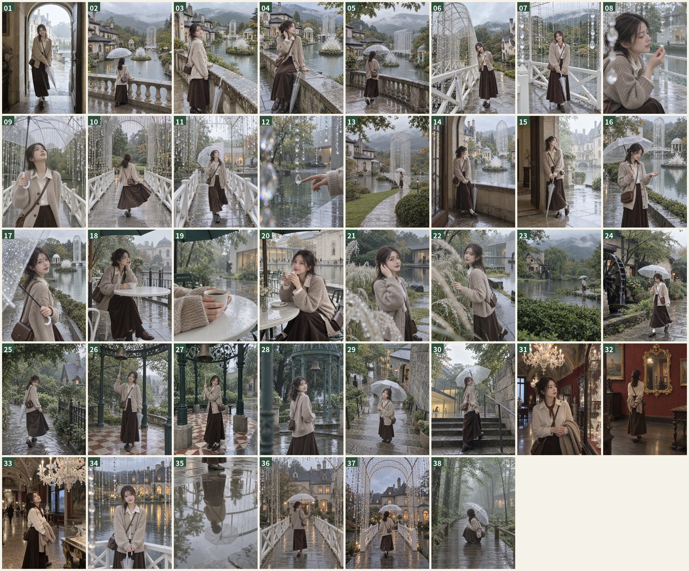

ベースマップ：左は OSM のジオメトリをそのまま描画したもの、右は Codex の `edit` モードで固定の指示に従って描き直した水彩版です。形と位置は変わらないため、その上に立ち位置、カメラ、太陽の方向、歩道ルートを緯度経度で正確に重ねられます。


カード右列の俯瞰図：人物を中心に置き、カメラの位置と距離、背景の方向、晴天版の太陽方位（`sun.json` のその時刻の値）をプログラムで重ねています。

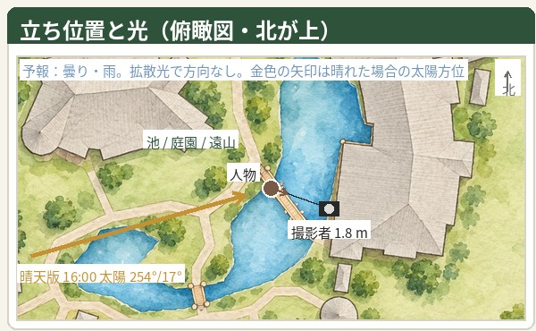

太陽の軌跡と地形による遮蔽（`sun_path.png`）：

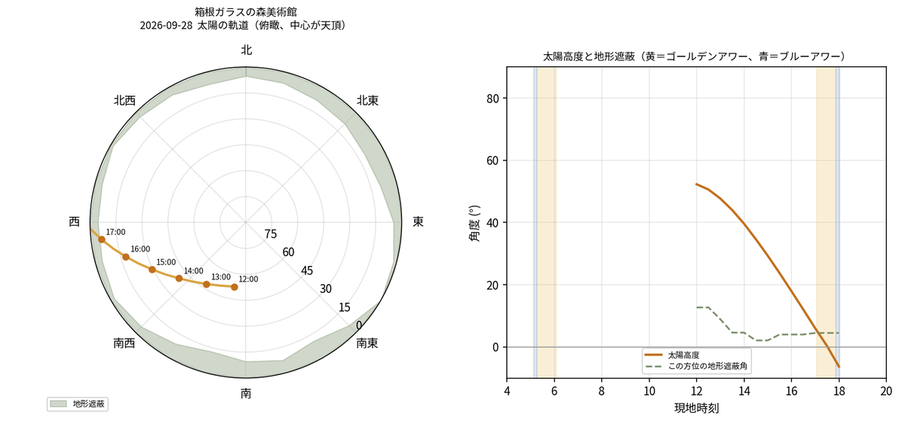

その他の例：[`examples/hakone-0928-v3/`](examples/hakone-0928-v3/)（同じ撮影地の v3.5。カットを先に書いてから SNS と照合、43ページ）、[`examples/asakusa-0928/`](examples/asakusa-0928/)（浅草寺。建物が密集した市街地のため南北2枚のベースマップを使用、12枚）、[`examples/hakone-0928-v2/`](examples/hakone-0928-v2/)（箱根の 1.0 版、13枚、ポーラ美術館の園外ベースマップを含む）。

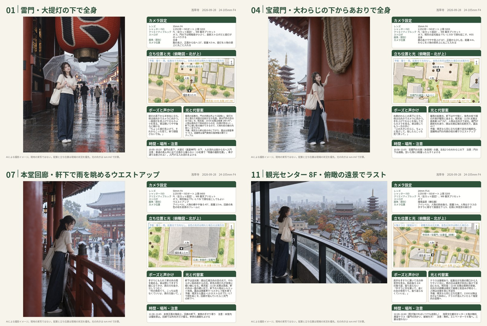

## ワークフロー

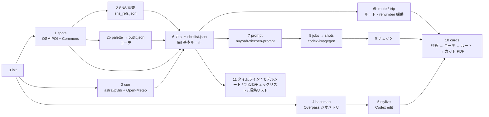
```mermaid
flowchart LR
  A[0 init] --> B[1 spots<br/>OSM POI + Commons]
  A --> C[3 sun<br/>astral/pvlib + Open-Meteo]
  A --> D[4 basemap<br/>Overpass ジオメトリ] --> E[5 stylize<br/>Codex edit]
  B --> F[2 SNS 調査<br/>sns_refs.json]
  B --> P[2b palette → outfit.json<br/>コーデ]
  B & C & F & P --> G[6 カット shotlist.json<br/>lint 基本ルール]
  G --> R[6b route / trip<br/>ルート・renumber 採番]
  G --> H[7 prompt<br/>nuyoah-xiezhen-prompt] --> I[8 jobs → shots<br/>codex-imagegen] --> J[9 チェック]
  J & E & R --> K[10 cards<br/>行程 → コーデ → ルート → カット PDF]
  G --> L[11 タイムライン / モデルシート / 到着時チェックリスト / 編集リスト]
```

各段階の規則ドキュメント（`docs/` 以下）と [INSTALL.md](INSTALL.md) は中国語で書かれています。

| 段階 | 内容 | 担当 | 規則ドキュメント |
|---|---|---|---|
| 0 立ち上げ | `pipeline.py init`：撮影地、日付、到着時刻、機材 | スクリプト | [WORKFLOW](docs/WORKFLOW.md) |
| 1 撮影スポット | `spots`：周辺の POI、Commons の写真、調査キーワード。続けて Web 調査 | スクリプト + Codex / Claude | |
| 2 SNS 調査 | 小紅書 / Instagram / 抖音 / TikTok を人と同じように閲覧。作例のあるアングル投稿、ポーズ投稿、プラットフォームの検索まとめを1件ずつ文章にして `sns_refs.json` に記録。元投稿の画像は保存しない | Codex / Claude（ブラウザが使える場合） | [SNS_NOTES](docs/SNS_NOTES.md) |
| 2b コーデ | `palette` で撮影地の主要色を抽出 → `outfit.json`：3色以内、撮影地の色との ΔE ≥ 12、差し替え案、カットごとの注意 | スクリプト + Codex / Claude | [OUTFIT_GUIDE](docs/OUTFIT_GUIDE.md) |
| 3 光 | `sun`：30分ごとの方位角と高度、DEM による地形遮蔽、1時間ごとの天気（光質、降水、気温、風）。出発前日は `sun --weather-only` で予報だけを更新 | スクリプト | |
| 4–5 ベースマップ | `basemap` → `stylize`：OSM ジオメトリ → Codex による水彩の描き直し | スクリプト + ローカルの Codex | |
| 6 カット | SNS 素材1件ごとに同じ構図のカットを1枚設計（`src` に出典を記録）し、足りない分を補う。物語上の役割、画角の配分、寄り/引きのリズム、姿勢と目線。加えて連写 ≥ 2 / 動画クリップ ≥ 5 / Live Photos ≥ 6。`lint` でチェック | Codex / Claude + スクリプト | [SNS_NOTES](docs/SNS_NOTES.md)、[SHOT_DESIGN](docs/SHOT_DESIGN.md)、[VIDEO_NOTES](docs/VIDEO_NOTES.md) |
| 6b ルート | `meta.route_stops` → `route`：歩道に沿った最短経路、滞在時間と時刻。`renumber` で番号を周遊順に変更。複数の撮影地は `trip.json` → `trip` | Codex / Claude + スクリプト | [ROUTE_NOTES](docs/ROUTE_NOTES.md) |
| 7 プロンプト | 最初に `scene_bible.md`（撮影地の実際の様子と間違えやすい点）を書く。シリーズのマスタープロンプト＋同シリーズのバリエーション。フレーミングの段落には元投稿の構図を記述した文章を使う。動画クリップはキーフレームを書き、別途 `move_prompts.md` に開始／中間／終了の3フレームを書く | Codex / Claude | [prompt_chains](templates/prompt_chains.md) |
| 8–9 画像生成とチェック | `jobs [--missing]` → `shots`、動画クリップの3フレームは `jobs --moves` → `shots --moves`。1枚ずつ第6ステップに沿ってチェックし、元投稿の記述と照らして構図を確認。ステータスは test / failed | スクリプト + codex-imagegen + Codex / Claude | |
| 10 撮影台本 | `cards`：行程 → コーデ → ルート → カット（ルート順。動画クリップのカードの後にカメラワークページ）、`<日期>_<地点>_拍摄脚本.pdf`。同時に `<日期>_<地点>_拍摄核对表.html` を生成 | スクリプト | [CARD_SPEC](docs/CARD_SPEC.md) |
| 11 当日の資料 | タイムライン、モデルシート、到着時チェックリスト、編集リスト | Codex / Claude | [templates/](templates/) |

## クイックスタート

**Codex 単体で利用でき、Claude のインストールは不要です。** Python 環境のセットアップ後、Windows では `.venv\Scripts\python.exe scripts/install_skill.py`、macOS / Linux では `.venv/bin/python scripts/install_skill.py` を実行すると、skill のインストールとリポジトリの登録が行われます。Codex で `$xiezhen-shoot-planner` を使って計画を始めてください。詳しい手順、プロジェクト単位でのインストール、対応範囲については [INSTALL.md 第4節](INSTALL.md#4-安装-skill纯-codex-推荐) を参照してください。Codex 単体では、デスクトップ版のブラウザ接続または MCP を通じてログイン済みのブラウザを使えます。接続方法は後述の「Codex 単体でのブラウザ操作・PC 操作」を参照してください。画像生成には codex-imagegen-cli を使います。skill をインストールしても、これらのブラウザ／デスクトップ用ツールは自動ではインストールされません。オプションの機能が欠けている場合は、欠けている部分を記録したうえで残りの成果物を仕上げます。

新しい PC にゼロからセットアップする場合（Python 環境、オプションの codex-imagegen、Codex または Claude の skill、セルフテスト）は [`INSTALL.md`](INSTALL.md) の手順に従ってください。所要時間は約10分です。セットアップ済みのマシンでは次のとおりです。

```bash
git clone https://github.com/utopiabelmont/xiezhen-shoot-pipeline.git
cd xiezhen-shoot-pipeline
pip install -r requirements.txt        # Windows：setup.cmd をダブルクリック
python check_env.py
python pipeline.py register            # リポジトリのパスを登録。Codex / Claude の skill はこれをもとにローカルのリポジトリを見つける

# スクリプトの段階
python pipeline.py init    hakone-1003 --place "箱根ガラスの森美術館" --date 2026-10-03 --arrive 13:00 --hours 12-18 --elev-m 657
python pipeline.py spots   hakone-1003
python pipeline.py palette hakone-1003           # 撮影地の主要色 → outfit.json に書き込む
python pipeline.py sun     hakone-1003
python pipeline.py basemap hakone-1003 --meters 130
python pipeline.py stylize hakone-1003           # ローカルの codex-imagegen が必要（ChatGPT でログイン）

# 手作業の段階：spots_social.md、sns_refs.json、outfit.json、shotlist.json（src と route_stops を含む）、trip.json、scene_bible.md、prompts.md、move_prompts.md

python pipeline.py lint    hakone-1003           # カット設計の基本ルール + 動的素材の配分 + コーデの色チェック
python pipeline.py route   hakone-1003 --speed 0.85
python pipeline.py renumber hakone-1003          # 番号を周遊順に変更し、時間帯を立ち寄り地点ごとに均等に割り振る
python pipeline.py jobs    hakone-1003           # prompts.md → inbox/hakone-1003.jsonl（先に自動で lint）
python pipeline.py shots   hakone-1003           # → out/hakone-1003/*.png + log.jsonl
python pipeline.py jobs    hakone-1003 --moves   # move_prompts.md → 動画クリップの開始／中間／終了の3フレーム
python pipeline.py shots   hakone-1003 --moves   # → out/hakone-1003-moves/。良いものを選んで plans/hakone-1003/move_frames/ に置く
python pipeline.py sns-import hakone-1003        # 任意：自分のスマートフォンに保存した元投稿の画像を sns_inbox/ に置き、sns_private/ にアーカイブ（リポジトリには含めない）
python pipeline.py cards   hakone-1003           # → 行程／コーデ／ルートページ + カットカード + 撮影台本 PDF + 撮影チェックリスト HTML
python pipeline.py checklist hakone-1003         # 撮影チェックリストだけを作り直す（--no-thumbs でサムネイルを埋め込まない）
python pipeline.py sun     hakone-1003 --weather-only   # 出発前日に予報だけを更新し、その後 cards を実行
python pipeline.py status  hakone-1003
```

オフラインでのセルフテスト：`spots` / `sun` には `--fixture` を、`basemap` には `--fixture overpass_geom_pola.json --center 35.25666,139.02120` を付けます。完成した成果物をすぐに見たい場合は、`examples/hakone-0928-v5/` の PDF と撮影チェックリスト HTML を開いてください。ページを再生成する場合は、`examples/hakone-0928-v3` を `plans/` にコピーし、`python pipeline.py cards hakone-0928-v3 --images examples/hakone-0928-v3/cards` を実行します。

## Codex / Claude と組み合わせて使う（Codex 単体にも対応）

Codex 単体の場合はターミナルで `pipeline.py` を直接実行し、Claude のローカルブリッジは使いません。`nuyoah-xiezhen-prompt` がインストールされていればそれを使い、なければリポジトリの `templates/prompt_chains.md` を使います。ブラウザのログイン機能が使えない場合は、元投稿を閲覧したことにはせず、SNS 調査の欠落を明記します。

[`skill/xiezhen-shoot-planner/SKILL.md`](skill/xiezhen-shoot-planner/SKILL.md) は Codex（デスクトップ版 / CLI）と Claude（Claude Code / Cowork / claude.ai）向けのワークフロー skill です。インストール方法は [`INSTALL.md`](INSTALL.md) の第4節、段階の概要は [`skill/README.md`](skill/README.md) を参照してください。インストール後は日付と撮影地を伝えるだけです。

> 10月3日に箱根ガラスの森とポーラ美術館に行きます。13時に着くので、撮影台本を作ってください。

機材を指定しなければデフォルト（Sony α7 V + 24-105mm F4 + HVL-F60RM2、Live Photos は iPhone 14 Pro、ジンバルを使った動画クリップは DJI Osmo Pocket 3、スナップは Ricoh GR IV）を使います。複数の機材がある場合はすべて伝えてください。SNS 調査は機材ごとに1回ずつ検索し、同じ機材で撮られたアングル投稿の再現を優先して、各カットにどの機材を使うかを明記します。Codex / Claude は段階番号に沿ってスクリプトを実行し、Web と SNS の調査、色の抽出とコーデの決定、SNS 素材に倣ったカットの作成、ルートの作成とルート順の採番、プロンプトの作成、画像生成、チェック、PDF の合成までを行い、タイムライン、モデルシート、到着時チェックリスト、編集リストも出力します。手作業の段階の判断基準はすべて skill と `docs/` に書かれています。生成画像には test / failed のみを付け、ユーザーが確認して初めて final になります。

リポジトリのパスは skill に固定で書き込んでいません。Codex / Claude は、会話での指定 → 接続済みフォルダ内で `pipeline.py` を含むディレクトリ → `~/.xiezhen-pipeline/config.json`（`pipeline.py register` が書き込む）の順に探します。

### Codex 単体でのブラウザ操作・PC 操作

Codex 単体でも、ブラウザ操作や PC 操作のツールを接続できます。実際に使える機能は、現在のセッションで有効になっているツール、ブラウザ接続、Web サイトへのアクセス権限によって決まります。ターミナル、Web 検索、ログイン済みブラウザ、Windows のデスクトップ操作は、それぞれ個別に設定する機能です。また、クラウドセッションがローカルの Chrome のログイン状態を自動的に引き継ぐことはありません。

**デスクトップ版では公式のブラウザ接続を優先してください。** この機能に対応した Codex / ChatGPT のデスクトップ環境では、Settings → Computer Use からブラウザ拡張機能をインストールして接続し、会話の中で `@Chrome` / `@Edge` を選ぶかタブを指定して、SNS にログイン済みのブラウザプロファイルを使います。公式の Computer Use ではデスクトップアプリの操作もできますが、利用できるかどうかはプラットフォーム、地域、有効化の状態によります。ブラウザ接続とデスクトップアプリの操作は別々に設定します。[公式のブラウザ拡張機能の説明](https://learn.chatgpt.com/docs/chrome-extension) と [公式の PC 操作の説明](https://learn.chatgpt.com/use-cases/use-your-computer-with-codex) を参照してください。

**CLI を使う場合や、単独でインストールできる方法が必要な場合は、次の GitHub プロジェクトから選べます。**

| プロジェクト | 接続できる機能 | このパイプラインでの用途と制限 |
|---|---|---|
| [Microsoft Playwright MCP](https://github.com/microsoft/playwright-mcp)（推奨） | ページを開く、検索、クリック、スクロール、ページの読み取り。別途スクリーンショットツールあり。拡張機能モードでは既存の Chrome / Edge のタブに接続し、ログインセッションを再利用可能 | 投稿を1件ずつ見る SNS 調査に向く。デフォルトのページスナップショットはテキストとアクセシビリティツリーで、写真の構図、ポーズ、光はそこから判断できない。拡張機能のインストールは [上流の説明](https://github.com/microsoft/playwright/blob/main/packages/extension/README.md) を参照 |
| [Chrome DevTools MCP](https://github.com/ChromeDevTools/chrome-devtools-mcp) | Chrome の制御、ページの読み取り、スクリーンショットとネットワークリクエストの確認。起動中のブラウザにも接続可能 | 動的なページの調査や読み込みの問題の切り分けに向く。既存のブラウザを再利用するには [接続の説明](https://github.com/ChromeDevTools/chrome-devtools-mcp/blob/main/docs/advanced-usage.md) に従ってデバッグ接続を設定 |
| [Windows-MCP](https://github.com/CursorTouch/Windows-MCP) | Windows のウィンドウ、マウス、キーボード、UI の読み取りとスクリーンショット | ファイル選択ダイアログやエクスプローラーなど、デスクトップアプリの操作が必要な場合に使用。上流は現在 Python 3.13+ と uv を必要とし、中国語版 Windows では一部のツールに対応上の注意点がある。このパイプラインの Python 3.12 venv はそのまま流用しない |
| [Browser Use](https://github.com/browser-use/browser-use) | Codex などのエージェントにブラウザ CLI を提供するほか、独立したブラウザエージェントとクラウドサービスも提供 | 複雑な閲覧フローに向く。CLI で既存の Codex に接続する使い方と独立エージェントは別の用途で、独立エージェントには通常別途モデル API の設定が必要。クラウドサービスは追加費用が発生する場合がある |

Playwright MCP の拡張機能モードを使う Codex の設定例です（事前に Node.js / npm をインストールして `npx` を使えるようにし、上流の説明に従ってブラウザ拡張機能をインストールしておきます）。

```powershell
codex mcp add playwright -- npx -y @playwright/mcp@latest --extension
```

Codex を再起動するか新しいセッションを開始したら、拡張機能の案内に従って SNS にログイン済みのタブに接続し、`$xiezhen-shoot-planner` で調査を始めます。上記のコマンドは MCP を設定するだけで、ブラウザ拡張機能のインストールや SNS へのログインを代わりに行うものではありません。

SNS 調査では「文字を読む」ことと「写真を見る」ことを区別してください。タイトル、本文、コメント、ページ構造は文字による調査の材料になります。構図、人物の位置、ポーズ、光を再現するには、使用中のツールが視覚的な内容を提供でき、しかもそれが本リポジトリの素材ルールに沿っている必要があります。現行のルールでは、SNS の元投稿画像のダウンロードやスクリーンショット、画像生成モデルへの入力を禁止しています。ページのスクリーンショットを使って視覚的に判断する方法をとる場合は、先に関連するルールを明確にして変更する必要があり、ツールをインストールしてもこの制約は自動的には変わりません。元投稿を実際に見られない場合は写真の細部を作り上げず、確認できる文字情報とリンクだけを記録し、カットには「SNS素材なし」と付けます。

以上は上流の公開ドキュメントに基づいて挙げたオプションの接続方法で、本リポジトリでは小紅書 / Instagram / 抖音 / TikTok での動作をまだ個別には検証していません。ログインのポップアップ、CAPTCHA、プラットフォームのアクセス制限は引き続き調査に影響します。制限に遭遇した場合はそのプラットフォームでの操作を中止し、欠落として記録します。インストール後にすべてのプラットフォームにアクセスできることは保証しません。素材ルールの全文は [SNS_NOTES](docs/SNS_NOTES.md) を参照してください。

## 使用例

以下は Codex / Claude への依頼文と、それに対応する処理です。最初の2例は `examples/` 内の企画にそれぞれ対応し、残りはよくある部分的な使い方です。

**1. 撮影地1か所、全工程**

> 9月28日の午前10時に浅草寺に着きます。撮影台本を作ってください。

企画 `asakusa-0928` を立ち上げ、spots、sun、basemap（境内が南北に長いため、ベースマップを2枚に分割）、stylize を実行し、Web と SNS を調査して12枚のカットを書き、lint を通します。続いてプロンプトの作成、画像生成、チェックを経て `2026-09-28_浅草寺_拍摄脚本.pdf` を合成し、タイムライン、モデルシート、到着時チェックリストを添えます。完成品は [`examples/asakusa-0928`](examples/asakusa-0928) を参照してください。

**2. 1日で複数の撮影地を回る、行程と園内ルートを組む**

> 9月28日の12時半に箱根湯本に着きます。メインはガラスの森で、雨ならポーラ美術館を予備にします。公式サイトか小紅書の攻略記事に沿って回る順番を決めて、台本は歩く順に並べてください。

メインの plan に `trip.json`（出発地と到着地、2つの美術館、バス路線と発着時刻、所要分数。NAVITIME で調べた日付を明記し、ポーラには `optional` を付ける）を書き、`meta.route_stops` は公式サイトの順路と攻略記事に沿って14地点を並べます。予備の撮影地で複数枚撮る場合は別の plan を作り、`trip.json` の `plan` フィールドで紐付けます。PDF の冒頭には行程ページ、コーデページ、ルートページの順に並び、カットカードはその後にルート順で続きます。完成品は [`examples/hakone-0928-v3`](examples/hakone-0928-v3)（43ページ）、ルート順に番号を振り直した新版は [`examples/hakone-0928-v5`](examples/hakone-0928-v5) を参照してください。

**3. 機材や人数を変える、動的素材を使わない**

> 10月12日の午前に鎌倉の長谷寺で、2人一緒に撮ります。今回は α7C II と 35mm F1.4 だけで、ストロボはなし。動画と Live Photos は撮りません。

`init` 時に `--gear` / `--body` / `--flash` / `--people` を指定します。カットの焦点距離は 35mm のみとし、ポーズと立ち位置は2人用に書き、ストロボ欄はすべてオフにして、burst / video / live のカットは加えません。機材にない焦点距離は lint で弾かれます。

**4. 光と天気だけを確認する**

> 10月5日の午後に長谷寺で撮ります。何時ごろの光がいちばん良いですか。雨は降りそうですか。

`init` と `sun` だけを実行し、`sun.md` に基づいて回答します。内容は、30分ごとの太陽の方位角と高度、山による遮蔽で直射光が何時に終わるか、予報上の光質（晴天の硬い光 / 薄曇り / 曇天）、人物をどの方向に向けて立たせるかです。日付が16日より先の場合は天文データのみを示し、近くなったら予報を再確認するよう伝えます。画像生成や PDF の作成は行いません。

**5. コーデの提案だけが欲しい**

> 来週浅草寺に行きます。モデルは何色の服がいいでしょうか。手持ちはオフホワイトのニットカーディガンとネイビーのロングスカートです。

`palette` で撮影地の写真から主要色を抽出し、`docs/OUTFIT_GUIDE.md` に従って `outfit.json` を書きます。手持ちの服と撮影地の主要色との ΔE を確認し、メイン案、差し替え案、小物とヘアメイクを示したうえで、コーデページとしてレンダリングして単独で返します。

**6. 出発前日に予報を更新する**

> 明日行くので、もう一度天気を確認してください。雨だったら、ルートの順番やカットは変えたほうがいいですか。

`sun --weather-only` で予報だけを更新し（ローカルでネットワークに接続できない場合は、ブラウザで Open-Meteo の API を開いて JSON として保存し、`--weather-json` で読み込みます）、最新の予報を `meta.forecast` と `trip.json` の `weather` に書き込みます。雨天の場合は屋内の地点と回廊を前に移し、`route_speed_mps` を 0.85 に下げます。`route_stops` を変更して `cards` を再実行すると、行程ページの天気欄、ルートページ、PDF、撮影チェックリストがまとめて更新され、タイムラインも合わせて修正します。画像は描き直しません。

**7. 動的素材を追加する**

> Live Photos と動画クリップをもう少し増やしてください。Live Photos は6枚以上、動画クリップは5本以上でお願いします。

`docs/VIDEO_NOTES.md` に従ってカットを追加して `supplement: true` を付け、それぞれに `clip.mode`、`clip.move`、開始・終了の画面、ND と露出の基準を書きます。lint を通したら `jobs --missing` で追加分だけをキューに入れ、画像生成後に `cards` を再実行し、別途編集リスト `clips.md` を出力します。

**8. 特定のカットを描き直す**

> 12枚目は背景の向きが違うので、描き直してください。

`sun.md` とベースマップを参照しながら `shotlist.json` と `prompts.md` のこのカットを修正し、`out/<plan>/12*.png` を別の場所に移して、`jobs --missing` でこの1枚だけをキューに入れます。画像生成後に `cards` を再実行します。変更が多い場合は `<plan>-v2` としてコピーして改版し、変更のないカットは `img_from` で元の画像を再利用します。

**9. 当面は画像を生成しない**

> この PC には Codex が入っていないので、先に台本だけ組んでください。

段階7まで進め、`stylize` と `shots` を飛ばして直接 `cards` を実行します。カットカードのイメージ画像の位置には「イメージ画像は未生成」と表示され、俯瞰図はスタイライズ済みのベースマップがない場合は簡易図になります。あとで codex-imagegen をセットアップした PC で `stylize`、`jobs`、`shots`、`cards` を追加で実行すれば完成します。

**10. 小紅書の作例投稿に倣ってカットを設計する**

> 小紅書と Instagram でこの美術館のよく撮られているアングルとポーズを調べて、同じように撮れるようにしてください。足りなければ何枚か補ってください。

ログイン済みの Chrome で投稿を1件ずつ見て、アングル投稿、ポーズ投稿、「問点点」の検索まとめを1件ずつ文章にして `sns_refs.json` に記録します。素材1件ごとに同じ構図のカットを1枚設計して `src` を書き、導入、ディテール、動的素材を補ってから lint を通し、ルートを組んで `renumber` で採番します。プロンプトのフレーミングの段落には、元投稿の構図を記述した文章をそのまま使います。カットページには元投稿の QR コードがあり、現場で読み取って見比べられます。元投稿の画像はユーザー自身が保存し、`sns_inbox/` に置いたうえで `sns-import` により、リポジトリに含めない `sns_private/` にアーカイブします。完成品は [`examples/hakone-0928-v5`](examples/hakone-0928-v5) を参照してください。

**11. 新しい PC で初めて使う**

> リポジトリは E:\tools\xiezhen-pipeline に置いてあります。セットアップしてください。

[`INSTALL.md`](INSTALL.md) に従ってローカルで `setup.cmd` を実行し（uv のインストール、venv の作成、セルフチェック）、最後に `pipeline.py register --root E:\tools\xiezhen-pipeline` でパスを登録します。以降の会話ではリポジトリの場所を伝える必要はありません。Codex へのログインは本人がターミナルで行う必要があり、Codex / Claude がアカウントやパスワードを扱うことはありません。

## ディレクトリ構成

```
pipeline.py            統一エントリーポイント：init / spots / sun / palette / basemap / stylize / lint / route / renumber / trip / jobs / shots / outfit / cards / checklist / sns-import / status / register
run_shots.py           inbox/*.jsonl → codex-imagegen で1件ずつ画像生成 → out/<バッチ>/ + log.jsonl（各ジョブは1回だけ送信し、失敗は記録のみ）
check_env.py           依存関係とツールのセルフチェック
tools/
  geo_common.py        ジオコーディング、方位、距離、HTTP（オフライン fixture とリトライを含む）
  spots.py             周辺の POI + Commons の写真 + 調査キーワード
  sun_light.py         太陽位置（astral、pvlib でクロスチェック）、地形遮蔽（DEM のリング状サンプリング）、天気による光質
  osm_geometry.py      Overpass out geom → レイヤー別ジオメトリ（林地/空き地/草地/水面/建物/道路/歩道/POI）→ ベースマップ
  basemap.py           ジオメトリの描画。v1 の手作業フォーマットと v2 のレイヤー形式の両方を読み込める
  palette.py           撮影地の写真から主要色を抽出（コーデの根拠）
  make_outfit_page.py  コーデページ（カラーチップ、ΔE 分離度、各案、カットごとの注意）
  route.py             園内ルート：歩道グラフ上の最短経路、滞在時間の見積もり、ルートページ
  trip.py              1日で複数の撮影地を回る行程ページ（当日の天気を含む）
  checklist.py         現場用の撮影チェックリスト（単一ファイルの HTML、チェック可能）
  moves.py             動画クリップのカメラワーク図ページとカメラワーク集の一覧図（move_frames/ があれば Codex の3フレームを使用）
  move_gif.py          カメラワークのアニメーション：俯瞰図上でカメラと人物を同期して動かし、マスターからの連続切り出しまたはフレーム間のクロスフェード（カメラワーク集または企画の動画クリップ）
  moves_library_prompts.py  カメラワーク集のマスタープロンプト、切り出し経路、フレームごとの edit プロンプト（リレーのバッチと並列のバッチ）
  renumber.py          カット番号を周遊ルート順に振り直し、付随ファイルも同期
  sns_import.py        自分で保存した元投稿の画像を番号ごとに sns_private/ へアーカイブ
  sns_refs.py poses.py 旧版の SNS まとめページとポーズ参考ページ（カットに src がない場合のみ出力）
  make_cards.py        カットページ：SNS 出典欄と QR コード、複数のベースマップ、屋内、園外ウィンドウ、30分刻みの太陽表、媒体別の設定ブロックの切り替え
  fixtures/            オフライン用のサンプル（Nominatim、Overpass、Commons、Open-Meteo、標高）
templates/             カットのテンプレートと JSON Schema、プロンプトチェーン、SNS 調査表、コーデ / 行程 / 編集リスト / タイムライン / 到着時チェックリスト / モデルシートのテンプレート、ベースマップのスタイル指示、手作業ジオメトリの例
scripts/               install_skill.py（Codex / Claude 用のクロスプラットフォームインストーラー）。Windows：setup.ps1（uv + venv + セルフチェック + register）、job.example.ps1（単発タスクのテンプレート、UTF-8 BOM 付き）
setup.cmd run_job.cmd run_shots.cmd   Windows 用のダブルクリック起動ファイル
skill/                 Codex / Claude 共通のワークフロー skill と段階の概要
INSTALL.md             新しい PC へのインストール手順（Windows / macOS / Linux、codex-imagegen、skill、アップデート、よくある質問）
docs/                  WORKFLOW（SOP）、SNS_NOTES（SNS 素材起点のカット設計）、SHOT_DESIGN（カット設計の基本ルール）、OUTFIT_GUIDE（コーデ）、VIDEO_NOTES（連写/動画クリップ/Live Photos）、ROUTE_NOTES（行程と園内ルート）、CAMERA_NOTES（α7 V の外観、ストロボ、動画プリセット）、CARD_SPEC（カードのレイアウト）、WINDOWS_SETUP（導入と既知のハマりどころ）、CHANGELOG
examples/              hakone-0928-v5（38枚、SNS 起点、47ページ）、hakone-0928-v3（v3.5、43ページ）、asakusa-0928（12枚、ベースマップ2枚）、hakone-0928-v2（13枚）
plans/ inbox/ out/ refs/   実行時のディレクトリ（リポジトリには含めない。残したい企画は examples/ にコピー）
```

## データソースと依存関係

| 用途 | ソース | 説明 |
|---|---|---|
| 太陽位置 | astral、pvlib | オフラインで計算。両者のクロスチェックで一致を確認（0.05° 以内） |
| 天気、標高 | Open-Meteo | 雲量、直達/散乱日射、降水確率（16日予報）。90 m DEM で地形の遮蔽角を推定 |
| ジオコーディング | Nominatim | 1秒あたり1回以下。スクリプトに User-Agent を設定済み |
| 敷地のジオメトリ、歩道、POI | Overpass API（OpenStreetMap、ODbL） | `out geom`、POST リクエスト。欠けている歩道は `--extra` で手作業で補う |
| 撮影地の写真と主要色 | Wikimedia Commons geosearch | よく使われるアングルと季節感の確認。`palette.py` で主要色を6色抽出 |
| SNS | 小紅書 / Instagram / 抖音 / TikTok | 公開 API なし。Codex / Claude がログイン済みの Chrome で人と同じように閲覧し、アングル、構図、ポーズを文章に書き起こす。ページに載せるのは元投稿のリンクと QR コードのみ |
| 交通とルートの根拠 | NAVITIME / 公式の時刻表 / 公式の施設順路 / 攻略記事 | Codex / Claude が調べて `trip.json` と `meta.route_source` に記入し、調べた日付を明記 |
| 画像生成 | codex-imagegen-cli 0.2.0（サードパーティ製ツール。Codex の内部画像 API を呼び出す） | Codex デスクトップ版 / CLI の ChatGPT ログイン（平文の `auth.json`）を使い、サブスクリプションの利用枠で生成。モデルはサーバー側が決定。バージョンの固定と認証情報の管理は INSTALL 第3節を参照 |
| プロンプトのルール | nuyoah-xiezhen-prompt | シリーズのマスタープロンプト、同シリーズのバリエーション、第6ステップのチェック |

天気による光質の判定：直達比 ≥ 0.5 かつ雲量 < 60% なら晴天の硬い光、≥ 0.5 なら高層雲越しの光、0.2–0.5 は薄曇り、< 0.2 は曇天とします。カットはデフォルトで予報に合わせて組み、もう一方の天気を代替案とします。

## 既知の制限

- Codex の内部画像 API はアルファ版です。サイズは保証されず（1152x1536 を指定すると 1086x1448 が返る）、モデルも指定できません。モデルを固定したい場合は公式の Images API を使ってください。
- この API には公開ドキュメントがなく、サードパーティ製ツールの codex-imagegen-cli から呼び出しています。使うのはユーザー自身の ChatGPT アカウントと利用枠で、Codex のアップデートによって使えなくなる可能性があります。平文の `~/.codex/auth.json` が必要なので、このファイルを同期フォルダやリポジトリに置かないでください。リポジトリ自体には秘密鍵などは一切含まれておらず、その他のネットワーク API はすべて公開 API です。
- Open-Meteo の予報は16日先までで、それより先の日付は天文データのみになります。出発前日にもう一度 `sun` を実行してください。
- OSM にない歩道は `--extra` で概略線を描くしかなく、カードとルートページには「概略」と表示されます。ルートページの滞在時間は媒体ごとの見積もりで、実測値ではありません。
- 行程ページの撮影地間の線は直線で、道路を表すものではありません。便は出発当日の検索結果を優先してください。
- 公式サイトの園内マップは施設の順序を読み取るためだけに使い、カードには載せません。撮影地の主要色は公開写真のサンプリングによるもので、その季節の実際の景色とは差がある場合があります。
- 地形による遮蔽は DEM からの推定です。園内の樹木や建物による遮蔽は現場で判断してください。
- 生成画像はあくまでイメージで、カードのフッターには常に「AIイメージ、現地で撮影した写真ではありません」と記載されます。カットのステータスは test / failed のみで、ユーザーが確認して初めて final になります。
- イメージ画像と元投稿の一致度は文章の記述に左右されます。人物の位置や前景・背景の前後関係を具体的に書くほど近づきますが、動作の細部（例：「傘の上部だけが見える」）は人物全体が描かれてしまうことがあります。こうしたフレームは個別に書き直すか、近似として受け入れます。
- 元投稿の画像は取得せず、スクリーンショットも撮らず、画像生成の入力にも使いません。私用版で元の画像を見たい場合は、自分のスマートフォンで保存したうえで `sns-import` を使ってください。
- PowerShell 5.1 は BOM 付き UTF-8 のスクリプトしか正しく読み込めません。`job.ps1` を編集するときは保存時のエンコーディングに注意してください（`docs/WINDOWS_SETUP.md` 第5節）。

## ページの言語

`pipeline.py cards`（または `tools/` 内の各ページ描画スクリプト）の前に `XIEZHEN_LANG=en` または `XIEZHEN_LANG=ja` を設定すると、撮影台本、ルート、行程、コーデ、カメラワークの各ページとチェックリストを英語または日本語で描画します。文字列は文単位で `locales/<言語>.json` を引いて置き換えます。現在の対訳表はページのラベルと README の図に使ったサンプル企画をカバーしており、対訳のない文は中国語のまま残ります。`XIEZHEN_I18N_MISSING=<ファイル>` を設定すると該当する文が一覧に出るので、対訳表に追加できます。README の図は `python scripts/readme_images.py --lang ja`（または `en`、`zh`）で再生成します。

## ライセンス

MIT。OSM のデータは ODbL に従い、Commons の画像はそれぞれのライセンスに従います。SNS のコンテンツは文章による記述と元投稿へのリンクのみを記録し、画像は保存しません。
