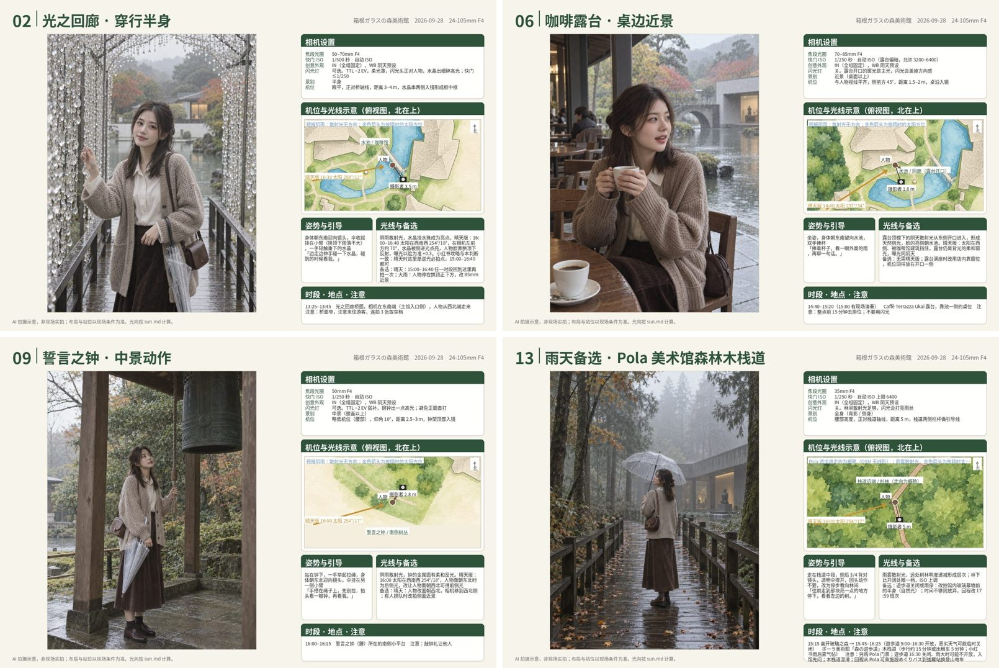
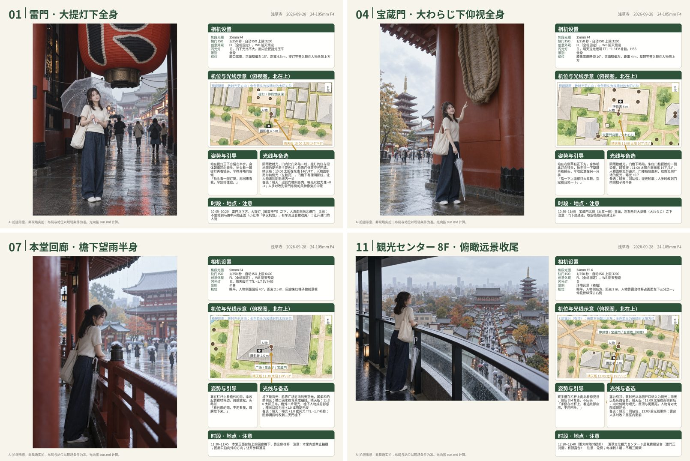
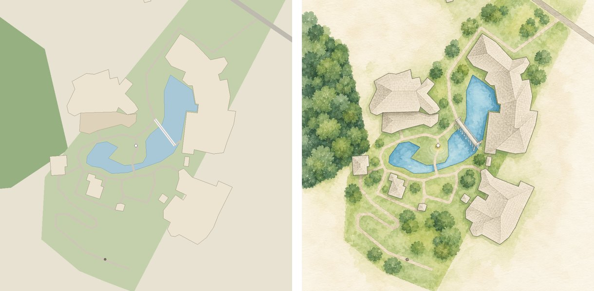
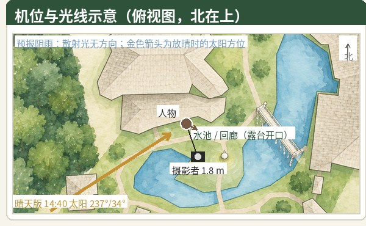
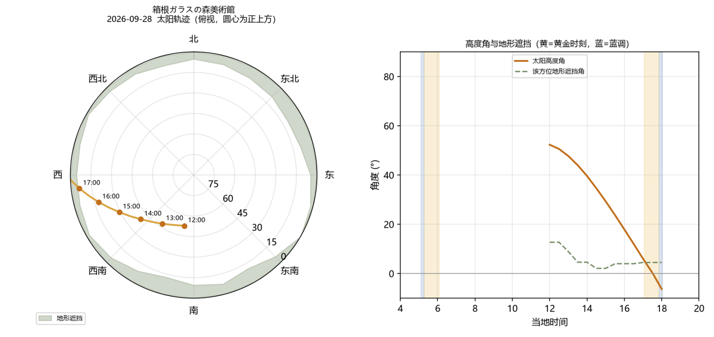
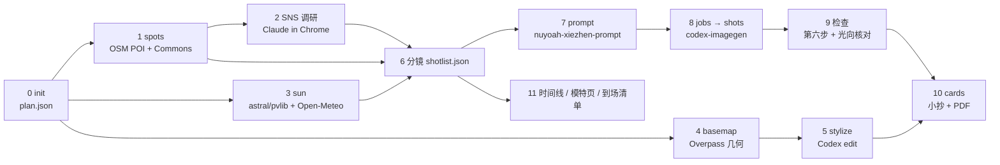

# xiezhen-shoot-pipeline

**给真实景点、真实日期做人像外拍规划的流水线。** 输入一个景点名、一个日期、到场时段和器材，得到一套可以直接带去现场的东西：每张分镜一页的拍摄小抄（示意图 + 相机设置 + 俯视站位与光向图 + 姿势引导 + 注意事项）、当天时间线、模特一页纸、到场核对清单。

底层由五类工具拼起来：OpenStreetMap 出园区几何与周边 POI，astral / pvlib 与 Open-Meteo 算太阳位置、地形遮挡和天气光质，Claude 在已登录的 Chrome 里做小红书 / Instagram / 抖音 / TikTok 的机位调研并写分镜，[nuyoah-xiezhen-prompt](https://github.com/nuyoah-ai-works/nuyoah-xiezhen-prompt) 把分镜编译成写真 prompt，[codex-imagegen-cli](https://github.com/jdmnk/codex-imagegen-cli) 用 ChatGPT 订阅内的 Codex 额度出示意图和水彩底图。

> A portrait-shoot planning pipeline for a real location on a real date: OSM geometry and POIs, sun position with terrain occlusion and weather-based light quality, social-media spot research, a ≥ 9-shot shot list, prompts compiled by nuyoah-xiezhen-prompt, preview images from Codex Image, and one printable cheat-sheet card per shot. Docs are in Chinese; the code and templates are language-neutral.



## 你会得到什么

以示例企划 [`examples/hakone-0928-v2/`](examples/hakone-0928-v2/)（箱根ガラスの森美術館，2026-09-28，13:00 到场，α7 V + 24-105mm F4）为例：

| 产物 | 内容 | 示例 |
|---|---|---|
| `sun.md` / `sun.json` / `sun_path.png` | 逐半小时的太阳方位、高度、影长；地形遮挡后的实际直射截止（该日 17:00，几何日落 17:35）；天气光质分类 | [sun.md](examples/hakone-0928-v2/sun.md) |
| `spots.md` / `spots_social.md` | 周边 38 个 POI、Commons 照片分布；小红书 2067 赞攻略、IG 标签、抖音票价、TikTok 官方账号的机位线索与对分镜的影响 | [spots_social.md](examples/hakone-0928-v2/spots_social.md) |
| `basemaps/` | OSM 几何渲染的俯视底图，以及 Codex 重绘、几何不变的水彩版；园外备选点（Pola 美术馆）单独一张 | 见下图 |
| `shotlist.json` / `shotlist.md` | 13 条分镜：景别、焦段、机位、站位朝向、光型、动作引导、晴天/阴天/雨天备选、创意外观与闪光灯建议 | [shotlist.md](examples/hakone-0928-v2/shotlist.md) |
| `prompts.md` → `out/<plan>/` | 每张分镜的完整中文 prompt 与生成的示意图，`generation_log.jsonl` 记录每次提交 | [prompts.md](examples/hakone-0928-v2/prompts.md) |
| `cards/` + `<日期>_<地点>_拍摄小抄.pdf` | 每张一页，1600×1067，可打印可手机翻 | [2026-09-28_箱根ガラスの森美術館_拍摄小抄_v2.pdf](examples/hakone-0928-v2/2026-09-28_箱根ガラスの森美術館_拍摄小抄_v2.pdf) |
| `timeline.md` / `model_sheet.md` / `arrival_checklist.md` | 巴士班次与每张分镜的时段、分岔点；给模特看的一页纸；到场 10 分钟要核对的事 | [timeline.md](examples/hakone-0928-v2/timeline.md) |

第二个示例 [`examples/asakusa-0928/`](examples/asakusa-0928/)（浅草寺，2026-09-28 上午，雨天，12 张）是用 `pipeline.py` 从零跑出来的：密集城区用南北两张底图（`--name north/south`），俯瞰、拱廊、门洞、香炉等都有对应的俯视站位。



第三个示例 [`examples/hakone-0928-v3/`](examples/hakone-0928-v3/) 是 1.1.0 的分镜基本法（`docs/SHOT_DESIGN.md` + `pipeline.py lint`）落地后重跑的箱根：19 张主线 + 1 张 Pola 雨天备选，按开场 → 环境 → 互动 → 肖像 → 细节 → 收尾排叙事，景别 远景 2 / 全身 6 / 七分 2 / 半身 4 / 近景 3 / 特写 3，焦段 24–105 三档、姿态四种、看镜头 7/19，lint 硬性与提示项全部通过。20 张示意图一轮生成无失败（单张 28–151 秒）。


底图：左为 OSM 几何直接渲染，右为 Codex `edit` 模式按固定指令重绘的版本，形状位置不变，所以能在上面按经纬度精确叠加站位、相机与太阳方向。



小抄右栏的俯视图：人物居中，相机位置与距离、背景方向、晴天版太阳方位（按 `sun.json` 该时刻取值）都是程序叠加的，不靠模型画。



太阳轨迹与地形遮挡（`sun_path.png`）：



## 工作流



阶段 0、1、3、4、5、8、10 是脚本（`pipeline.py` 子命令）；2、6、7、9、11 由 Claude（或人）按 `templates/` 里的模板完成。每个阶段的输入、输出、验收标准写在 [`docs/WORKFLOW.md`](docs/WORKFLOW.md)；分镜怎么分景别、排节奏、定角色，写在 [`docs/SHOT_DESIGN.md`](docs/SHOT_DESIGN.md)，`pipeline.py lint` 按它检查，不过硬性项就不生成出图任务。

## 快速开始

新电脑从零安装（Windows 双击 `setup.cmd`、codex-imagegen、装 skill、自测）按 [`INSTALL.md`](INSTALL.md) 走，约 10 分钟。已装好的机器：

```bash
git clone https://github.com/utopiabelmont/xiezhen-shoot-pipeline.git
cd xiezhen-shoot-pipeline
pip install -r requirements.txt        # Windows：双击 setup.cmd
python check_env.py

# 自动阶段
python pipeline.py init    hakone-0928 --place "箱根ガラスの森美術館" --date 2026-09-28 --arrive 13:00 --hours 12-18 --elev-m 657
python pipeline.py spots   hakone-0928
python pipeline.py sun     hakone-0928
python pipeline.py basemap hakone-0928 --meters 130
python pipeline.py stylize hakone-0928           # 需要本机 codex-imagegen（ChatGPT 登录）

# 人工阶段：填 plans/hakone-0928/spots_social.md，写 shotlist.json，用 nuyoah-xiezhen-prompt 写 prompts.md

python pipeline.py lint    hakone-0928           # 分镜基本法检查（景别配比、叙事角色、节奏、姿态视线）
python pipeline.py jobs    hakone-0928           # prompts.md → inbox/hakone-0928.jsonl（先自动 lint）
python pipeline.py shots   hakone-0928           # → out/hakone-0928/*.png + log.jsonl
python pipeline.py cards   hakone-0928           # → cards/ + 2026-09-28_箱根ガラスの森美術館_拍摄小抄.pdf
python pipeline.py status  hakone-0928
```

不联网自测：`spots` / `sun` 加 `--fixture`；`basemap` 加 `--fixture overpass_geom_pola.json --center 35.25666,139.02120`。

想直接看完整产物：把 `examples/hakone-0928-v2` 复制到 `plans/`，跑 `python pipeline.py status hakone-0928-v2`。

## 和 Claude 一起用

`skill/xiezhen-shoot-planner/SKILL.md` 是给 Claude（Claude Code / Cowork）用的流程 skill：把它装进 skills 目录，对 Claude 说「帮我规划 10 月 3 日去某某景点的外拍，13 点到，24-105mm」，它会按阶段号跑脚本、做网页与 SNS 调研、写分镜和 prompt、出图、检查、合成小抄。人工阶段的判断标准都写在 skill 与 `docs/WORKFLOW.md` 里，Claude 不会跳过检查步骤把生成图直接标成 final。

分镜到 prompt 的编译规则来自 nuyoah-xiezhen-prompt：一组分镜共用风格词链、成像词链、人物与服装（`templates/prompt_chains.md`），每张只改取景与机位、动作与视线、环境与光线；光线按「来源—落点—结果」写，方位与高度直接引用 `sun.md`。

## 目录

```
pipeline.py            统一入口：init / spots / sun / basemap / stylize / lint / jobs / shots / cards / status
run_shots.py           inbox/*.jsonl → codex-imagegen 逐条出图 → out/<批次>/ + log.jsonl（每条只提交一次，失败只记录）
check_env.py           依赖与工具自检
tools/
  geo_common.py        地理编码、方位、距离、HTTP（含离线 fixture）
  spots.py             周边 POI + Commons 照片 + 调研关键词
  sun_light.py         太阳位置（astral，pvlib 交叉验证）、地形遮挡（DEM 环采样）、天气光质
  osm_geometry.py      Overpass out geom → 分层几何（林地/空地/草地/水面/建筑/道路/步道/POI）→ 底图
  basemap.py           几何渲染，v1 手工格式与 v2 分层格式都能读
  make_cards.py        小抄页面合成：多底图、室内、园外窗口、半点太阳表、自动截断
  fixtures/            离线样本（Nominatim、Overpass、Commons、Open-Meteo、高程）
templates/             分镜模板与 JSON Schema、prompt 词链、SNS 调研表、时间线 / 到场清单 / 模特页模板、底图风格指令、手工几何示例
scripts/               Windows：setup.ps1（uv + venv）、job.example.ps1（一次性任务模板，UTF-8 BOM）
setup.cmd run_job.cmd run_shots.cmd   Windows 双击入口
skill/xiezhen-shoot-planner/          Claude 用的流程 skill
INSTALL.md             新电脑安装说明
docs/                  WORKFLOW（SOP）、SHOT_DESIGN（分镜基本法）、WINDOWS_SETUP（部署与已知坑）、CARD_SPEC（小抄版式）、CAMERA_NOTES（α7 V 外观与闪光灯策略）、CHANGELOG
examples/                  三个完整示例企划：hakone-0928-v2（13 张）、asakusa-0928（12 张，双底图）、hakone-0928-v3（20 张，分镜基本法）
plans/ inbox/ out/ refs/   运行时目录（out/ 与 plans/ 不入库；要保留的企划复制到 examples/）
```

## 数据源与依赖

| 用途 | 来源 | 说明 |
|---|---|---|
| 太阳位置 | astral、pvlib | 离线计算，两者交叉验证一致（0.05° 内） |
| 天气、高程 | Open-Meteo | 云量、直射/散射辐射、降水概率（16 天预报）；90 m DEM 估算地形遮挡角 |
| 地理编码 | Nominatim | ≤ 1 次/秒，脚本自带 User-Agent |
| 园区几何、POI | Overpass API（OpenStreetMap，ODbL） | `out geom`，POST 请求 |
| 公开照片分布 | Wikimedia Commons geosearch | 看常见机位与季节 |
| 社交平台 | 小红书 / Instagram / 抖音 / TikTok | 无公开接口；由 Claude 在已登录的 Chrome 里人工级浏览，只记录文字线索 |
| 出图 | codex-imagegen-cli（Codex 内部图片接口） | 用 Codex 桌面版 / CLI 的 ChatGPT 登录，走订阅额度；模型由服务端决定 |
| prompt 规则 | nuyoah-xiezhen-prompt | 系列母版、同系列变体、第六步检查 |

天气光质判定：直射比 ≥ 0.5 且云量 < 60% 为晴天硬光；≥ 0.5 为高云透光；0.2–0.5 薄云；< 0.2 阴天。分镜默认按预报编排，另一种天气作备选。

## 已知限制

- Codex 内部图片接口是 alpha：尺寸不保证（1152x1536 会返回 1086x1448），不能指定模型。要固定模型请改用官方 Images API。
- Open-Meteo 预报只有 16 天，更早的日期只有天文数据；出发前一天再跑一次 `sun`。
- OSM 里没有的步道（例如 Pola 美术馆的森の遊歩道）只能用 `--extra` 画概略线，小抄上会注明「概略」。
- 地形遮挡按 DEM 估算，园内树木与建筑的遮挡要现场判断。
- 生成图只是示意，小抄页脚固定写「AI 拍摄示意，非现场实拍」；分镜状态只有 test / failed，用户确认后才 final。
- PowerShell 5.1 只认带 BOM 的 UTF-8 脚本；改 `job.ps1` 时注意保存编码（`docs/WINDOWS_SETUP.md` 第 5 节）。

## 许可

MIT。OSM 数据遵循 ODbL；Commons 图片各自许可；社交平台内容只记录文字线索，不保存图片。
