**English** | [简体中文](README.zh-CN.md) | [日本語](README.ja.md)

# xiezhen-shoot-pipeline

**A pipeline for planning portrait photo shoots at a real location on a real date.** You give it one location (or several for one day) and a date. It produces a set of materials you can take to the site: an itinerary page with that day's weather, an outfit plan, an in-park route page, a shoot script PDF with one page per shot (preview image, SNS source post with QR code, camera settings, top-view position and light diagram, pose direction, notes), a phone checklist in HTML that you tick off item by item, and a timeline, a one-page model sheet, an arrival checklist and a clip edit list.

Shots are based on camera spots and poses that have actually produced photos at the location on social media. Codex or Claude opens the original posts on Xiaohongshu, Instagram, Douyin and TikTok in a browser and writes down the camera position, composition and pose as text. Each shot is designed to match one post, and extra shots fill in whatever the posts do not cover. Preview images are generated from that text alone: the original post images are not downloaded, not screenshotted, and never passed to the image model. Shots are numbered in walking-route order, so on site you shoot from 01 to the last one.

The pipeline combines several tools. OpenStreetMap provides the park geometry, footpaths and nearby POIs. astral / pvlib and Open-Meteo compute sun position, terrain occlusion and weather-based light quality. Dominant colours are extracted from Wikimedia Commons photos of the site and used to check the outfit. Codex or Claude uses a signed-in browser to research camera spots and outfits on Xiaohongshu / Instagram / Douyin / TikTok and writes the shot list, which a linter then validates. The walking route is computed on OSM footpaths. The optional [nuyoah-xiezhen-prompt](https://github.com/nuyoah-ai-works/nuyoah-xiezhen-prompt), or the prompt-chain template in this repository, compiles the shots into portrait prompts, and [codex-imagegen-cli](https://github.com/jdmnk/codex-imagegen-cli) generates the preview images and watercolour base maps using the Codex quota included in a ChatGPT subscription.

The detailed documentation ([INSTALL.md](INSTALL.md), [docs/](docs/), the templates and the skill) is written in Chinese. The code is language-neutral.

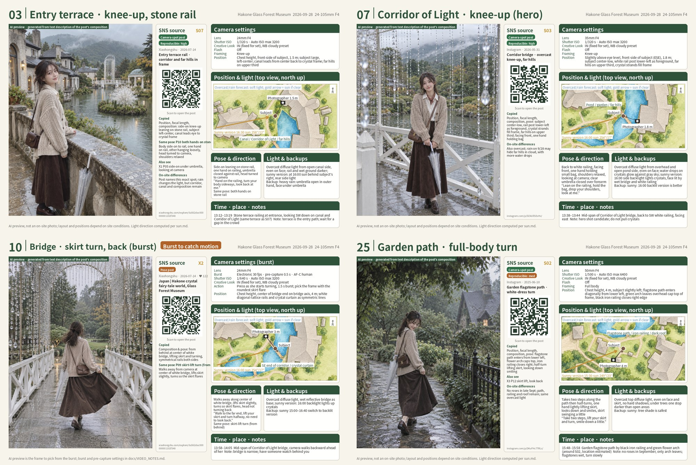

## Shoot script PDF and checklist

Each plan produces two files for use on site: `<日期>_<地点>_拍摄脚本.pdf` (date, place, "shoot script"; for printing or a tablet) and `<日期>_<地点>_拍摄核对表.html` (date, place, "shoot checklist"; opened on a phone and ticked off item by item). Each of the three case studies below comes with the complete output; click a summary line to expand it.

### Case study 1: Hakone Glass Forest Museum (rain, one camera body)

<details><summary><b>Hakone Glass Forest Museum · 2026-09-28 · rain · arrival 13:00 · α7 V + 24-105mm F4 · 38 shots · 47 pages (click to expand)</b></summary>

<br>

The output is in [`examples/hakone-0928-v5/`](examples/hakone-0928-v5/) (v5). The PDF contains, from front to back:

| Page | Content | Generated by |
|---|---|---|
| Itinerary | Schematic map of the day's locations at their real coordinates; transport between them (line, departure and arrival times, minutes); arrival and departure time at each stop. The day's weather: hourly conditions over the itinerary (weather, precipitation, precipitation probability, temperature and feels-like, wind speed), sunset and the time direct sun ends after terrain occlusion, notes for the itinerary and clothing; sources | `trip.json` + `sun.json` → `tools/trip.py` |
| Outfit ×2 | Site dominant colours (sampled from Commons photos) and ΔE separation from the clothing colours, colour strategy (analogous / adjacent / complementary accent), main plan, replacements for rain, sun and cold, props, makeup and hair, per-shot clothing notes | `palette.py` + `outfit.json` → `make_outfit_page.py` |
| Route | Walking route computed along footpaths on the watercolour base map, numbered stops, shots at each stop, walking distance, arrival and departure times | `meta.route_stops` → `tools/route.py` |
| Shots ×38 | Numbered in route order. 25 are designed from SNS material (7 camera-spot posts, poses from 13 pose posts, and Xiaohongshu's "Wen Diandian" (问点点) search summary); 13 are supplementary (transitions, details, bursts, clips, Live Photos). One preview image per page. The source panel gives the material type and how reproducible it is, platform and date, post title, a QR code to the post, what was copied, the same pose, and on-site differences today. The right column holds camera settings (switching by medium), top-view position and light direction, pose and direction, light and backups, time slot and notes | `shotlist.json` (`src`) + preview images → `make_cards.py` |
| Camera move ×5 | One page after each clip card: subject-centred top-view path (start and end positions of camera and subject, position at each second), side view of camera height and tilt, operating notes, start / mid / end frames (9:16 frames Codex draws from the text; if absent, line drawings derived from focal length and distance), timeline bar and S&Q output duration | `clip` + `move_frames/` → `tools/moves.py` |

The checklist arranges everything in the same plan that needs confirming on site as tickable items: gear before departure (settings for bursts, S-Log3 clips, ND and iPhone Live Photos, listed automatically from the focal lengths and media the shots use), clothing, props, makeup and hair, transport, arrival checks, all shots grouped by route stop (thumbnail, focal length, framing, gaze, one line to say to the model, SNS source and post link; expand for camera position, light, clip start/end and exposure), an overview of clip camera moves, and wrap-up. At the top are overall progress and counts per medium; you can show only unfinished items or only one medium. Opened on the shoot day, it highlights the stop for the current time. Tick state is stored only in this device's browser and nothing is sent over the network.

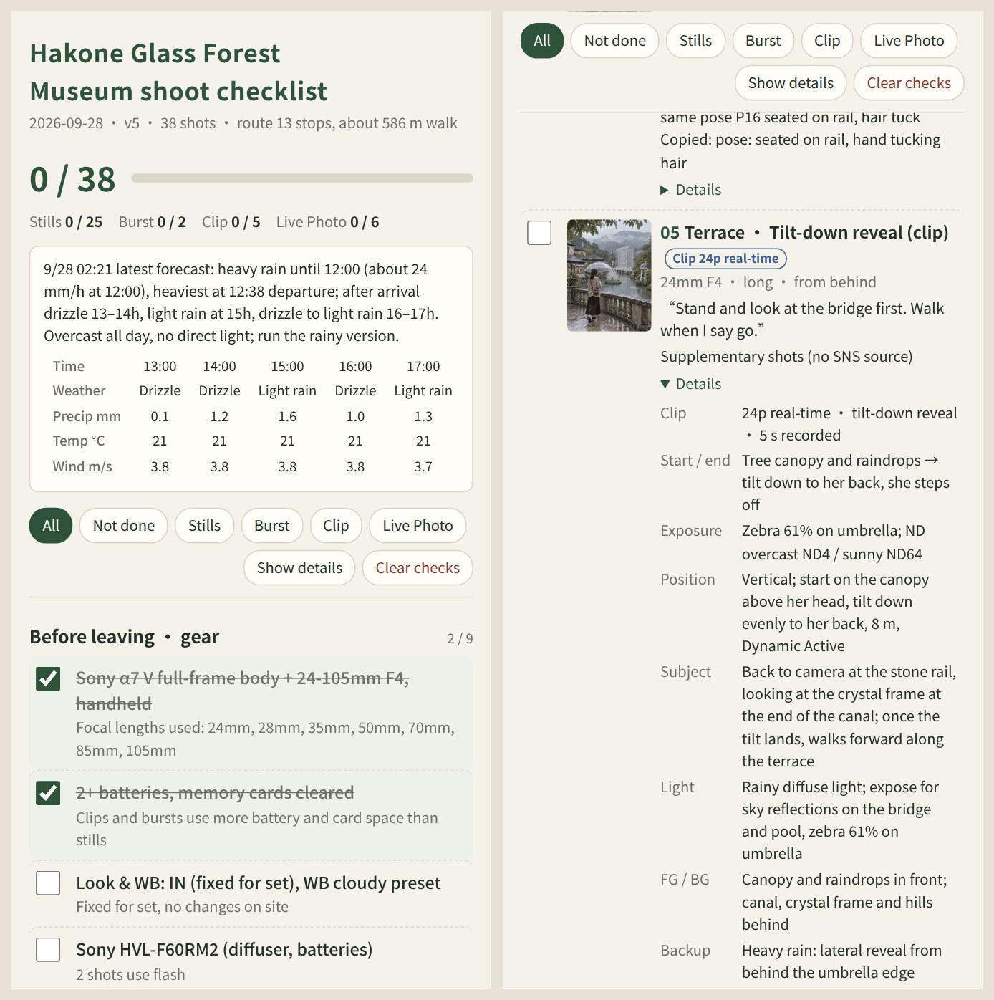

The two kinds of source panel on shot pages: the first is designed from an Instagram camera-spot post (hero shot), the second is a supplementary shot.

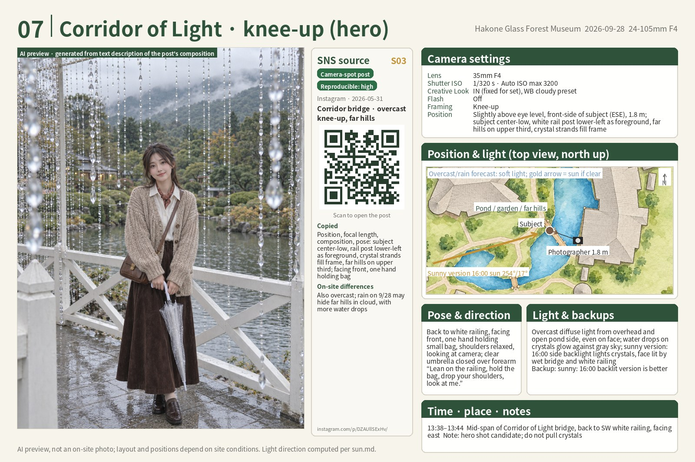

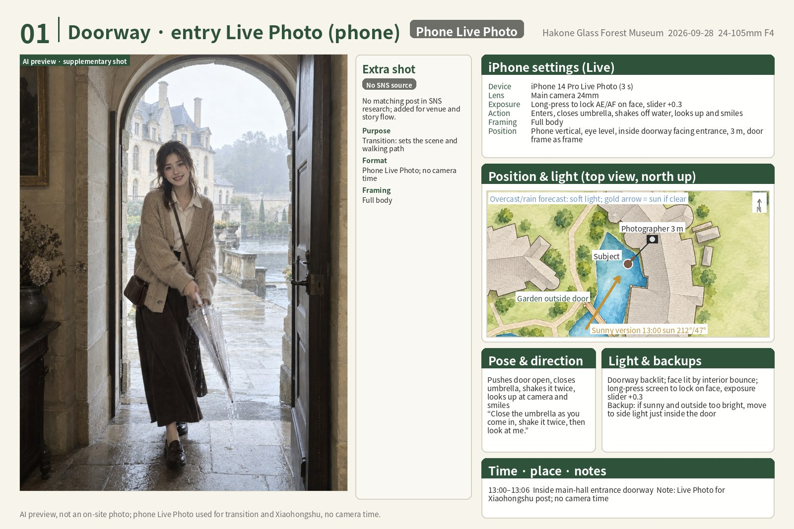

A single camera-move page (top-view path, side-view tilt, operating notes, start / mid / end frames). The checklist has a "Clip camera moves" overview and an expandable "Camera move" item for each clip:

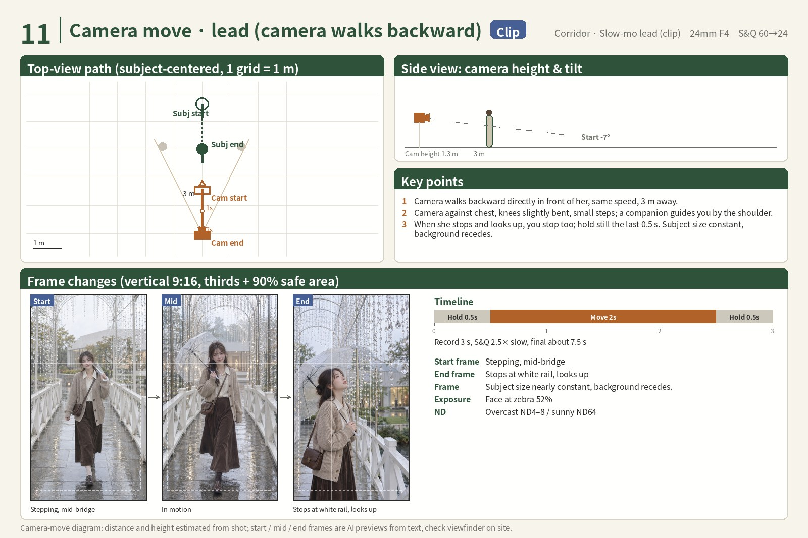

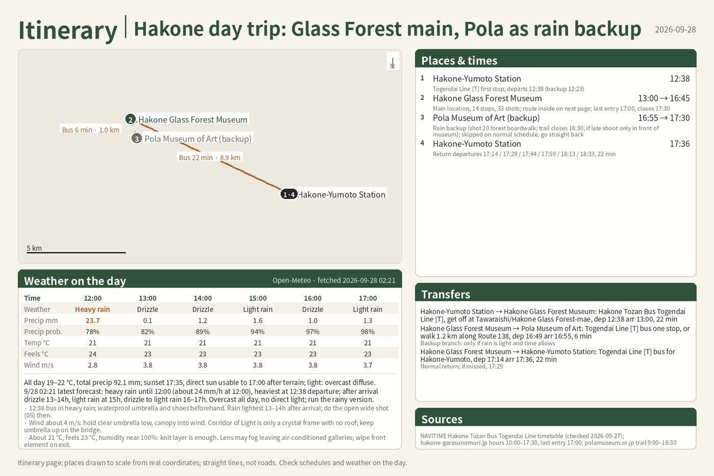

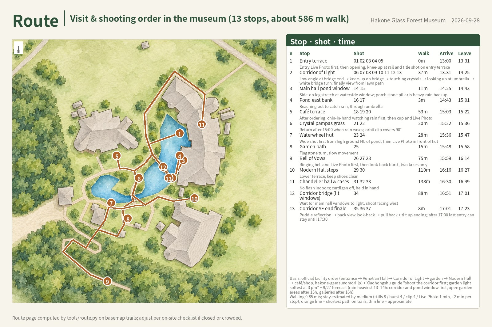

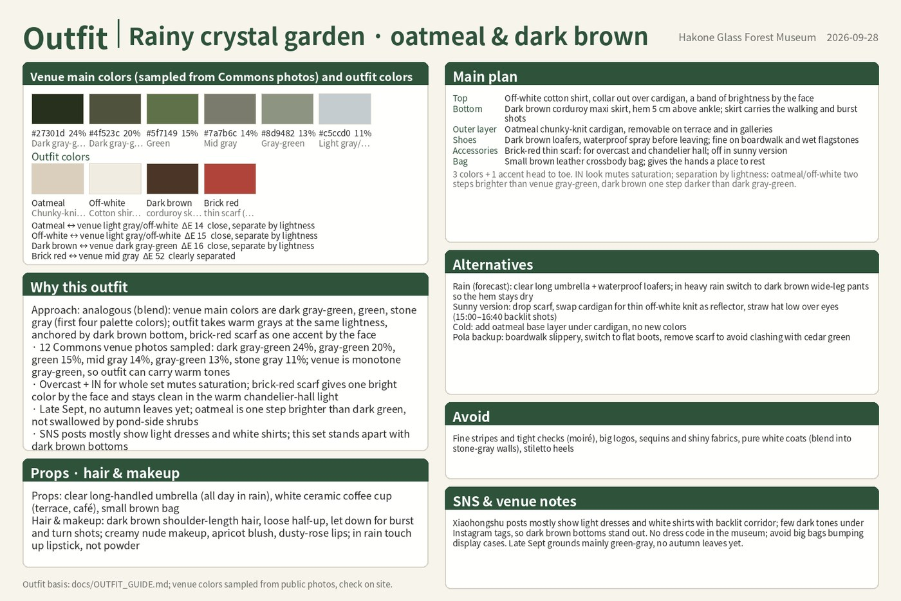


Base map: the left is rendered directly from OSM geometry; the right is a watercolour version that Codex redraws in `edit` mode with a fixed instruction. Shapes and positions do not change, so positions, camera, sun direction and footpath routes can be overlaid precisely by latitude and longitude.


The top view in the right column of the cheat sheet: the subject is centred, and the camera position and distance, background direction and the sunny-version sun azimuth (taken from `sun.json` for that time) are all overlaid by the program.

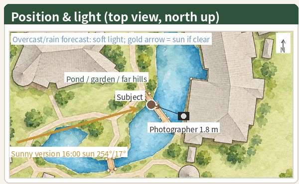

Sun path and terrain occlusion (`sun_path.png`):

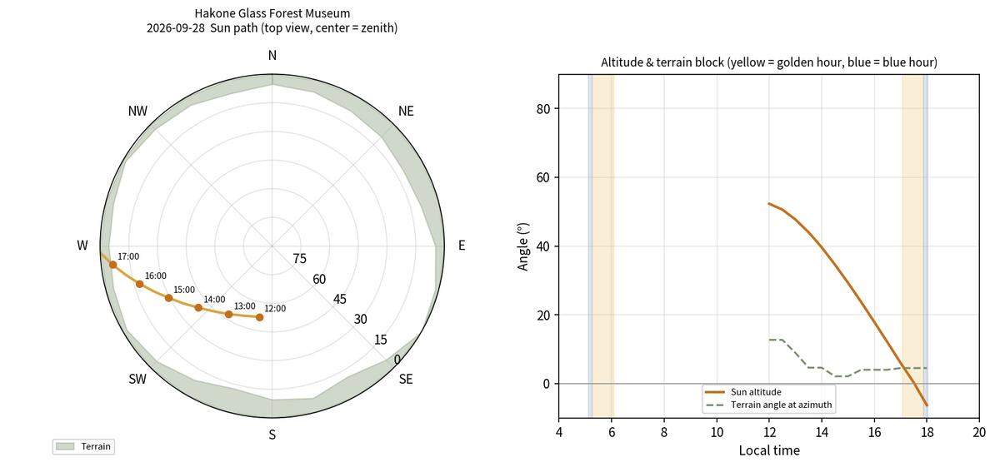

</details>

### Case study 2: Tokyo Tower (city, sunny, four devices)

<details><summary><b>Tokyo Tower · 2026-10-03 · sunny · arrival 15:20 · α7 V / GR IV / Pocket 3 / iPhone · 27 shots · 37 pages (click to expand)</b></summary>

<br>

What was said to Codex / Claude:

> /xiezhen-shoot-planner Write a shoot script for the photo spots around Tokyo Tower. The date is not fixed; go on the next sunny day. Gear: iPhone 14 Pro, Sony a7M5 + 24-105 F4, Ricoh GR4 and DJI Pocket 3.

The output is in [`examples/tokyotower-1003/`](examples/tokyotower-1003/): `2026-10-03_东京塔_拍摄脚本.pdf` (37 pages) and `2026-10-03_东京塔_拍摄核对表.html`. The pages of this example are in Chinese.


How it differs from case study 1:

- **Date chosen from the forecast.** The request only said "the next sunny day", so tenki.jp, Weathernews and Open-Meteo were checked first and the nearest sunny day, 10/3, was chosen (20% chance of rain, 0–3% cloud cover at 15–16h), with 10/10 and 10/11 as fallbacks. `sun.md` gives sunset at 17:23 and blue hour at 17:39–17:49. In the city, tall buildings block the sun earlier than terrain does: after 17:00 there is no direct light at street level, and only the upper part of the tower is lit.
- **Route ordered by the light.** The afternoon starts on the south and west sides of the tower, which face the sun (the Akabanebashi road sign, a Shiba Park bench, the Hokkaido Wine steps, the Ukai stairs, the Caledo Tower alley). At 17:00 the route moves to the east side and waits at the foot of the tower for the lights to come on around 17:22, reaches Zojoji at 17:46 for the blue-hour hero shot of the main hall with the lit tower, and ends at a phone booth in Higashi-Azabu. 11 stops, about 2.75 km on foot, 15:20 → 18:42.
- **Several base maps for a city site.** The 700 m overview map is used only to compute the route. The top views on the shot pages use three district maps of 360–400 m (south, west, east), so the streets stay legible when enlarged. During styling, two maps had footpaths painted as canals; they were redrawn once with `--prompt-extra` stating that there are no rivers or water surfaces.
- **Four devices, each with its own job.** The α7 V + 24-105 shoots the main stills, bursts and S-Log3 clips. The GR IV shoots the look-back on the slope and the phone-booth closing shot; the latter follows a Douyin post shot with a GR4 at the same phone booth. The Pocket 3 shoots two gimbal clips: following from behind in the alley and a quarter orbit at the foot of the tower. The iPhone shoots 7 Live Photos. SNS research ran one round of searches per device, and posts shot on the same device were reproduced first.
- **SNS material.** 13 camera-spot posts (two highly liked Xiaohongshu notes split image by image into 10 entries, 1 from Douyin, 2 from Instagram) and 2 platform summaries (the text of the Xiaohongshu "Diandian" summary of 47 notes, and of a Douyin image post listing 12 camera spots). 12 of the 14 stills are designed from this material. The other 2 (an alley close-up and a fingertip close-up at the foot of the tower), all clips and all Live Photos are supplementary shots.
- **Outfit.** The site colours are grey streets, clear blue sky and the tower's international orange. The outfit uses off-white and light camel, which sit next to orange, with a tomato-red bag as the only saturated colour. A light trench coat goes on after 17:00; in the night shots the off-white shirt dress keeps a bright area below the face.

| Page | Count | Content |
|---|---|---|
| Itinerary page | 1 | In and out via Akabanebashi Station, Azabudai Hills 33F as an alternative, hourly weather for 15–20h |
| Outfit pages | 2 | ΔE between site colours and outfit colours, main plan, substitutes for overcast, rain and a silver-white version under the lights, reminders for each of the 27 shots |
| Route page | 1 | The 11 stops on the overview map, with arrival and departure times |
| Shots | 27 | 14 stills (2 of them bursts), 6 clips, 7 Live Photos; the numbers follow the walking order |
| Camera-move pages | 6 | Tilt-down reveal, follow from behind, quarter orbit, fixed slow motion, fixed turn and look back, fixed walks away |

Four shot pages: the Akabanebashi road-sign hero shot (Xiaohongshu camera-spot post), sitting on the guardrail of the road to the right of Ukai (text of the Douyin image post), the Zojoji blue-hour hero shot (Xiaohongshu Diandian summary), and the phone-booth closing shot (post shot on the same GR model).


One overview map and three district maps:


Quarter orbit at the foot of the tower (Pocket 3): the start frame is before the lights come on, and the tower is lit by the end frame.


Generation log: the 21 stills and Live Photos and the 18 clip frames (three per clip) were submitted once, in three parallel batches. After each image was checked, 5 were regenerated with a rewritten framing section: in 19 the tower in the background was too sharp for the shallow depth of field at 105mm; the three frames of 20 did not keep the same shot size; the start frame of 22 should show the face from behind and to the side, looking back at the tower, but came out looking at the camera. In the second round one image hung for 12 minutes; it was stopped by hand and resubmitted. Both rounds are recorded in `generation_log.jsonl`, and the replaced images are marked `failed` with the reason.

</details>

### Case study 3: Hengyang, four spots in one day (overcast with showers, iPhone only)

<details><summary><b>Hengyang · 2026-10-03 · overcast, late-afternoon showers · 08:30–19:30 · iPhone 16 Pro Max only · 4 plans, 103 shots · 4 PDFs, 139 pages (click to expand)</b></summary>

<br>

What was said to Codex / Claude, with a screenshot of a Xiaohongshu route map attached (Shigu Academy → Baoweili → Jiefang Road → Dongzhou Island, with taxi minutes between them):

> /xiezhen-shoot-planner Use this skill to make a one-day travel shoot script for the four spots in the image I uploaded. The date is tomorrow, 10/3, and the device is an iPhone 16 Pro Max. No upper limit on the number of shots: do every one you can find, but remove duplicates.

The output is in [`examples/hengyang-1003/`](examples/hengyang-1003/), one plan folder per spot, each with its own `2026-10-03_<地点>_拍摄脚本.pdf` and `2026-10-03_<地点>_拍摄核对表.html`. The pages of this example are in Chinese.

| Plan | Spot | Time | Stills (+ optional) | Clips / Live Photos | Hero shot | PDF |
|---|---|---|---|---|---|---|
| [`hy-shigu-1003`](examples/hengyang-1003/hy-shigu-1003/) | Shigu Academy | 08:30–10:55 | 12 (+3) | 5 / 6 | Full length with a fan at the lattice doors of Daguan Hall | 35 pages |
| [`hy-baoweili-1003`](examples/hengyang-1003/hy-baoweili-1003/) | Baoweili | 11:10–13:56 | 15 (+4) | 5 / 6 | Half length holding flowers on the platform (Portrait mode) | 39 pages |
| [`hy-jiefang-1003`](examples/hengyang-1003/hy-jiefang-1003/) | Jiefang Road | 14:10–16:07 | 9 | 5 / 6 | Low-angle shot under the 3D billboard | 29 pages |
| [`hy-dongzhou-1003`](examples/hengyang-1003/hy-dongzhou-1003/) | Dongzhou Island | 16:20–19:30 | 13 (+3) | 5 / 5 (+1) | Looking back from the railing under the covered-bridge lanterns | 36 pages |


Compared with case studies 1 and 2:

| | Case 1 Hakone | Case 2 Tokyo Tower | Case 3 Hengyang |
|---|---|---|---|
| Scope | One museum | One landmark and the streets around it | Four spots in one day, one plan each |
| Date and weather | Fixed date, rain throughout | Nearest sunny day from the forecast | Fixed date (the next day), overcast, showers at 16–18h |
| Devices | α7 V + 24-105 | α7 V, GR IV, Pocket 3, iPhone with split roles | iPhone 16 Pro Max only |
| SNS material | 7 camera-spot posts, 13 pose posts | 13 camera-spot posts, 2 platform summaries | 56 camera spots from 24 posts, 7 platform summaries |
| Shots | 38 | 27 | 103 (no upper limit, kept after de-duplication) |
| Route based on | Official facility order, guides, hourly rain | Guide order, light direction, lighting-up time | The user's route map; within each spot, opening hours, showers and sunset |
| Pages | 47 | 37 | 139 across four PDFs |

In more detail:

- **Four spots in one day.** The order of the spots and the travel times follow the route map the user supplied (DAY1 of 烛染尘's "Hengyang 2 days 1 night" guide). Each spot has its own base map, route page and shot numbers starting at 01. The four plans share one `trip.json`, so the first page of all four PDFs is the same itinerary page for the whole day: 08:30 Shigu Academy → 11:10 Baoweili → 14:10 Jiefang Road → 16:20 Dongzhou Island → 19:30 done, with 15, 11 and 12 minutes by taxi in between. Inside each spot the order follows opening hours, showers and sunset: Shigu Academy is shot at 8:30–10:00, when it is least crowded after opening; on Dongzhou Island the heaviest shower at 17h falls while shooting under the corridors of Chuanshan Academy, the lawn at Fuzhi Tower comes around 18:00, and the covered-bridge lanterns come after sunset.
- **One phone only.** Focal lengths are written as iPhone lens settings (0.5× 13mm, 1× 24/28/35mm, 2× 48mm, Portrait mode 2×, 5× 120mm). Clips use three modes: 4K 24 fps in real time, 4K 60 fps slowed to 24p at home, and Slo-mo 4K 120 fps, in place of the α7 V S&Q presets of case studies 1 and 2. Bursts are taken by sliding the shutter button left. There is no flash and none is used; night shots rely on the lanterns and Night mode. Besides the searches per spot, SNS research ran one extra round per device ("衡阳 iPhone 拍照", a Xiaohongshu Diandian summary of 59 notes).
- **No upper limit, with de-duplication.** The four spots gave 56 camera spots from 24 posts, and the same wall or the same tree was often shot in several posts. This case adds a de-duplication step: each plan has a `dedupe.md` that applies four rules. Material from the same position with the same shot size is merged into one shot, with the secondary posts recorded in `src.also`. Material from the same position with a different shot size or pose keeps one still and becomes Live Photos or clips for the rest. Shots in the same set that repeat the same pose, gaze and shot size become optional. Material whose position is unclear or whose season does not match is not used. The result is 49 main stills (8 of them bursts), 10 optional stills, 20 clips and 24 Live Photos; `dedupe.md` maps every piece of material to its shot.
- **Night posts rewritten for daytime.** On social media Jiefang Road is almost all night shots (traffic seen from the footbridge, Hong Kong-style signs). The visit is in the afternoon, so every shot was rewritten as an overcast daytime shot, and each card keeps the night version of the original post under "backup".
- **One outfit across four spots.** A pale moon-white Chinese-collar top with frog buttons and a long oat skirt, with a dark green cardigan added in the afternoon. Props change with the spot: a folding fan at Shigu Academy, yellow daisies at Baoweili, a clear umbrella and street snacks on Jiefang Road, the umbrella and the fan on Dongzhou Island. No Commons photos of the sites were found (palette returned 0), so the colours were chosen from the site colours seen in the SNS posts.
- **Base map and position fixes.** Dongzhou Island sits in the middle of the Xiang River, and the OSM render drew the island as water; a second version with the island filled in as land was rendered and composited. The first styling of Baoweili and Jiefang Road turned the streets into parks, so they were redrawn with `--prompt-extra` stating that they are city streets. At Shigu Academy the approximate positions of 9 shots fell on the river; subject and camera were moved together to the nearest bank (5–23 m). These three fixes were made with one-off scripts inside the plans.
- **Materials for the day.** The timeline for each spot lists decision points (booking failed, the second floor of Hejiang Pavilion closed, the cliff-inscription path closed, heaviest shower, lanterns not lit yet, wanting a sit-down lunch, and so on). The Shigu Academy `clips.md` also has an edit list for a whole-day reel of 10 clips from the four spots.

The four hero shots: Daguan Hall at Shigu Academy (Xiaohongshu camera-spot post; the round fan in the post is replaced with a folding fan), the Baoweili platform (Xiaohongshu camera-spot post shot on an a6700 at a medium focal length, redone in iPhone Portrait mode at 2×), the 3D billboard on Jiefang Road (the image in the user's route map has no person in it; a person was added for a 0.5× low-angle shot), and the covered bridge on Dongzhou Island (Xiaohongshu camera-spot post; with no sunset under the overcast sky, the key light becomes the lanterns after sunset).


The itinerary page shared by the four PDFs:


The route pages of the four spots:


Dongzhou Island 02, a wipe reveal (opening clip): the start frame is a pillar of the covered bridge, and a sideways move reveals her walking along the bridge.


Generation log: the 103 preview images and the 60 start / mid / end frames of the 20 clips were submitted in 8 parallel batches (4 for stills, 4 for camera-move frames). Most images took 30–60 seconds; including the regenerations, everything finished in about 35 minutes. One Baoweili batch hung on shot 20, and the remaining shots were submitted again as new batches. In the image-by-image check, Dongzhou Island 02 and 03 showed the covered-bridge lanterns already lit at 16:30, which contradicts "the lanterns come on after sunset"; they were regenerated with "the lanterns are not lit yet" added to the light section, together with the three camera-move frames of 02. Shot 26 (the three-faced Guanyin at Luohan Temple) was also regenerated after it was misjudged as single-faced from a thumbnail; on checking the full image, both rounds show three faces. Both rounds are recorded in each plan's `generation_log.jsonl` and `generation_log_moves.jsonl`: the first-round 02 and 03 are marked `failed` with the reason, and the first-round 26 is noted as replaced.


</details>

### Camera-move library

11 camera moves with the same original model, the same outfit and the same fictional garden museum, animated by `tools/move_gif.py`. On the left top view, the orange dot is the camera and the green dot is the subject; both move in sync with the frame. On the right is the vertical 9:16 frame. So that the background and subject change continuously along the path within a move, the frames are made in two ways:

- The 4 moves where only the camera moves and the subject stays still (tilt-down reveal, wipe reveal, fixed slight push-in, pull back + tilt up): Codex first draws one large master image that covers the whole path, then a 9:16 crop window moves continuously across the master along the camera path. Every frame comes from the same image, so background and subject stay consistent from frame to frame.
- The 7 moves where the subject moves or the camera follows the subject: each frame is an edit that uses the start frame as reference and changes only the part named in the description. Side tracking and follow from behind are chained frame by frame (frame 2 uses frame 1 as reference, frame 3 uses frame 2, and so on), so background panning and the approach to the archway accumulate. The fixed-camera moves all use the same start frame as reference, so the composition does not change.

Per-frame prompts and crop paths are in `tools/moves_library_prompts.py` (`MASTERS` / `RECIPES` / `EDITS` / `CHAIN`); the source frames and generation logs are in `docs/img/moves/frames/`.

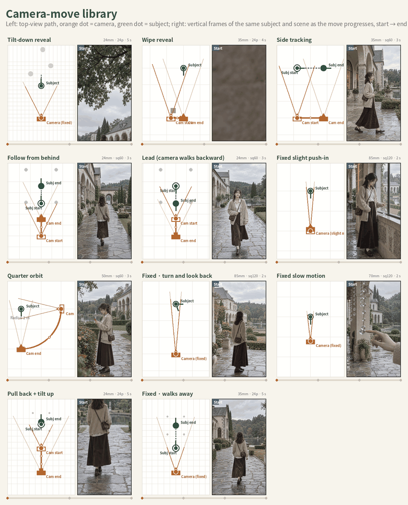

<details><summary>Each move at full size</summary>

<table>
<tr><td align="center"><b>Tilt-down reveal</b><br>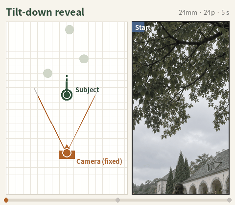</td><td align="center"><b>Wipe reveal</b><br>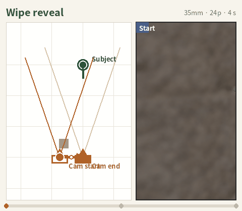</td><td align="center"><b>Side tracking</b><br>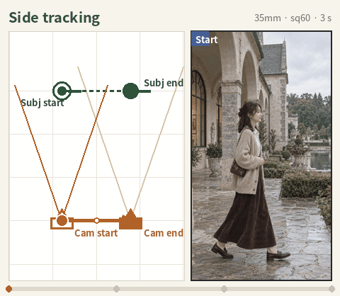</td></tr>
<tr><td align="center"><b>Follow from behind</b><br>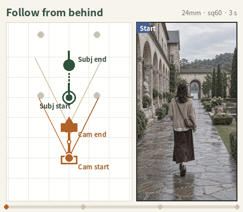</td><td align="center"><b>Lead (camera walks backward)</b><br>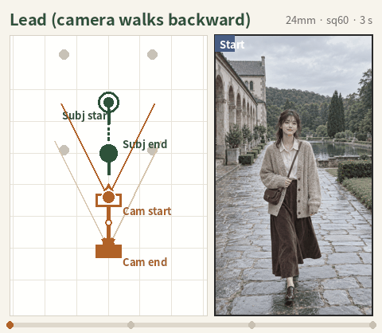</td><td align="center"><b>Fixed slight push-in</b><br>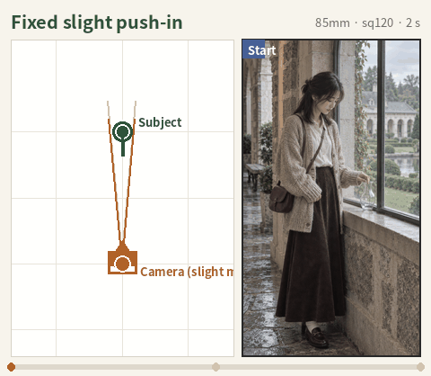</td></tr>
<tr><td align="center"><b>Quarter orbit</b><br>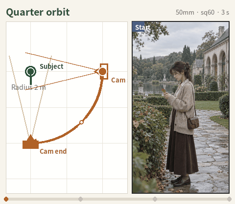</td><td align="center"><b>Fixed · turn and look back</b><br>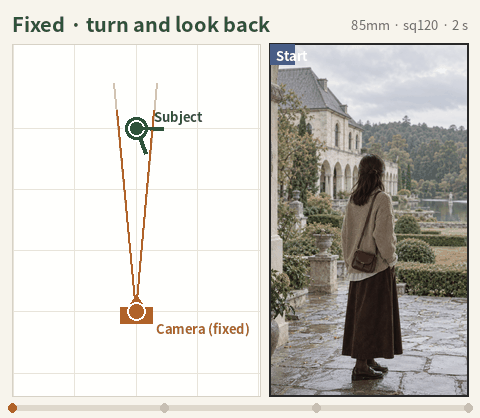</td><td align="center"><b>Fixed slow motion</b><br>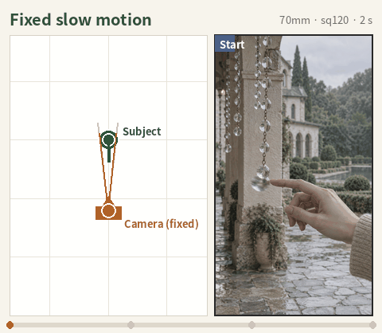</td></tr>
<tr><td align="center"><b>Pull back + tilt up</b><br>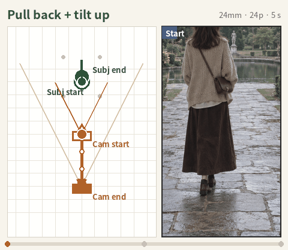</td><td align="center"><b>Fixed · walks away</b><br>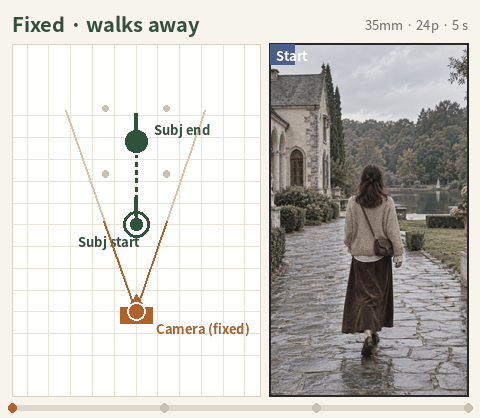</td></tr>
</table>

</details>

### Other examples

[`examples/hakone-0928-v3/`](examples/hakone-0928-v3/) (v3.5 at the same location, shots written first and then checked against SNS, 43 pages), [`examples/asakusa-0928/`](examples/asakusa-0928/) (Senso-ji, a dense urban area covered by two base maps, north and south, 12 shots) and [`examples/hakone-0928-v2/`](examples/hakone-0928-v2/) (Hakone version 1.0, 13 shots, including an off-site base map for the Pola Museum of Art).

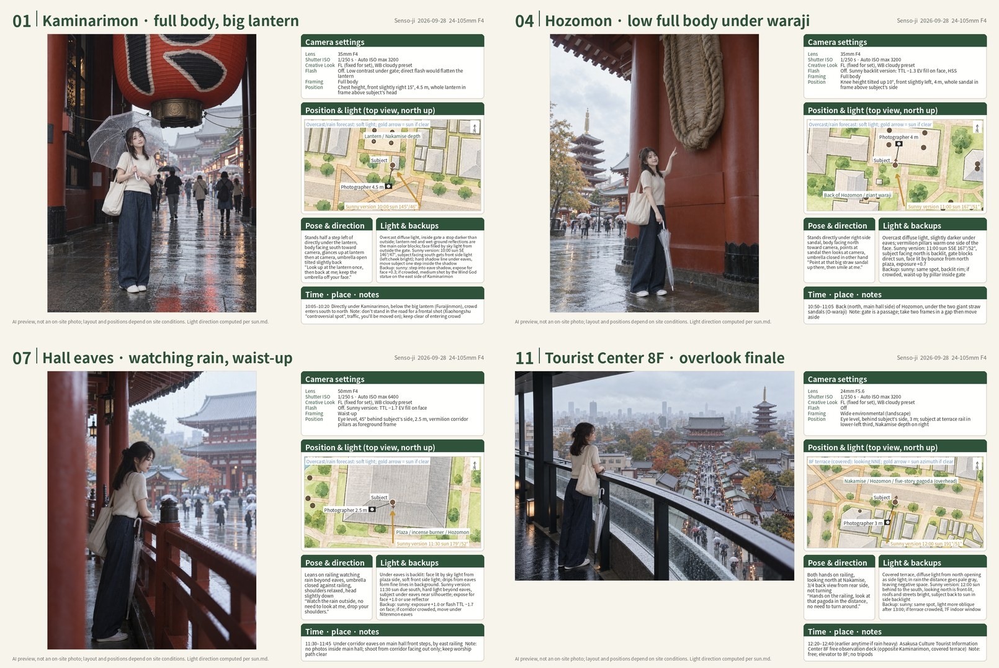


## Workflow

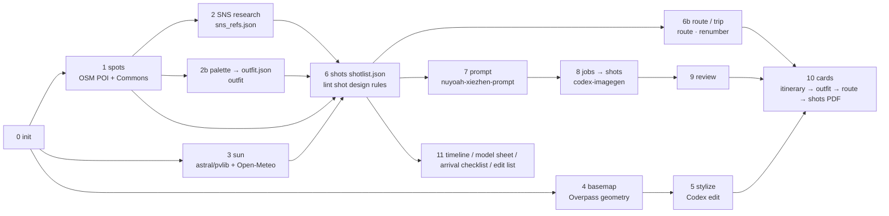

| Stage | What it does | Done by | Rules document |
|---|---|---|---|
| 0 Setup | `pipeline.py init`: location, date, arrival, gear | Script | [WORKFLOW](docs/WORKFLOW.md) |
| 1 Photo spots | `spots`: nearby POIs, Commons photos, research keywords; then web research | Script + Codex / Claude | |
| 2 SNS research | Human-like browsing of Xiaohongshu / Instagram / Douyin / TikTok; camera-spot posts, pose posts and platform summaries that have produced photos are written up as text in `sns_refs.json`; post images are not stored | Codex / Claude (when a browser is available) | [SNS_NOTES](docs/SNS_NOTES.md) |
| 2b Outfit | `palette` extracts site dominant colours → `outfit.json`: ≤ 3 colours, ΔE ≥ 12 from site colours, replacement plans, per-shot notes | Script + Codex / Claude | [OUTFIT_GUIDE](docs/OUTFIT_GUIDE.md) |
| 3 Light | `sun`: azimuth and elevation every half hour, DEM terrain occlusion, hourly weather (light quality, precipitation, temperature, wind); the day before departure, `sun --weather-only` refreshes only the forecast | Script | |
| 4–5 Base map | `basemap` → `stylize`: OSM geometry → Codex watercolour redraw | Script + local Codex | |
| 6 Shots | Design one matching shot per SNS source (`src` records the source), then add more where needed; narrative role, framing mix, yori/hiki (close/wide) rhythm, pose and gaze, plus bursts ≥ 2 / clips ≥ 5 / Live Photos ≥ 6; checked by `lint` | Codex / Claude + script | [SNS_NOTES](docs/SNS_NOTES.md), [SHOT_DESIGN](docs/SHOT_DESIGN.md), [VIDEO_NOTES](docs/VIDEO_NOTES.md) |
| 6b Route | `meta.route_stops` → `route`: shortest path along footpaths, dwell times and clock times; `renumber` changes shot numbers to route order; multiple locations: `trip.json` → `trip` | Codex / Claude + script | [ROUTE_NOTES](docs/ROUTE_NOTES.md) |
| 7 Prompts | Write `scene_bible.md` first (what the site really looks like and what is easy to get wrong); series master + same-series variants, with the framing section taken from the text description of the post's composition; clips get keyframes, plus a separate `move_prompts.md` with start / mid / end frames | Codex / Claude | [prompt_chains](templates/prompt_chains.md) |
| 8–9 Generation and review | `jobs [--missing]` → `shots`; clip start/mid/end frames: `jobs --moves` → `shots --moves`; review each image with step 6 of the prompt rules and compare the composition with the post description; status test / failed | Script + codex-imagegen + Codex / Claude | |
| 10 Shoot script | `cards`: itinerary → outfit → route → shots (in route order, with a camera-move page after each clip card) as `<日期>_<地点>_拍摄脚本.pdf`; also generates `<日期>_<地点>_拍摄核对表.html` | Script | [CARD_SPEC](docs/CARD_SPEC.md) |
| 11 Shoot-day materials | Timeline, model sheet, arrival checklist, edit list | Codex / Claude | [templates/](templates/) |

## Quick start

**Works with Codex alone; Claude is not required.** After setting up the Python environment, run `.venv\Scripts\python.exe scripts/install_skill.py` on Windows or `.venv/bin/python scripts/install_skill.py` on macOS / Linux to install the skill and register the repository. In Codex, start planning with `$xiezhen-shoot-planner`. For detailed steps, project-scoped installation and capability limits, see [INSTALL.md section 4](INSTALL.md#4-安装-skill纯-codex-推荐). With Codex alone, a signed-in browser can be used through the desktop app's browser connection or through MCP; see [Browser and computer control with Codex alone](#browser-and-computer-control-with-codex-alone) below. Images are generated with codex-imagegen-cli. Installing the skill does not install these browser or desktop tools. When an optional capability is missing, the gap is recorded and the remaining outputs are completed.

To set up a new computer from scratch (Python environment, optional codex-imagegen, Codex or Claude skill, self-test), follow [`INSTALL.md`](INSTALL.md); it takes about 10 minutes. On a machine that is already set up:

```bash
git clone https://github.com/utopiabelmont/xiezhen-shoot-pipeline.git
cd xiezhen-shoot-pipeline
pip install -r requirements.txt        # Windows: double-click setup.cmd
python check_env.py
python pipeline.py register            # Register the repo path; the Codex / Claude skill uses it to find the local repo

# Script stages
python pipeline.py init    hakone-1003 --place "箱根ガラスの森美術館" --date 2026-10-03 --arrive 13:00 --hours 12-18 --elev-m 657
python pipeline.py spots   hakone-1003
python pipeline.py palette hakone-1003           # Site dominant colours → writes outfit.json
python pipeline.py sun     hakone-1003
python pipeline.py basemap hakone-1003 --meters 130
python pipeline.py stylize hakone-1003           # Requires local codex-imagegen (ChatGPT sign-in)

# Manual stages: spots_social.md, sns_refs.json, outfit.json, shotlist.json (with src and route_stops), trip.json, scene_bible.md, prompts.md, move_prompts.md

python pipeline.py lint    hakone-1003           # Shot design rules + dynamic media mix + outfit colour check
python pipeline.py route   hakone-1003 --speed 0.85
python pipeline.py renumber hakone-1003          # Renumber in route order; time slots split evenly per stop
python pipeline.py jobs    hakone-1003           # prompts.md → inbox/hakone-1003.jsonl (runs lint first)
python pipeline.py shots   hakone-1003           # → out/hakone-1003/*.png + log.jsonl
python pipeline.py jobs    hakone-1003 --moves   # move_prompts.md → clip start / mid / end frames
python pipeline.py shots   hakone-1003 --moves   # → out/hakone-1003-moves/; put the ones you pick into plans/hakone-1003/move_frames/
python pipeline.py sns-import hakone-1003        # Optional: post images you saved on your own phone go into sns_inbox/, then are archived to sns_private/ (not committed)
python pipeline.py cards   hakone-1003           # → itinerary / outfit / route pages + shot cards + shoot script PDF + checklist HTML
python pipeline.py checklist hakone-1003         # Rebuild only the checklist (--no-thumbs: no embedded thumbnails)
python pipeline.py sun     hakone-1003 --weather-only   # Day before departure: refresh only the forecast, then run cards
python pipeline.py status  hakone-1003
```

Offline self-test: add `--fixture` to `spots` / `sun`; for `basemap` add `--fixture overpass_geom_pola.json --center 35.25666,139.02120`. To see complete outputs directly, open the PDF and checklist HTML in `examples/hakone-0928-v5/`. To re-render the pages, copy `examples/hakone-0928-v3` into `plans/` and run `python pipeline.py cards hakone-0928-v3 --images examples/hakone-0928-v3/cards`.

## Using it with Codex / Claude (Codex alone is supported)

With Codex alone, `pipeline.py` runs directly in the terminal without Claude's local bridge. If `nuyoah-xiezhen-prompt` is installed it is used; otherwise the repository's `templates/prompt_chains.md` is used. When signed-in browser access is unavailable, the agent does not pretend to have viewed the original posts and records the SNS research gap explicitly.

[`skill/xiezhen-shoot-planner/SKILL.md`](skill/xiezhen-shoot-planner/SKILL.md) is the workflow skill for Codex (desktop app / CLI) and Claude (Claude Code / Cowork / claude.ai). For installation see section 4 of [`INSTALL.md`](INSTALL.md); for an overview of the stages see [`skill/README.md`](skill/README.md). Once it is installed, you only need to give the date and location:

> On October 3 I'm going to the Hakone Glass Forest Museum and the Pola Museum of Art, arriving at 13:00. Make me a shoot script.

If you do not mention gear, the defaults are used (Sony α7 V + 24-105mm F4 + HVL-F60RM2, iPhone 14 Pro for Live Photos, DJI Osmo Pocket 3 for gimbal clips, Ricoh GR IV for snapshots). If you tell it about several devices, SNS research runs one round per device, gives priority to recreating camera-spot posts shot on the same device, and each shot states which device to use. Codex / Claude runs the scripts by stage number, does web and SNS research, extracts colours and decides the outfit, writes shots based on SNS material, plans the route and numbers shots by it, writes prompts, generates and reviews images, assembles the PDF, and provides the timeline, model sheet, arrival checklist and edit list. The criteria for the manual stages are written in the skill and in `docs/`. Generated images are marked only test / failed, and become final only after the user confirms them.

The repository path is not hard-coded in the skill. Codex / Claude looks for it in this order: path given in the conversation → a directory containing `pipeline.py` in a connected folder → `~/.xiezhen-pipeline/config.json` (written by `pipeline.py register`).

### Browser and computer control with Codex alone

Codex on its own can be connected to browser and computer-control tools. What it can actually do depends on the tools enabled in the current session, the browser connection and site access permissions. Terminal, web search, signed-in browser and Windows desktop control are configured separately. A cloud session does not automatically get the Chrome sign-in state of your local machine.

**In the desktop app, use the official browser connection first.** In a Codex / ChatGPT desktop environment that supports it, install and connect the browser extension under Settings → Computer Use, then choose `@Chrome` / `@Edge` or a specific tab in the conversation, using a browser profile that is signed in to the SNS platforms. Official Computer Use also provides desktop app control; availability depends on platform, region and whether it is enabled. Browser connection and desktop app control are configured separately. See the [official browser extension guide](https://learn.chatgpt.com/docs/chrome-extension) and the [official computer-use guide](https://learn.chatgpt.com/use-cases/use-your-computer-with-codex).

**For the CLI, or if you need a standalone setup, you can choose one of these GitHub projects:**

| Project | Capabilities | Use in this pipeline and limitations |
|---|---|---|
| [Microsoft Playwright MCP](https://github.com/microsoft/playwright-mcp) (recommended) | Opens pages, searches, clicks, scrolls, reads pages, plus a screenshot tool; extension mode can connect to existing Chrome / Edge tabs and reuse the signed-in session | Suited to researching SNS post by post. The default page snapshot is text and accessibility structure, which cannot be used to judge composition, pose or light in a photo. For installing the extension see the [upstream instructions](https://github.com/microsoft/playwright/blob/main/packages/extension/README.md) |
| [Chrome DevTools MCP](https://github.com/ChromeDevTools/chrome-devtools-mcp) | Controls Chrome, reads pages, views screenshots and network requests; can connect to a running browser | Suited to researching dynamic pages and debugging loading problems. To reuse an existing browser, configure the debugging connection as described in the [connection instructions](https://github.com/ChromeDevTools/chrome-devtools-mcp/blob/main/docs/advanced-usage.md) |
| [Windows-MCP](https://github.com/CursorTouch/Windows-MCP) | Windows windows, mouse, keyboard, UI reading and screenshots | Use when you need to operate desktop apps such as file pickers or File Explorer. Upstream currently requires Python 3.13+ and uv, some tools need adjustments on Chinese-language Windows, and it does not reuse this pipeline's Python 3.12 venv |
| [Browser Use](https://github.com/browser-use/browser-use) | Provides a browser CLI for agents such as Codex, plus a standalone browser agent and a cloud service | Suited to complex browsing flows. Connecting the CLI to an existing Codex and running the standalone agent are different uses; the standalone agent usually needs its own model API configuration, and the cloud service may incur extra cost |

Example Codex configuration for Playwright MCP in extension mode (install Node.js / npm first so that `npx` is available, and install the browser extension as described upstream):

```powershell
codex mcp add playwright -- npx -y @playwright/mcp@latest --extension
```

After restarting Codex or starting a new session, connect the tab that is signed in to SNS as the extension prompts, then start research with `$xiezhen-shoot-planner`. The command above only configures MCP. It does not install the browser extension or sign in to SNS for you.

SNS research separates reading text from looking at photos. Titles, body text, comments and page structure support text research. To recreate composition, subject position, pose and light, the current tool must also provide visual content, and its use must comply with this repository's material rules. The current rules prohibit downloading or screenshotting original SNS post images and prohibit passing them to the image model. Any approach that relies on page screenshots for visual judgement requires the relevant rules to be explicitly revised first; installing a tool does not change this constraint. When the original post cannot actually be viewed, photo details are not invented: only verifiable text and links are recorded, and the shot is marked "no SNS source".

These are optional integrations listed according to upstream public documentation. They have not each been tested in this repository against Xiaohongshu / Instagram / Douyin / TikTok. Sign-in pop-ups, CAPTCHAs and platform access restrictions can still interfere with research. When a restriction is hit, work on that platform stops and the gap is recorded. There is no guarantee that every platform will be accessible after installation. For the full material rules see [SNS_NOTES](docs/SNS_NOTES.md).

## Usage examples

Below are things you can say to Codex / Claude and how each is handled. The first two correspond to plans in `examples/`; the rest are common partial uses.

**1. One location, full workflow**

> I'll be at Senso-ji at 10:00 on September 28. Make me a shoot script.

Creates the plan `asakusa-0928`, runs spots, sun, basemap (the temple grounds are long north to south, so it is split into two base maps) and stylize, does web and SNS research, writes 12 shots and passes lint, writes prompts, generates and reviews images, and assembles `2026-09-28_浅草寺_拍摄脚本.pdf` with a timeline, model sheet and arrival checklist. See the result in [`examples/asakusa-0928`](examples/asakusa-0928).

**2. Several locations in one day, with itinerary and in-park route**

> I'll arrive at Hakone-Yumoto at 12:30 on September 28. The main shoot is at the Glass Forest; the Pola Museum of Art is a backup if it rains. Order the visit using the official site or Xiaohongshu guides, and order the cheat sheets by walking order.

The main plan writes `trip.json` (start and end points, the two museums, bus lines with departure and arrival times, minutes, and the NAVITIME query date; Pola is marked `optional`), and `meta.route_stops` lists 14 stops following the official recommended order and the guides. If the backup location needs several shots, create a separate plan and attach it in `trip.json` with the `plan` field. The PDF begins with the itinerary page, outfit page and route page, followed by the shot cards in route order. See the result in [`examples/hakone-0928-v3`](examples/hakone-0928-v3) (43 pages); the newer version with shots renumbered by route is [`examples/hakone-0928-v5`](examples/hakone-0928-v5).

**3. Different gear, number of people, no dynamic media**

> On the morning of October 12 we're going to Hase-dera in Kamakura, two people in the shoot. This time I'm only bringing an α7C II and a 35mm F1.4, no flash, and no video or Live Photos.

Set `--gear` / `--body` / `--flash` / `--people` at `init`. Shots use only 35mm, pose and positions are written for two people, the flash field is off throughout, and no burst / video / live shots are added. lint rejects focal lengths that are not in the gear list.

**4. Light and weather only**

> Hase-dera on the afternoon of October 5: what time is the light best? Will it rain?

Runs only `init` and `sun`, and answers from `sun.md`: sun azimuth and elevation every half hour, when direct sun ends after mountain occlusion, forecast light quality (sunny hard light / thin cloud / overcast), and which direction the subject should face. If the date is more than 16 days away, only astronomical data is given, with a note to check the forecast again closer to the date. No images, no PDF.

**5. Outfit advice only**

> We're going to Senso-ji next week. What colours should the model wear? She has an off-white knit cardigan and a navy long skirt.

Runs `palette` to extract dominant colours from site photos, writes `outfit.json` following `docs/OUTFIT_GUIDE.md`, checks the ΔE between the existing clothes and the site colours, gives a main plan, replacement plans, props, makeup and hair, and renders an outfit page that is sent back on its own.

**6. Refreshing the forecast the day before**

> We're going tomorrow. Check the weather again. If it rains, should the route order and shots change?

`sun --weather-only` refreshes only the forecast (if the local machine has no network access, open the Open-Meteo API in a browser, save it as JSON, and load it with `--weather-json`), and writes the latest forecast into `meta.forecast` and the `weather` field of `trip.json`. For rain, indoor stops and covered corridors are moved earlier and `route_speed_mps` is lowered to 0.85. After editing `route_stops`, rerun `cards`; the weather panel on the itinerary page, the route page, the PDF and the checklist are all updated, and the timeline is updated to match. Images are not redrawn.

**7. Adding dynamic media**

> Add more Live Photos and clips: at least 6 Live Photos and at least 5 clips.

Adds shots following `docs/VIDEO_NOTES.md` and marks them `supplement: true`. Each gets `clip.mode`, `clip.move`, start and end frames, ND and exposure reference. After lint passes, `jobs --missing` queues only the new ones; after generation, rerun `cards` and also produce a `clips.md` edit list.

**8. Redrawing one shot**

> The background direction in shot 12 is wrong. Redraw it.

Using `sun.md` and the base map, correct this entry in `shotlist.json` and `prompts.md`, move `out/<plan>/12*.png` aside, run `jobs --missing` to queue only this one, then rerun `cards` after generation. For larger changes, copy the plan to `<plan>-v2` and revise it there; unchanged shots reuse the original images through `img_from`.

**9. No image generation for now**

> This computer doesn't have Codex. Lay out the cheat sheets first.

Goes up to stage 7, skips `stylize` and `shots`, and runs `cards` directly: the preview image area on each shot card shows a "preview image pending" placeholder, and the top view falls back to a simple diagram when there is no stylized base map. Later, on a computer with codex-imagegen installed, run `stylize`, `jobs`, `shots` and `cards` to fill them in.

**10. Designing shots from Xiaohongshu posts**

> Find the camera spots and poses that produced good photos at this museum on Xiaohongshu and Instagram, and recreate them. Add a few more if there aren't enough.

Browses posts one by one in a signed-in Chrome, and writes camera-spot posts, pose posts and "Wen Diandian" summaries as text into `sns_refs.json`. Designs one matching shot per source and writes `src`, adds opening, detail and dynamic shots, passes lint, plans the route and numbers shots with `renumber`. The framing section of each prompt uses the description of the post's composition directly. Shot pages carry a QR code to the original post so you can scan and compare on site. Original post images are saved only by you: put them in `sns_inbox/` and `sns-import` archives them to `sns_private/`, which is not committed. See the result in [`examples/hakone-0928-v5`](examples/hakone-0928-v5).

**11. First use on a new computer**

> The repository is at E:\tools\xiezhen-pipeline. Set it up for me.

Following [`INSTALL.md`](INSTALL.md), runs `setup.cmd` on the local machine (installs uv, creates the venv, runs the self-check), and finally registers the path with `pipeline.py register --root E:\tools\xiezhen-pipeline`, so later conversations do not need the repository location. Codex sign-in must be completed by you in the terminal; Codex / Claude never handles account credentials.

**12. No fixed date: pick the day by the weather and split the work across several devices**

> Tokyo Tower, on the next sunny day. Gear: iPhone 14 Pro, a7M5 + 24-105, GR4 and Pocket 3.

Checks the 16-day forecast, sets up the plan on the nearest sunny day and writes a forecast summary into `meta.forecast`; `init --gear` lists all four devices. SNS research runs one round of searches per device, posts shot on the same device are reproduced first, and each shot records its `device`. For a city site, one overview map is used for the route and several district maps for the top views. See [`examples/tokyotower-1003`](examples/tokyotower-1003) (case study 2).

**13. Several spots in one day, one phone, no limit on camera spots**

> (With a screenshot of a Xiaohongshu route map) Shoot these four spots tomorrow in one day with an iPhone 16 Pro Max. Do every camera spot you can find, but remove duplicates.

Each spot gets its own plan and the four plans share one `trip.json`, with the order and travel times taken from the route map. `init --gear` lists only the iPhone, focal lengths are written as lens settings, and clips use three modes: 4K 24 fps, 4K 60 fps and Slo-mo 4K 120 fps. All SNS material is collected first, then each plan's `dedupe.md` applies four rules to merge duplicates, turn them into Live Photos or clips, or make them optional. See [`examples/hengyang-1003`](examples/hengyang-1003) (case study 3).

## Directory layout

```
pipeline.py            Single entry point: init / spots / sun / palette / basemap / stylize / lint / route / renumber / trip / jobs / shots / outfit / cards / checklist / sns-import / status / register
run_shots.py           inbox/*.jsonl → codex-imagegen generates each entry → out/<batch>/ + log.jsonl (each entry submitted once; failures are only logged)
check_env.py           Dependency and tool self-check
tools/
  geo_common.py        Geocoding, bearing, distance, HTTP (with offline fixtures and retries)
  spots.py             Nearby POIs + Commons photos + research keywords
  sun_light.py         Sun position (astral, cross-checked with pvlib), terrain occlusion (DEM ring sampling), weather light quality
  osm_geometry.py      Overpass out geom → layered geometry (woodland/open ground/grass/water/buildings/roads/footpaths/POIs) → base map
  basemap.py           Geometry rendering; reads both the v1 hand-written format and the v2 layered format
  palette.py           Extracts dominant colours from site photos (basis for the outfit)
  make_outfit_page.py  Outfit page (colour swatches, ΔE separation, plans, per-shot notes)
  route.py             In-park route: shortest path on the footpath graph, dwell estimates, route page
  trip.py              Multi-location one-day itinerary page (with that day's weather)
  checklist.py         On-site checklist (single-file HTML, tickable)
  moves.py             Clip camera-move pages and camera-move library overview (uses the three Codex frames when move_frames/ exists)
  move_gif.py          Camera-move animations: camera and subject moving in sync on the top view + continuous cropping from a master or per-frame crossfade (camera-move library or a plan's clips)
  moves_library_prompts.py  Camera-move library master prompts, crop paths and per-frame edit prompts (chained and parallel batches)
  renumber.py          Renumbers shots in route order and syncs related files
  sns_import.py        Archives post images you saved yourself to sns_private/ by shot number
  sns_refs.py poses.py Legacy SNS summary page and pose reference page (only produced when shots have no src)
  make_cards.py        Shot pages: SNS source panel and QR code, multiple base maps, indoor, off-site windows, half-hourly sun table, settings block switched by medium
  fixtures/            Offline samples (Nominatim, Overpass, Commons, Open-Meteo, elevation)
templates/             Shot template and JSON Schema, prompt chains, SNS research sheet, outfit / itinerary / edit list / timeline / arrival checklist / model sheet templates, base map style instruction, hand-written geometry example
scripts/               install_skill.py (cross-platform Codex / Claude install); Windows: setup.ps1 (uv + venv + self-check + register), job.example.ps1 (one-off task template, UTF-8 BOM)
setup.cmd run_job.cmd run_shots.cmd   Windows double-click entry points
skill/                 Workflow skill shared by Codex / Claude, and stage overview
INSTALL.md             Setup guide for a new computer (Windows / macOS / Linux, codex-imagegen, skill, updates, FAQ)
docs/                  WORKFLOW (SOP), SNS_NOTES (shots driven by SNS material), SHOT_DESIGN (shot design rules), OUTFIT_GUIDE (outfit), VIDEO_NOTES (bursts/clips/Live Photos), ROUTE_NOTES (itinerary and in-park route), CAMERA_NOTES (α7 V layout, flash, clip presets), CARD_SPEC (cheat sheet layout), WINDOWS_SETUP (deployment and known pitfalls), CHANGELOG
examples/              hengyang-1003 (four spots in one day, 103 shots, iPhone only, 4 PDFs, 139 pages), tokyotower-1003 (27 shots, sunny city site, four devices, 37 pages), hakone-0928-v5 (38 shots, SNS-driven, 47 pages), hakone-0928-v3 (v3.5, 43 pages), asakusa-0928 (12 shots, two base maps), hakone-0928-v2 (13 shots)
plans/ inbox/ out/ refs/   Runtime directories (not committed; copy plans you want to keep into examples/)
```

## Data sources and dependencies

| Purpose | Source | Notes |
|---|---|---|
| Sun position | astral, pvlib | Computed offline; the two agree (within 0.05°) |
| Weather, elevation | Open-Meteo | Cloud cover, direct/diffuse radiation, precipitation probability (16-day forecast); 90 m DEM to estimate terrain occlusion angle |
| Geocoding | Nominatim | ≤ 1 request/second; the script sets its own User-Agent |
| Park geometry, footpaths, POIs | Overpass API (OpenStreetMap, ODbL) | `out geom`, POST requests; missing footpaths are added by hand with `--extra` |
| Site photos and dominant colours | Wikimedia Commons geosearch | For common camera spots and seasons; `palette.py` extracts 6 dominant colours |
| Social media | Xiaohongshu / Instagram / Douyin / TikTok | No public API; Codex / Claude browses like a human in a signed-in Chrome and writes camera position, composition and pose as text; pages carry only the post link and QR code |
| Transport and route basis | NAVITIME / official timetables / official facility order / travel guides | Looked up by Codex / Claude and written into `trip.json` and `meta.route_source` with the query date |
| Image generation | codex-imagegen-cli 0.2.0 (third-party tool that calls Codex's internal image endpoint) | Uses the ChatGPT sign-in of the Codex desktop app / CLI (plain-text `auth.json`) and the subscription quota; the model is chosen by the server; for pinning the version and storing credentials see INSTALL section 3 |
| Prompt rules | nuyoah-xiezhen-prompt | Series master, same-series variants, step-6 review |

Weather light quality: direct ratio ≥ 0.5 and cloud cover < 60% is sunny hard light; ≥ 0.5 otherwise is high cloud with sun through; 0.2–0.5 is thin cloud; < 0.2 is overcast. Shots are planned for the forecast by default, with the other weather as a backup.

## Known limitations

- Codex's internal image endpoint is alpha: output size is not guaranteed (1152x1536 returns 1086x1448), and the model cannot be specified. To pin a model, use the official Images API instead.
- This endpoint is undocumented and is called through the third-party tool codex-imagegen-cli, using your own ChatGPT account and quota; it may stop working after a Codex update. It requires the plain-text `~/.codex/auth.json`; do not put this file in a synced folder or any repository. The repository itself contains no keys, and all other network endpoints are public.
- The Open-Meteo forecast covers only 16 days; earlier than that, only astronomical data is available. Run `sun` again the day before departure.
- Footpaths missing from OSM can only be drawn as approximate lines with `--extra`, and the cheat sheets and route page mark them as "approximate". Dwell times on the route page are estimated by medium, not measured.
- Connections between locations on the itinerary page are straight lines and do not represent roads. Check transport schedules on the day of departure.
- The official in-park map (園内マップ) is used only to read the facility order and is not included in the cheat sheets. Site dominant colours are sampled from public photos and may differ from the actual scene in the current season.
- Terrain occlusion is estimated from the DEM; occlusion by trees and buildings inside the park must be judged on site.
- Generated images are previews only; the cheat sheet footer always reads "AI shoot preview, not an on-site photo" (AI 拍摄示意，非现场实拍). Shot status is only test / failed, and becomes final only after the user confirms.
- How closely a preview image matches the original post depends on the text description: the more specific the subject position and the foreground/background order, the closer the result. Action details (for example "only the top of the umbrella visible") may still be drawn as a full figure; such frames need to be rewritten separately or accepted as approximate.
- Original post images are not scraped, not screenshotted and not used as image-generation input. To see the originals in a private copy, save them yourself on your phone and use `sns-import`.
- PowerShell 5.1 only accepts UTF-8 scripts with a BOM; watch the file encoding when editing `job.ps1` (`docs/WINDOWS_SETUP.md` section 5).

## Page language

Set `XIEZHEN_LANG=en` or `XIEZHEN_LANG=ja` before `pipeline.py cards` (or any page renderer in `tools/`) to draw the shoot script, route, itinerary, outfit and camera-move pages and the checklist in English or Japanese. Each string is translated as a whole through `locales/<lang>.json`. The dictionary currently covers the page labels and the example plans used for the README figures; strings without an entry stay in Chinese, and `XIEZHEN_I18N_MISSING=<file>` lists them so they can be added. The README figures are rebuilt with `python scripts/readme_images.py --lang en` (or `ja`, `zh`).

## License

MIT. OSM data is under ODbL; Commons images carry their own licenses; for social media content only text descriptions and post links are recorded, and no images are stored.
