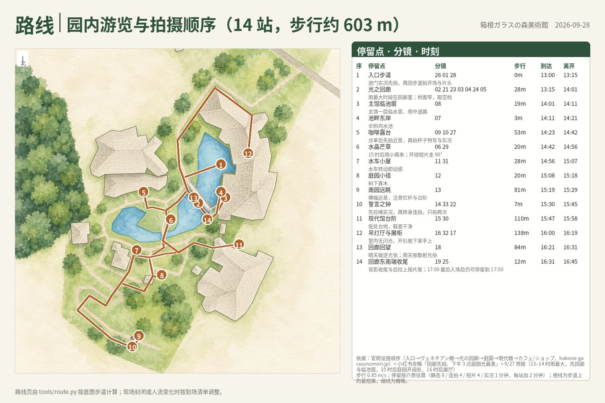
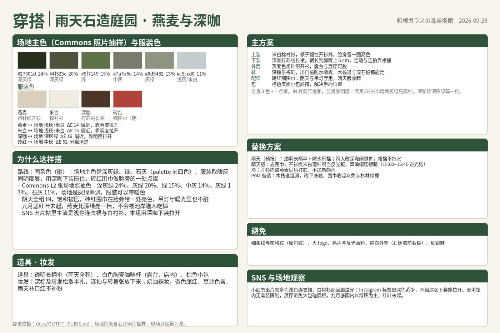

# xiezhen-shoot-pipeline

**给真实景点、真实日期做人像外拍规划的流水线。** 输入景点（一个或一天里的几个）和日期，得到一套可以直接带去现场的东西：一日行程页、穿搭方案、园内游览路线页、每条分镜一页的拍摄小抄（示意图 + 相机设置 + 俯视站位与光向图 + 姿势引导 + 注意事项），外加时间线、模特一页纸、到场核对清单和短片剪辑单。

底层由几类工具拼起来：OpenStreetMap 出园区几何、步道和周边 POI，astral / pvlib 与 Open-Meteo 算太阳位置、地形遮挡和天气光质，Wikimedia Commons 的场地照片抽主色给穿搭用，Claude 在已登录的 Chrome 里做小红书 / Instagram / 抖音 / TikTok 的机位与穿搭调研并写分镜，[nuyoah-xiezhen-prompt](https://github.com/nuyoah-ai-works/nuyoah-xiezhen-prompt) 把分镜编译成写真 prompt，[codex-imagegen-cli](https://github.com/jdmnk/codex-imagegen-cli) 用 ChatGPT 订阅内的 Codex 额度出示意图和水彩底图。

> A portrait-shoot planning pipeline for a real location on a real date: OSM geometry, sun position with terrain occlusion and weather-based light quality, social-media research, an outfit plan checked against the site's dominant colours, a narrative shot list (stills, bursts, S-Log3 clips, Live Photos) validated by a linter, an in-park walking route computed on OSM footpaths, prompts compiled by nuyoah-xiezhen-prompt, preview images from Codex Image, and one printable cheat-sheet card per shot. Docs are in Chinese; the code and templates are language-neutral.


## 一份小抄 PDF 里有什么

以 [`examples/hakone-0928-v3/`](examples/hakone-0928-v3/)（箱根ガラスの森美術館，2026-09-28，13:00 到场，α7 V + 24-105mm F4，v3.3，37 页）为例，PDF 从前到后：

| 页 | 内容 | 由谁生成 |
|---|---|---|
| 行程页 | 一天里各景点按真实经纬度的示意地图、点间交通（线路、发到时刻、分钟）、每站到达离开时刻、来源 | `trip.json` → `tools/trip.py` |
| 穿搭页 ×2 | 场地主色（Commons 照片抽样）与服装色的 ΔE 分离度、路线（同系/邻近/补色点缀）、主方案、雨晴冷替换、道具妆发、逐张着装提醒 | `palette.py` + `outfit.json` → `make_outfit_page.py` |
| 路线页 | 水彩底图上沿步道算出的游览路线、编号站点、每站分镜、步行距离、到达与离开时刻 | `meta.route_stops` → `tools/route.py` |
| 分镜 ×33 | 按路线顺序排：20 张静态、2 张连拍、5 条 S-Log3 短片关键帧、6 条 iPhone 实况；每页一张示意图、相机设置（按介质切换）、俯视站位与光向、姿势引导、光线与备选、时段与注意 | `shotlist.json` + 示意图 → `make_cards.py` |






底图：左为 OSM 几何直接渲染，右为 Codex `edit` 模式按固定指令重绘的水彩版，形状位置不变，所以能在上面按经纬度精确叠加站位、相机、太阳方向和步道路线。


小抄右栏的俯视图：人物居中，相机位置与距离、背景方向、晴天版太阳方位（按 `sun.json` 该时刻取值）都是程序叠加的。


太阳轨迹与地形遮挡（`sun_path.png`）：


其它两个示例：[`examples/asakusa-0928/`](examples/asakusa-0928/)（浅草寺，密集城区用南北两张底图，12 张）和 [`examples/hakone-0928-v2/`](examples/hakone-0928-v2/)（箱根 1.0 版，13 张，含 Pola 美术馆园外底图）。


## 工作流


| 阶段 | 做什么 | 谁做 | 规则文档 |
|---|---|---|---|
| 0 立项 | `pipeline.py init`：地点、日期、到场、器材 | 脚本 | [WORKFLOW](docs/WORKFLOW.md) |
| 1 出片点 | `spots`：周边 POI、Commons 照片、调研关键词；再做网页调研 | 脚本 + Claude | |
| 2 SNS 调研 | 小红书 / Instagram / 抖音 / TikTok 人工级浏览，记机位、时段、活动、穿搭观察 | Claude in Chrome | [WORKFLOW §2](docs/WORKFLOW.md) |
| 2b 穿搭 | `palette` 抽场地主色 → `outfit.json`：≤ 3 色、与场地色 ΔE ≥ 12、替换方案、逐张提醒 | 脚本 + Claude | [OUTFIT_GUIDE](docs/OUTFIT_GUIDE.md) |
| 3 光线 | `sun`：逐半小时方位高度、DEM 地形遮挡、天气光质 | 脚本 | |
| 4–5 底图 | `basemap` → `stylize`：OSM 几何 → Codex 水彩重绘 | 脚本 + 本机 Codex | |
| 6 分镜 | 叙事角色、景别配比、寄り/引き 节奏、姿态视线，加连拍 ≥ 2 / 短片 ≥ 5 / 实况 ≥ 6；`lint` 检查 | Claude + 脚本 | [SHOT_DESIGN](docs/SHOT_DESIGN.md)、[VIDEO_NOTES](docs/VIDEO_NOTES.md) |
| 6b 路线 | `meta.route_stops` → `route`：沿步道最短路、停留与时刻；多景点 `trip.json` → `trip` | Claude + 脚本 | [ROUTE_NOTES](docs/ROUTE_NOTES.md) |
| 7 prompt | 系列母版 + 同系列变体，短片与实况写关键帧 | Claude | [prompt_chains](templates/prompt_chains.md) |
| 8–9 出图与检查 | `jobs [--missing]` → `shots`；逐张按第六步检查，状态 test / failed | 脚本 + 本机 Codex + Claude | |
| 10 小抄 | `cards`：行程 → 穿搭 → 路线 → 分镜（按路线顺序），`<日期>_<地点>_拍摄小抄.pdf` | 脚本 | [CARD_SPEC](docs/CARD_SPEC.md) |
| 11 当天资料 | 时间线、模特页、到场清单、剪辑单 | Claude | [templates/](templates/) |

## 快速开始

新电脑从零安装（Windows 双击 `setup.cmd`、codex-imagegen、装 skill、自测）按 [`INSTALL.md`](INSTALL.md) 走，约 10 分钟。已装好的机器：

```bash
git clone https://github.com/utopiabelmont/xiezhen-shoot-pipeline.git
cd xiezhen-shoot-pipeline
pip install -r requirements.txt        # Windows：双击 setup.cmd
python check_env.py
python pipeline.py register            # 登记仓库路径，Claude 的 skill 据此找到本机仓库

# 脚本阶段
python pipeline.py init    hakone-1003 --place "箱根ガラスの森美術館" --date 2026-10-03 --arrive 13:00 --hours 12-18 --elev-m 657
python pipeline.py spots   hakone-1003
python pipeline.py palette hakone-1003           # 场地主色 → 写 outfit.json
python pipeline.py sun     hakone-1003
python pipeline.py basemap hakone-1003 --meters 130
python pipeline.py stylize hakone-1003           # 需要本机 codex-imagegen（ChatGPT 登录）

# 人工阶段：spots_social.md、outfit.json、shotlist.json（含 route_stops）、trip.json、prompts.md

python pipeline.py lint    hakone-1003           # 分镜基本法 + 动态素材配比 + 穿搭色检查
python pipeline.py route   hakone-1003 --speed 0.85
python pipeline.py jobs    hakone-1003           # prompts.md → inbox/hakone-1003.jsonl（先自动 lint）
python pipeline.py shots   hakone-1003           # → out/hakone-1003/*.png + log.jsonl
python pipeline.py cards   hakone-1003           # → 行程 / 穿搭 / 路线页 + 分镜卡 + PDF
python pipeline.py status  hakone-1003
```

不联网自测：`spots` / `sun` 加 `--fixture`；`basemap` 加 `--fixture overpass_geom_pola.json --center 35.25666,139.02120`。想直接看完整产物：把 `examples/hakone-0928-v3` 复制到 `plans/`，跑 `python pipeline.py cards hakone-0928-v3 --images examples/hakone-0928-v3/cards`。

## 和 Claude 一起用

[`skill/xiezhen-shoot-planner/SKILL.md`](skill/xiezhen-shoot-planner/SKILL.md) 是给 Claude（Claude Code / Cowork / claude.ai）用的流程 skill，安装方式见 [`INSTALL.md`](INSTALL.md) 第 4 节，阶段总览见 [`skill/README.md`](skill/README.md)。装好后只要说日期和地点：

> 10 月 3 日去箱根玻璃之森和 Pola 美术馆，13 点到，帮我做拍摄小抄。

器材不说就用默认（Sony α7 V + 24-105mm F4 + HVL-F60RM2，iPhone 14 Pro 拍实况）。Claude 会按阶段号跑脚本、做网页与 SNS 调研、抽色定穿搭、写分镜和路线、编 prompt、出图、检查、合成 PDF，并给出时间线、模特页、到场清单和剪辑单。人工阶段的判断标准都写在 skill 与 `docs/` 里，生成图只标 test / failed，用户确认后才 final。

仓库路径不写死在 skill 里：Claude 按 对话指定 → 已连接文件夹里含 `pipeline.py` 的目录 → `~/.xiezhen-pipeline/config.json`（`pipeline.py register` 写入）的顺序找。

## 目录

```
pipeline.py            统一入口：init / spots / sun / palette / basemap / stylize / lint / route / trip / jobs / shots / outfit / cards / status / register
run_shots.py           inbox/*.jsonl → codex-imagegen 逐条出图 → out/<批次>/ + log.jsonl（每条只提交一次，失败只记录）
check_env.py           依赖与工具自检
tools/
  geo_common.py        地理编码、方位、距离、HTTP（含离线 fixture 与重试）
  spots.py             周边 POI + Commons 照片 + 调研关键词
  sun_light.py         太阳位置（astral，pvlib 交叉验证）、地形遮挡（DEM 环采样）、天气光质
  osm_geometry.py      Overpass out geom → 分层几何（林地/空地/草地/水面/建筑/道路/步道/POI）→ 底图
  basemap.py           几何渲染，v1 手工格式与 v2 分层格式都能读
  palette.py           场地照片抽主色（穿搭依据）
  make_outfit_page.py  穿搭页（色卡、ΔE 分离度、方案、逐张提醒）
  route.py             园内路线：步道图最短路、停留估算、路线页
  trip.py              一日多景点行程页
  make_cards.py        分镜小抄页：多底图、室内、园外窗口、半点太阳表、按介质切换设置块
  fixtures/            离线样本（Nominatim、Overpass、Commons、Open-Meteo、高程）
templates/             分镜模板与 JSON Schema、prompt 词链、SNS 调研表、穿搭 / 行程 / 剪辑单 / 时间线 / 到场清单 / 模特页模板、底图风格指令、手工几何示例
scripts/               Windows：setup.ps1（uv + venv + 自检 + register）、job.example.ps1（一次性任务模板，UTF-8 BOM）
setup.cmd run_job.cmd run_shots.cmd   Windows 双击入口
skill/                 Claude 用的流程 skill 与阶段总览
INSTALL.md             新电脑安装说明（Windows / macOS / Linux、codex-imagegen、skill、更新、常见问题）
docs/                  WORKFLOW（SOP）、SHOT_DESIGN（分镜基本法）、OUTFIT_GUIDE（穿搭）、VIDEO_NOTES（连拍/短片/实况）、ROUTE_NOTES（行程与园内路线）、CAMERA_NOTES（α7 V 外观、闪光灯、短片预设）、CARD_SPEC（小抄版式）、WINDOWS_SETUP（部署与已知坑）、CHANGELOG
examples/              hakone-0928-v3（v3.3，37 页）、asakusa-0928（12 张，双底图）、hakone-0928-v2（13 张）
plans/ inbox/ out/ refs/   运行时目录（不入库；要保留的企划复制到 examples/）
```

## 数据源与依赖

| 用途 | 来源 | 说明 |
|---|---|---|
| 太阳位置 | astral、pvlib | 离线计算，两者交叉验证一致（0.05° 内） |
| 天气、高程 | Open-Meteo | 云量、直射/散射辐射、降水概率（16 天预报）；90 m DEM 估算地形遮挡角 |
| 地理编码 | Nominatim | ≤ 1 次/秒，脚本自带 User-Agent |
| 园区几何、步道、POI | Overpass API（OpenStreetMap，ODbL） | `out geom`，POST 请求；缺失步道用 `--extra` 手工补线 |
| 场地照片与主色 | Wikimedia Commons geosearch | 看常见机位与季节；`palette.py` 抽 6 个主色 |
| 社交平台 | 小红书 / Instagram / 抖音 / TikTok | 无公开接口；由 Claude 在已登录的 Chrome 里人工级浏览，只记录文字线索 |
| 交通与路线依据 | NAVITIME / 官网时刻表 / 官网設施顺序 / 攻略 | 由 Claude 查询后写进 `trip.json` 与 `meta.route_source`，注明查询日期 |
| 出图 | codex-imagegen-cli（Codex 内部图片接口） | 用 Codex 桌面版 / CLI 的 ChatGPT 登录，走订阅额度；模型由服务端决定 |
| prompt 规则 | nuyoah-xiezhen-prompt | 系列母版、同系列变体、第六步检查 |

天气光质判定：直射比 ≥ 0.5 且云量 < 60% 为晴天硬光；≥ 0.5 为高云透光；0.2–0.5 薄云；< 0.2 阴天。分镜默认按预报编排，另一种天气作备选。

## 已知限制

- Codex 内部图片接口是 alpha：尺寸不保证（1152x1536 会返回 1086x1448），不能指定模型。要固定模型请改用官方 Images API。
- Open-Meteo 预报只有 16 天，更早的日期只有天文数据；出发前一天再跑一次 `sun`。
- OSM 里没有的步道只能用 `--extra` 画概略线，小抄与路线页上会注明「概略」；路线页的停留时间是按介质估算的，不是实测。
- 行程页的景点连线是直线，不代表道路；班次以出发当天查询为准。
- 官网的園内マップ只用来读设施顺序，不放进小抄；场地主色来自公开照片抽样，与当季实景可能有差。
- 地形遮挡按 DEM 估算，园内树木与建筑的遮挡要现场判断。
- 生成图只是示意，小抄页脚固定写「AI 拍摄示意，非现场实拍」；分镜状态只有 test / failed，用户确认后才 final。
- PowerShell 5.1 只认带 BOM 的 UTF-8 脚本；改 `job.ps1` 时注意保存编码（`docs/WINDOWS_SETUP.md` 第 5 节）。

## 许可

MIT。OSM 数据遵循 ODbL；Commons 图片各自许可；社交平台内容只记录文字线索，不保存图片。
