[English](README.md) | **简体中文** | [日本語](README.ja.md)

# xiezhen-shoot-pipeline

**给真实景点、真实日期做人像外拍规划的流水线。** 输入景点（一个或一天里的几个）和日期，得到一套可以直接带去现场的东西：含当天天气的一日行程页、穿搭方案、园内游览路线页、每条分镜一页的拍摄脚本 PDF（示意图 + SNS 原帖来源与二维码 + 相机设置 + 俯视站位与光向图 + 姿势引导 + 注意事项），一份手机上逐条勾选的核对表 HTML，外加时间线、模特一页纸、到场核对清单和短片剪辑单。

分镜从社交平台上这个场地真实出过片的机位和姿势出发：Codex / Claude 在浏览器里看小红书、Instagram、抖音、TikTok 的原帖，把机位、构图和姿势写成文字，每张分镜照一条帖子设计同款，素材覆盖不到的地方再补；示意图只凭这段文字生成，原帖图片不下载、不截图，也不交给生图模型。分镜编号按游览路线排，现场从 01 拍到最后一张。

底层由几类工具拼起来：OpenStreetMap 出园区几何、步道和周边 POI，astral / pvlib 与 Open-Meteo 算太阳位置、地形遮挡和天气光质，Wikimedia Commons 的场地照片抽主色给穿搭用，Codex / Claude 用可访问的登录浏览器做小红书 / Instagram / 抖音 / TikTok 的机位与穿搭调研并写分镜，可选的 [nuyoah-xiezhen-prompt](https://github.com/nuyoah-ai-works/nuyoah-xiezhen-prompt) 或仓库词链模板把分镜编译成写真 prompt，[codex-imagegen-cli](https://github.com/jdmnk/codex-imagegen-cli) 用 ChatGPT 订阅内的 Codex 额度出示意图和水彩底图。

> A portrait-shoot planning pipeline for a real location on a real date: OSM geometry, sun position with terrain occlusion and weather-based light quality, social-media research, an outfit plan checked against the site's dominant colours, a narrative shot list (stills, bursts, S-Log3 clips, Live Photos) validated by a linter, an in-park walking route computed on OSM footpaths, prompts compiled by nuyoah-xiezhen-prompt, preview images from Codex Image, and one printable cheat-sheet card per shot. Docs are in Chinese; the code and templates are language-neutral.

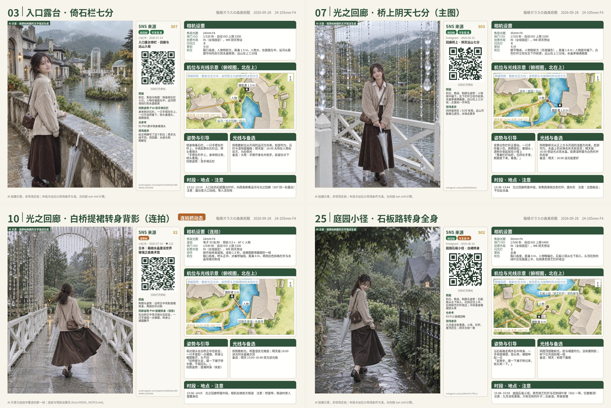

## 拍摄脚本 PDF 与核对表

每个企划产出两份给现场用的文件：`<日期>_<地点>_拍摄脚本.pdf`（打印或平板看）和 `<日期>_<地点>_拍摄核对表.html`（手机打开逐条勾选）。下面三个实战案例都附完整成品，点标题展开。

### 实战案例 1：箱根ガラスの森美術館（雨天、单机身）

<details><summary><b>箱根ガラスの森美術館 · 2026-09-28 · 雨天 · 13:00 到场 · α7 V + 24-105mm F4 · 38 条分镜 · 47 页（点击展开）</b></summary>

<br>

成品在 [`examples/hakone-0928-v5/`](examples/hakone-0928-v5/)（v5）。PDF 从前到后：

| 页 | 内容 | 由谁生成 |
|---|---|---|
| 行程页 | 一天里各景点按真实经纬度的示意地图、点间交通（线路、发到时刻、分钟）、每站到达离开时刻；当天天气（行程时段逐时的天气、降水量、降水概率、气温与体感、风速，日落与地形遮挡后的直射截止，对行程和穿着的提醒）、来源 | `trip.json` + `sun.json` → `tools/trip.py` |
| 穿搭页 ×2 | 场地主色（Commons 照片抽样）与服装色的 ΔE 分离度、路线（同系/邻近/补色点缀）、主方案、雨晴冷替换、道具妆发、逐张着装提醒 | `palette.py` + `outfit.json` → `make_outfit_page.py` |
| 路线页 | 水彩底图上沿步道算出的游览路线、编号站点、每站分镜、步行距离、到达与离开时刻 | `meta.route_stops` → `tools/route.py` |
| 分镜 ×38 | 编号即游览顺序：25 张照着 SNS 素材设计（7 条机位帖、13 个姿势帖里的姿势、小红书「问点点」汇总），13 张补充（过渡、细节、连拍、短片、实况）。每页一张示意图；来源栏写素材类型与可复现度、平台与日期、原帖标题、原帖二维码、照搬了什么、同款姿势、今天现场的差异；右栏相机设置（按介质切换）、俯视站位与光向、姿势引导、光线与备选、时段与注意 | `shotlist.json`（`src`）+ 示意图 → `make_cards.py` |
| 运镜页 ×5 | 每条短片卡后面一页：以人物为中心的俯视轨迹（相机与人物的起止位置、每秒位置）、侧视机高与俯仰、操作要点、起 / 中 / 止三帧（Codex 按文字画的 9:16 画面，没有时用按焦段与距离推算的线稿）、时间条与 S&Q 成片时长 | `clip` + `move_frames/` → `tools/moves.py` |

核对表把同一份企划里要在现场确认的内容排成勾选清单：出发前的器材（按分镜用到的焦段与介质自动列出连拍、S-Log3 短片、ND、iPhone 实况的设置项）、服装道具与妆发、行程班次、到场核对、按路线停留点分组的全部分镜（缩略图、焦段景别视线、对模特说的一句话、SNS 来源与原帖链接，展开可看机位、光线、短片起止与曝光）、短片运镜一览、收尾。顶部有总进度和按介质的计数，可以只看未完成或只看某种介质；出行当天打开会标出当前时刻所在的停留点。勾选状态只存在这台设备的浏览器里，不联网。

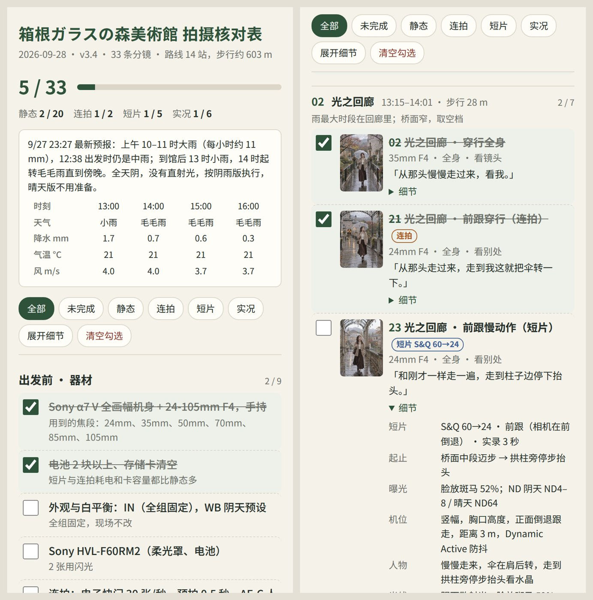

分镜页的两种来源栏：上面一张照着 Instagram 机位帖设计（主图），下面一张是补充分镜。

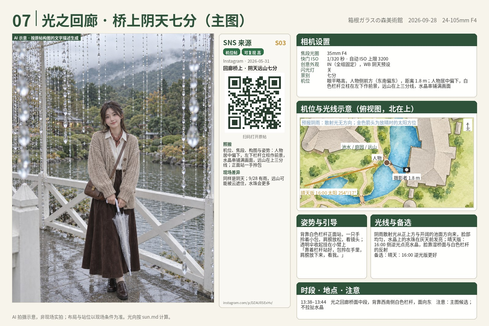

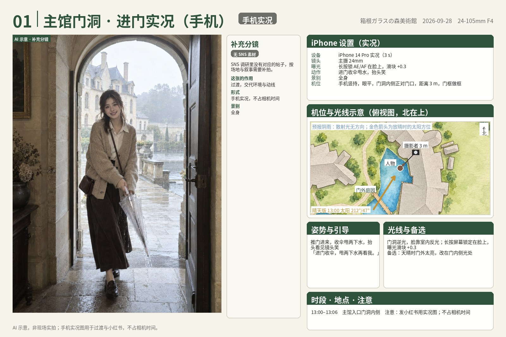

单条运镜页（俯视轨迹、侧视俯仰、操作要点、起 / 中 / 止三帧）。核对表里有「短片运镜一览」和每条短片的「运镜示意」展开项：

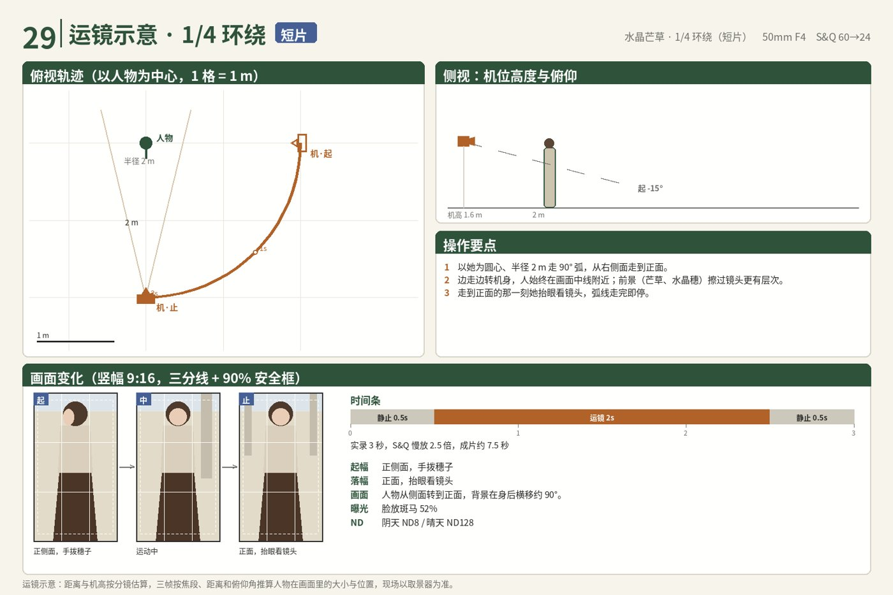

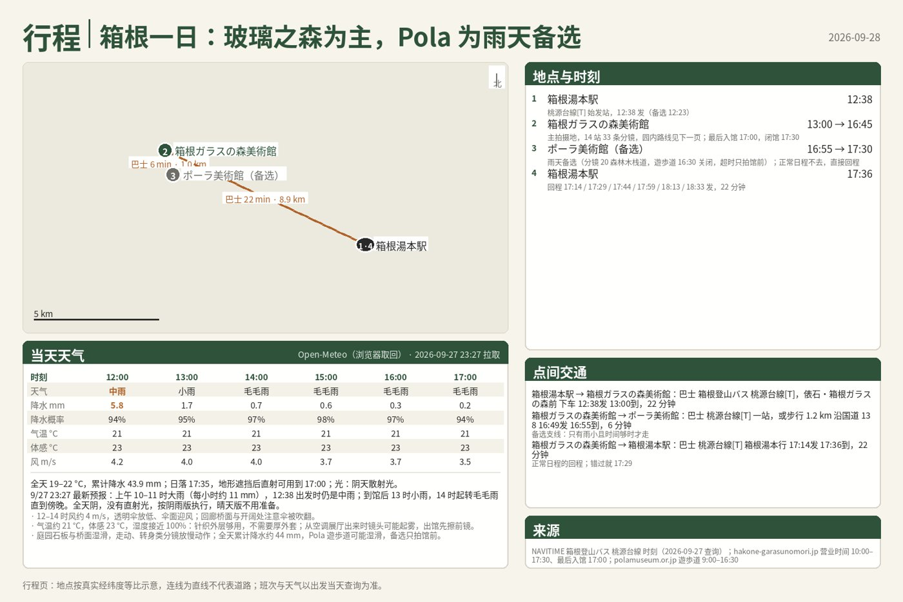


底图：左为 OSM 几何直接渲染，右为 Codex `edit` 模式按固定指令重绘的水彩版，形状位置不变，所以能在上面按经纬度精确叠加站位、相机、太阳方向和步道路线。


小抄右栏的俯视图：人物居中，相机位置与距离、背景方向、晴天版太阳方位（按 `sun.json` 该时刻取值）都是程序叠加的。


太阳轨迹与地形遮挡（`sun_path.png`）：


</details>

### 实战案例 2：东京塔（城区、晴天、四台设备）

<details><summary><b>东京塔 · 2026-10-03 · 晴天 · 15:20 到场 · α7 V / GR IV / Pocket 3 / iPhone · 27 条分镜 · 37 页（点击展开）</b></summary>

<br>

对 Codex / Claude 说的话：

> /xiezhen-shoot-planner 给东京塔的出片位置写拍摄脚本。日期没定，接下来哪天晴天就哪天出发；设备是 iPhone 14 Pro、索尼 a7M5 + 24-105 F4、理光 GR4 和大疆 Pocket 3。

成品在 [`examples/tokyotower-1003/`](examples/tokyotower-1003/)：`2026-10-03_东京塔_拍摄脚本.pdf`（37 页）与 `2026-10-03_东京塔_拍摄核对表.html`。

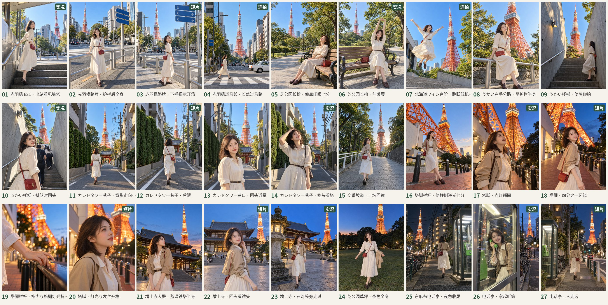

和实战案例 1 不一样的地方：

- **日期按预报定**。用户只说「哪天晴天就哪天」，先查 tenki.jp、Weathernews 与 Open-Meteo，取最近的晴天 10/3（降水 20%，15–16 时云量 0–3%），10/10、10/11 作备选。`sun.md` 给出日落 17:23、蓝调 17:39–17:49；城区高楼比地形更早挡光，17 时以后地面已没有直射光，只剩塔身上部受光。
- **按光线排路线**。下午先拍塔南、塔西的顺光面（赤羽橋路牌、芝公园长椅、北海道ワイン台阶、うかい楼梯、カレドタワー巷子），17:00 转到塔东，在塔脚等 17:22 前后点灯，17:46 到增上寺拍大殿与亮灯铁塔的蓝调主图，最后在东麻布的电话亭收尾。11 站，步行约 2.75 km，15:20 → 18:42。
- **城区用多张底图**。700 m 的总图只用来算路线；分镜卡的俯视图用南、西、东三张 360–400 m 的分区底图，放大后街巷仍看得清。风格化时有两张把步道画成了水渠，加 `--prompt-extra` 写明「没有任何河流与水面」重画一次。
- **四台设备分工**。α7 V + 24-105 拍主线照片、连拍和 S-Log3 短片；GR IV 拍坡道回眸与电话亭收尾，后者照的是抖音上一条用 GR4 拍的同一个电话亭；Pocket 3 拍巷子后跟和塔脚环绕两条云台短片；iPhone 拍 7 条实况。SNS 调研按每台设备各搜一轮，同款设备的帖子优先复刻。
- **SNS 素材**。机位帖 13 条（小红书两篇高赞笔记逐图拆成 10 条，抖音 1 条，Instagram 2 条），平台汇总 2 条（小红书「点点」47 篇笔记、抖音一篇 12 机位图文的文字）。14 张照片里 12 张照着素材设计，2 张（巷口近景、塔脚指尖特写）与全部短片、实况是补充分镜。
- **穿搭**。场地是灰色街道、晴空蓝与铁塔的国际橙，服装取与橙相邻的米白、浅驼，番茄红小包作唯一的饱和色；17 时后加薄风衣，夜景里米白衬衫裙给脸下方留一块亮面。

| 页 | 数量 | 内容 |
|---|---|---|
| 行程页 | 1 | 赤羽橋站进出、备选的麻布台之丘 33 层、15–20 时逐时天气 |
| 穿搭页 | 2 | 场地色与服装色 ΔE、主方案、转阴 / 雨天 / 灯光银白版的替换、27 条逐张提醒 |
| 路线页 | 1 | 总图上的 11 站与每站到达离开时刻 |
| 分镜 | 27 | 14 张照片（含 2 张连拍）、6 条短片、7 条实况，编号即游览顺序 |
| 运镜页 | 6 | 下摇揭示、后跟、四分之一环绕、固定升格、固定转身回眸、人走远 |

四张分镜卡：赤羽橋路牌主图（小红书机位帖）、うかい右手公路坐护栏（抖音图文的文字）、增上寺蓝调主图（小红书点点汇总）、电话亭收尾（GR IV 同款设备）。

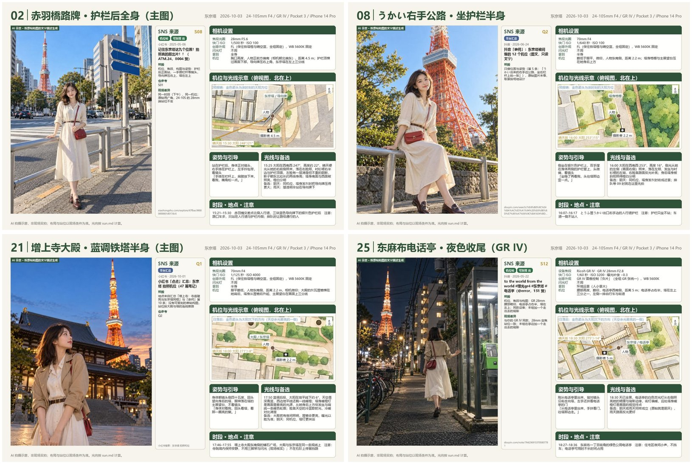

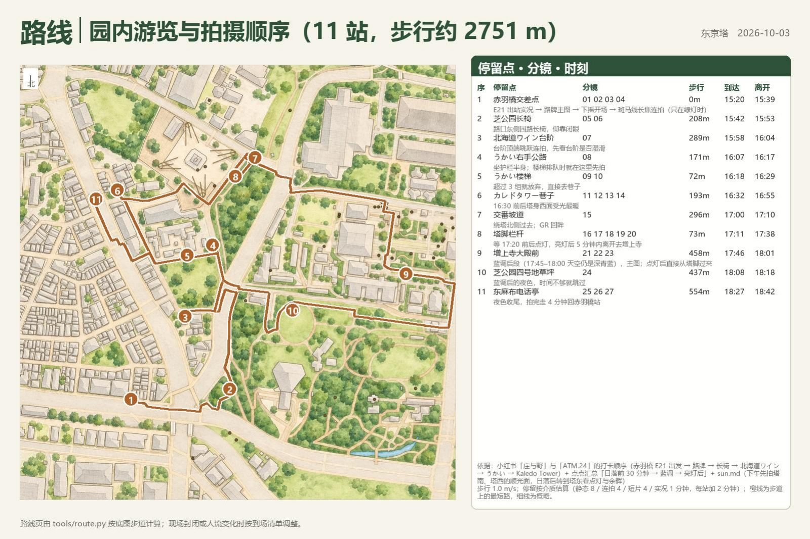

一张总图加三张分区底图：

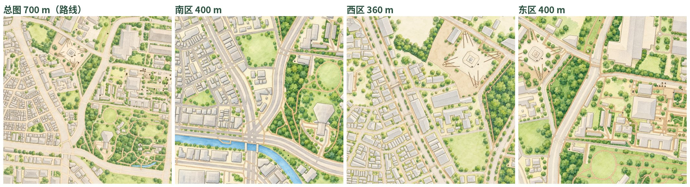

塔脚的四分之一环绕（Pocket 3）：起幅在点灯前，落幅时塔身已亮。

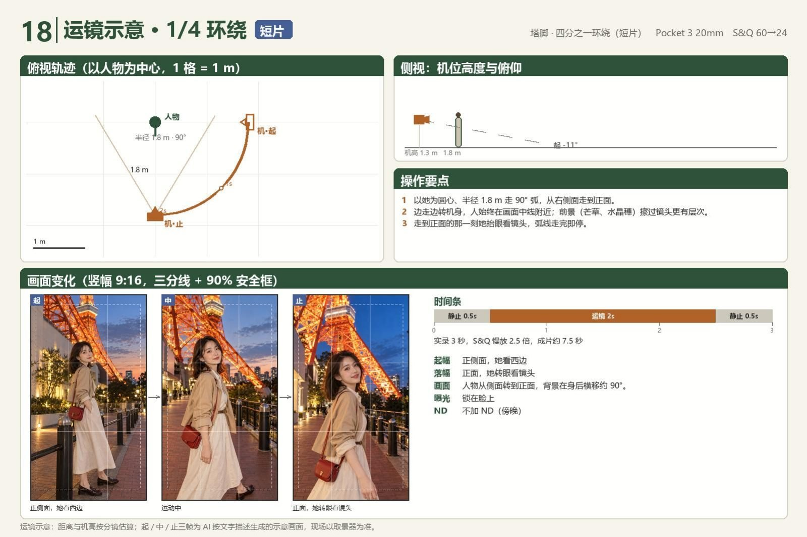

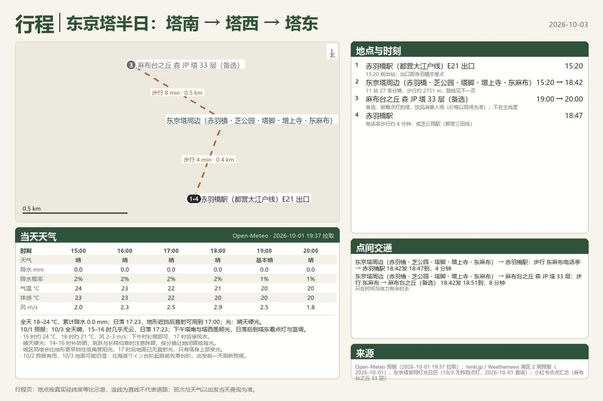

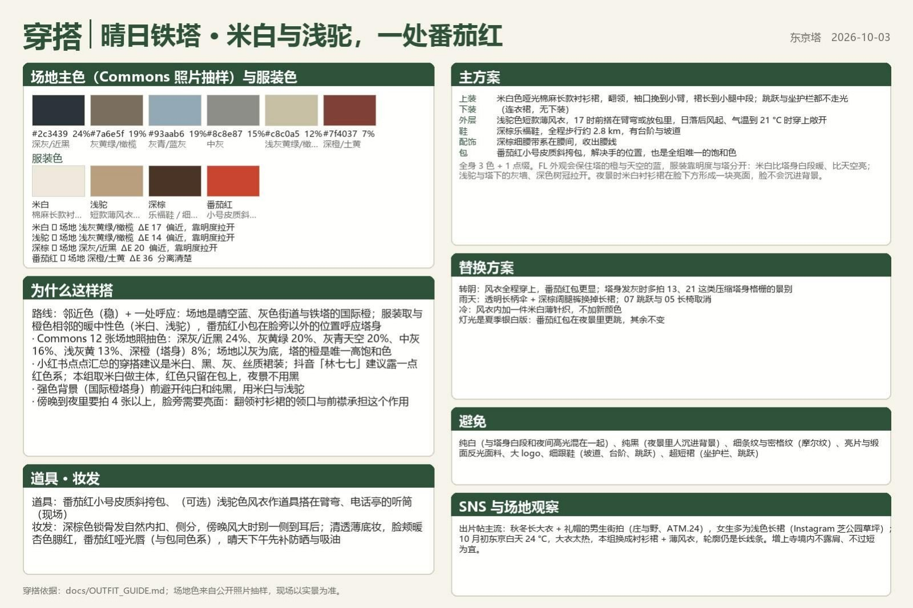

出图记录：21 张照片与实况、18 张短片三帧，分三路并行一次提交。逐张检查后 5 张改写取景段重出：19 的背景塔身太清楚，和 105mm 浅景深不符；20 的三帧景别前后不一致；22 的起幅应是回望铁塔的侧后脸，生成成了看镜头。第二轮里有一张卡住 12 分钟，手动中止后重新提交。两轮记录都在 `generation_log.jsonl`，被替换的标为 `failed` 并写明原因。

</details>

### 实战案例 3：衡阳一日四景点（阴转阵雨、只用 iPhone）

<details><summary><b>衡阳一日四景点 · 2026-10-03 · 阴、傍晚阵雨 · 08:30–19:30 · 仅 iPhone 16 Pro Max · 4 个企划 103 条分镜 · 4 份 PDF 共 139 页（点击展开）</b></summary>

<br>

对 Codex / Claude 说的话，同时附上一张小红书路线图截图（石鼓书院 → 保卫里 → 解放路 → 东洲岛，标了打车分钟数）：

> /xiezhen-shoot-planner 使用这个 skill 对上传给你的这四个景点进行为期一天的旅拍脚本制作，出行时间是 10.3 明天，设备是 iPhone 16 Pro Max，脚本数量不设上限能找到的都做，但是要做查重

成品在 [`examples/hengyang-1003/`](examples/hengyang-1003/)，每个景点一个企划文件夹，各有一份 `2026-10-03_<地点>_拍摄脚本.pdf` 与 `2026-10-03_<地点>_拍摄核对表.html`：

| 企划 | 景点 | 时段 | 照片（另有备选） | 短片 / 实况 | 主图 | PDF |
|---|---|---|---|---|---|---|
| [`hy-shigu-1003`](examples/hengyang-1003/hy-shigu-1003/) | 石鼓书院 | 08:30–10:55 | 12（+3） | 5 / 6 | 大观楼格扇门前全身持扇 | 35 页 |
| [`hy-baoweili-1003`](examples/hengyang-1003/hy-baoweili-1003/) | 保卫里 | 11:10–13:56 | 15（+4） | 5 / 6 | 站台抱花半身（人像模式） | 39 页 |
| [`hy-jiefang-1003`](examples/hengyang-1003/hy-jiefang-1003/) | 解放路 | 14:10–16:07 | 9 | 5 / 6 | 3D 屏下低机位仰拍 | 29 页 |
| [`hy-dongzhou-1003`](examples/hengyang-1003/hy-dongzhou-1003/) | 东洲岛 | 16:20–19:30 | 13（+3） | 5 / 5（+1） | 廊桥灯笼下倚栏回眸 | 36 页 |

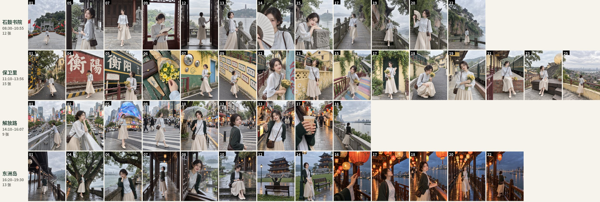

和实战案例 1、2 的比较：

| | 案例 1 箱根 | 案例 2 东京塔 | 案例 3 衡阳 |
|---|---|---|---|
| 范围 | 一个场馆 | 一个景点及周边街区 | 一天四个景点，各建一个企划 |
| 日期与天气 | 指定日期，全程雨 | 按预报挑最近的晴天 | 指定次日，全天阴，16–18 时阵雨 |
| 设备 | α7 V + 24-105 | α7 V、GR IV、Pocket 3、iPhone 分工 | 只有 iPhone 16 Pro Max |
| SNS 素材 | 7 条机位帖、13 条姿势帖 | 13 条机位帖、2 条平台汇总 | 24 篇帖子拆出 56 条机位、7 条平台汇总 |
| 分镜数 | 38 | 27 | 103（不设上限，查重后保留） |
| 路线依据 | 官网设施顺序、攻略、逐时雨量 | 攻略顺序、光线方向与点灯时刻 | 用户给的路线图；景点内按开放时间、阵雨与日落 |
| 页数 | 47 | 37 | 4 份共 139 |

具体差别：

- **一天四个景点**。景点顺序与车程照用户给的路线图（烛染尘「衡阳2天1夜保姆级攻略」的 DAY1）。每个景点各有自己的底图、路线页和从 01 开始的编号；四个企划共用同一份 `trip.json`，所以四份 PDF 的第一页是同一张全天行程页：08:30 石鼓书院 → 11:10 保卫里 → 14:10 解放路 → 16:20 东洲岛 → 19:30 收工，点间打车 15、11、12 分钟。景点内部再按开放时间、阵雨和日落排序：石鼓书院放在开门后人最少的 8:30–10:00；东洲岛 17 时阵雨最大的那段排在船山书院回廊下，夫之楼草坪排在 18:00 前后，廊桥灯笼排在日落之后。
- **只用一台手机**。焦段写成 iPhone 的镜头档位（0.5× 13mm、1× 24/28/35mm、2× 48mm、人像模式 2×、5× 120mm）。短片分三档：录像 4K 24 fps 实时、4K 60 fps 回家放 24p、慢动作 4K 120 fps，对应案例 1、2 里 α7 V 的 S&Q 预设；连拍是按住快门向左滑。没有外闪，全组不开闪光，夜景靠灯笼和夜间模式。SNS 除了按景点搜，还按设备另搜了一轮「衡阳 iPhone 拍照」（小红书点点汇总 59 篇）。
- **不设上限，但要查重**。四个景点共读了 24 篇帖子，拆出 56 条机位，同一面墙、同一棵树常被几篇帖子拍过。这次多了查重一步，每个企划写一份 `dedupe.md`，按四条规则处理：同一站位、同一景别的素材合并成一张，次要帖子记进 `src.also`；同一站位但景别或姿势不同的，留一张照片，其余改成实况或短片；同组里「姿态 + 视线 + 景别」重复的列为备选；位置不明或季节不符的不出分镜。结果是 49 张主线照片（含 8 张连拍）、10 张备选、20 条短片、24 条实况，`dedupe.md` 里有逐条的「素材 → 分镜」对照。
- **夜景帖改成日景**。解放路在 SNS 上几乎都是夜景（天桥车流、港风招牌），这天下午到，就全部改成阴天日景，原帖的夜景写法留在每张卡的「备选」里。
- **一套衣服走四个景点**。月白盘扣短衫 + 燕麦长裙，下午加墨绿开衫；道具按景点换：石鼓书院折扇、保卫里黄雏菊、解放路透明伞与小吃、东洲岛伞与折扇。Commons 没有抽到场地照片（palette 0 张），配色按 SNS 帖子里的场地颜色定。
- **底图与坐标的修正**。东洲岛是江心岛，OSM 渲染时把岛当成了水面，另画一版把岛补成陆地再合成；保卫里与解放路第一次风格化被画成了公园，加 `--prompt-extra` 写明是城区街巷后重画；石鼓书院有 9 条分镜的概略坐标落在江面上，人和机位一起平移到最近的岸边（5–23 m）。这三处是在企划里用一次性脚本处理的。
- **当天资料**。每个景点的时间线写了分岔点（预约没约上、合江亭二楼不开、摩崖石刻小路封闭、阵雨最大、灯笼没亮、想坐下吃午饭等）；石鼓书院的 `clips.md` 另附四个景点 10 条短片的全天合辑剪辑单。

四个景点的主图：石鼓书院大观楼（小红书机位帖，原帖团扇换成折扇）、保卫里站台（小红书机位帖，原帖 a6700 中焦，换成 iPhone 人像模式 2×）、解放路 3D 屏（用户给的路线图原图无人，加入人物做 0.5× 低机位仰拍）、东洲岛廊桥（小红书机位帖，阴天没有夕阳，主光换成日落后的灯笼）。

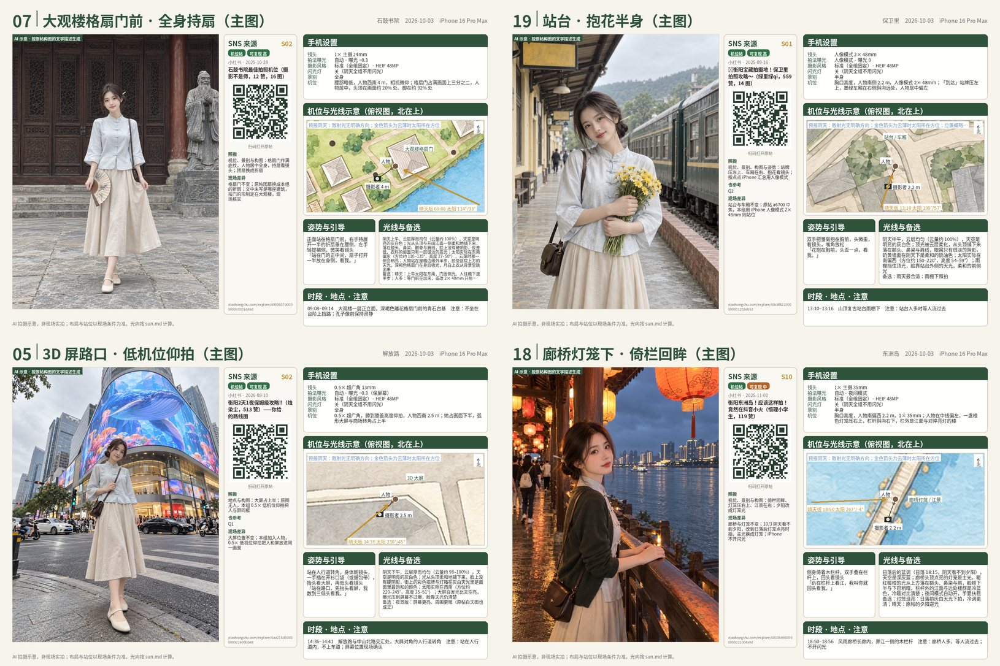

四份 PDF 共用的行程页：

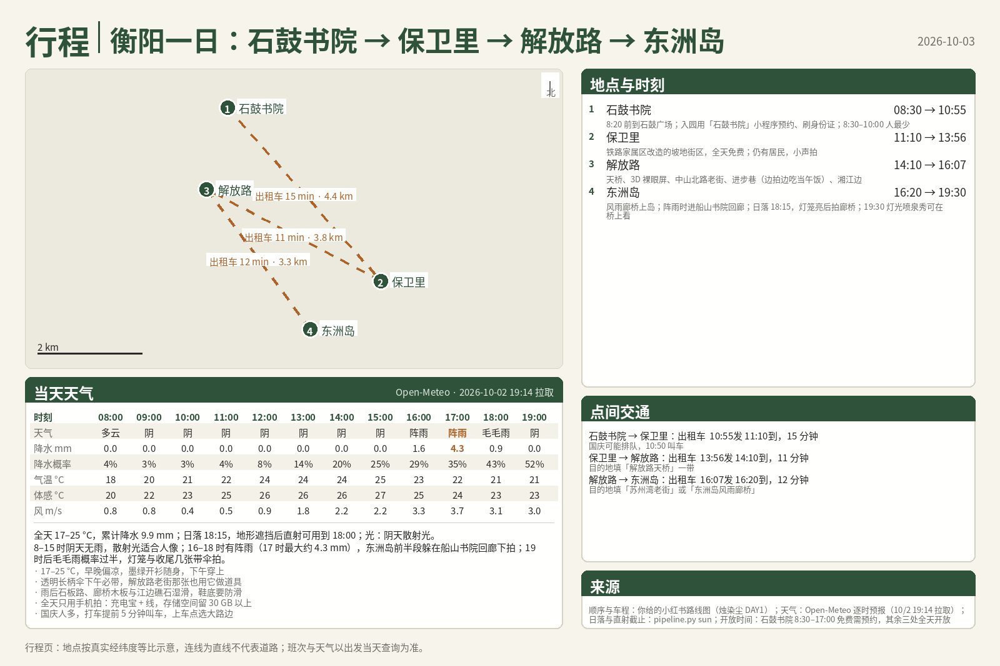

四个景点的路线页：

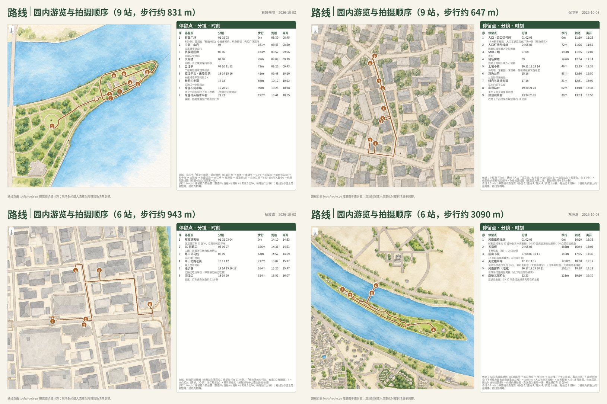

东洲岛 02 的遮挡揭示（开场短片）：起幅是廊柱，横移露出走在廊桥上的人。

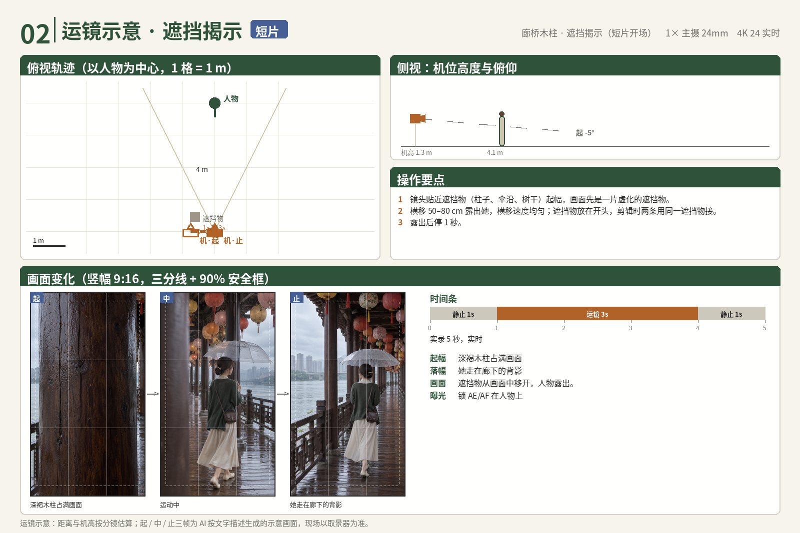

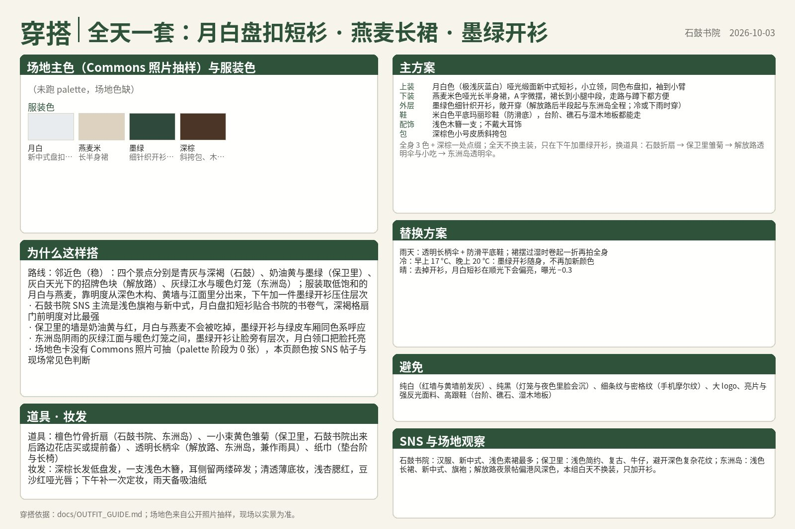

出图记录：103 张示意图与 20 条短片的 60 张三帧，分 8 路并行提交（照片 4 路、运镜帧 4 路），单张多在 30–60 秒，连同重出约 35 分钟。保卫里一路在第 20 张卡住，其余各张另开批次补齐。逐张检查时，东洲岛 02、03 在 16:30 的廊桥上把灯笼画成了点亮的，和「日落后才点灯」不符，光线段加上「灯笼还没点亮」后重出，02 的运镜三帧一起重出；26（罗汉寺三面观音）按缩略图误判为单面像也重出了一次，复核原图后两轮都是三面像。各企划的 `generation_log.jsonl` 与 `generation_log_moves.jsonl` 记了两轮：02、03 的第一轮标为 `failed` 并写明原因，26 的第一轮记为已被替换。

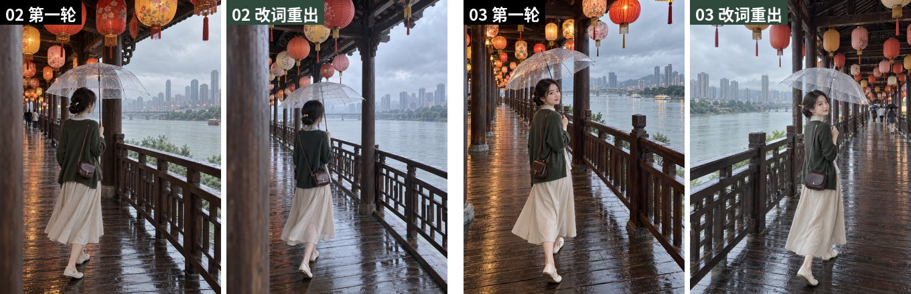

</details>

### 运镜库

11 种运镜，同一位原创人物、同一套服装、同一处虚构的庭园美术馆，`tools/move_gif.py` 合成动图。左边俯视图上橙点是相机、绿点是人物，随画面同步移动；右边是竖幅 9:16 画面。为了让同一条运镜里的背景和人物随轨迹连续变化，画面分两种做法：

- 只动镜头、人物不动的 4 种（下摇揭示、遮挡揭示、固定微推、后拉上摇）：Codex 先画一张包含整段轨迹的大母版，再按运镜路径在母版上连续移动 9:16 取景框，每一帧都取自同一张图，背景和人物不会前后对不上。
- 人物在动、或相机跟着人物走的 7 种：以起幅为参考图做 edit，每帧只改描述里的那部分。侧跟与后跟逐帧接力（第 2 帧以第 1 帧为参考，第 3 帧以第 2 帧为参考……），背景的平移、拱门的靠近一路累积；固定机位的几种都以同一张起幅为参考，构图不变。

逐帧 prompt 与取景路径在 `tools/moves_library_prompts.py`（`MASTERS` / `RECIPES` / `EDITS` / `CHAIN`），原帧与生成记录在 `docs/img/moves/frames/`。

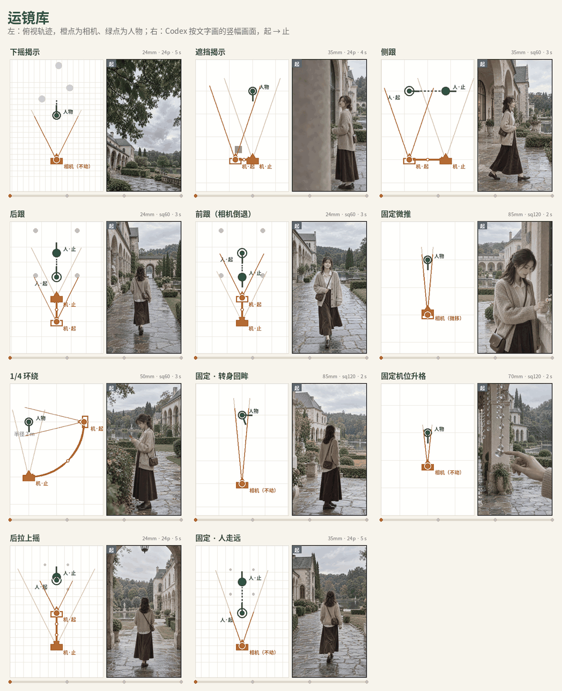

<details><summary>逐条放大看</summary>

<table>
<tr><td align="center"><b>下摇揭示</b><br>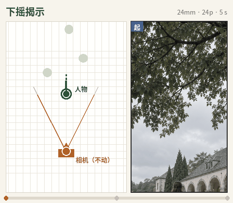</td><td align="center"><b>遮挡揭示</b><br>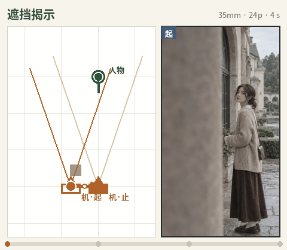</td><td align="center"><b>侧跟</b><br>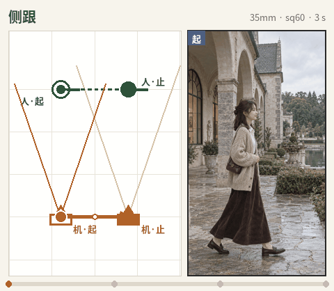</td></tr>
<tr><td align="center"><b>后跟</b><br>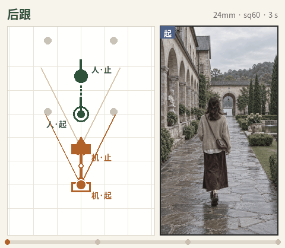</td><td align="center"><b>前跟（相机倒退）</b><br>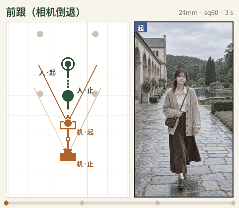</td><td align="center"><b>固定微推</b><br>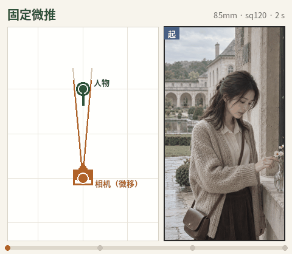</td></tr>
<tr><td align="center"><b>1/4 环绕</b><br>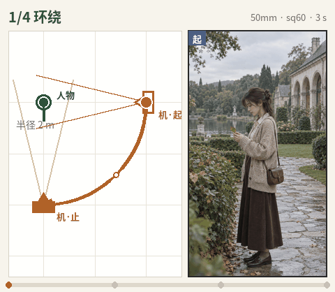</td><td align="center"><b>固定 · 转身回眸</b><br>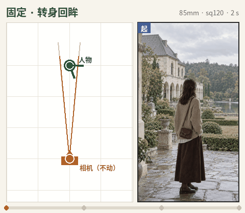</td><td align="center"><b>固定机位升格</b><br>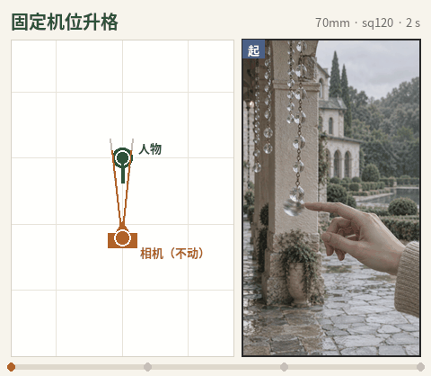</td></tr>
<tr><td align="center"><b>后拉上摇</b><br>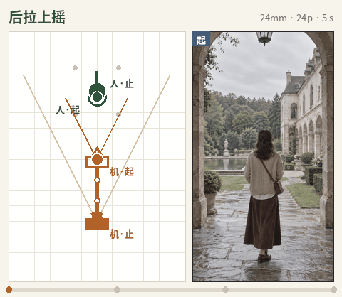</td><td align="center"><b>固定 · 人走远</b><br>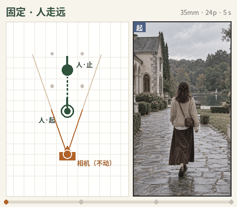</td></tr>
</table>

</details>

### 其它示例

[`examples/hakone-0928-v3/`](examples/hakone-0928-v3/)（同一场地的 v3.5，分镜先写好再对照 SNS，43 页）、[`examples/asakusa-0928/`](examples/asakusa-0928/)（浅草寺，密集城区用南北两张底图，12 张）和 [`examples/hakone-0928-v2/`](examples/hakone-0928-v2/)（箱根 1.0 版，13 张，含 Pola 美术馆园外底图）。


## 工作流

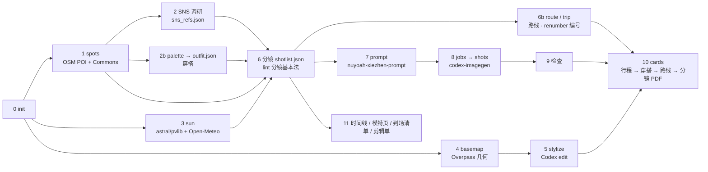
```mermaid
flowchart LR
  A[0 init] --> B[1 spots<br/>OSM POI + Commons]
  A --> C[3 sun<br/>astral/pvlib + Open-Meteo]
  A --> D[4 basemap<br/>Overpass 几何] --> E[5 stylize<br/>Codex edit]
  B --> F[2 SNS 调研<br/>sns_refs.json]
  B --> P[2b palette → outfit.json<br/>穿搭]
  B & C & F & P --> G[6 分镜 shotlist.json<br/>lint 分镜基本法]
  G --> R[6b route / trip<br/>路线 · renumber 编号]
  G --> H[7 prompt<br/>nuyoah-xiezhen-prompt] --> I[8 jobs → shots<br/>codex-imagegen] --> J[9 检查]
  J & E & R --> K[10 cards<br/>行程 → 穿搭 → 路线 → 分镜 PDF]
  G --> L[11 时间线 / 模特页 / 到场清单 / 剪辑单]
```

| 阶段 | 做什么 | 谁做 | 规则文档 |
|---|---|---|---|
| 0 立项 | `pipeline.py init`：地点、日期、到场、器材 | 脚本 | [WORKFLOW](docs/WORKFLOW.md) |
| 1 出片点 | `spots`：周边 POI、Commons 照片、调研关键词；再做网页调研 | 脚本 + Codex / Claude | |
| 2 SNS 调研 | 小红书 / Instagram / 抖音 / TikTok 人工级浏览；出过片的机位帖、姿势帖、平台汇总逐条写成文字记进 `sns_refs.json`，不存原帖图片 | Codex / Claude（可用浏览器时） | [SNS_NOTES](docs/SNS_NOTES.md) |
| 2b 穿搭 | `palette` 抽场地主色 → `outfit.json`：≤ 3 色、与场地色 ΔE ≥ 12、替换方案、逐张提醒 | 脚本 + Codex / Claude | [OUTFIT_GUIDE](docs/OUTFIT_GUIDE.md) |
| 3 光线 | `sun`：逐半小时方位高度、DEM 地形遮挡、逐时天气（光质、降水、气温、风）；出发前一天 `sun --weather-only` 只刷新预报 | 脚本 | |
| 4–5 底图 | `basemap` → `stylize`：OSM 几何 → Codex 水彩重绘 | 脚本 + 本机 Codex | |
| 6 分镜 | 每条 SNS 素材设计一张同款（`src` 记来源），不够的再补；叙事角色、景别配比、寄り/引き 节奏、姿态视线，加连拍 ≥ 2 / 短片 ≥ 5 / 实况 ≥ 6；`lint` 检查 | Codex / Claude + 脚本 | [SNS_NOTES](docs/SNS_NOTES.md)、[SHOT_DESIGN](docs/SHOT_DESIGN.md)、[VIDEO_NOTES](docs/VIDEO_NOTES.md) |
| 6b 路线 | `meta.route_stops` → `route`：沿步道最短路、停留与时刻；`renumber` 把编号改成游览顺序；多景点 `trip.json` → `trip` | Codex / Claude + 脚本 | [ROUTE_NOTES](docs/ROUTE_NOTES.md) |
| 7 prompt | 先写 `scene_bible.md`（场地真实样子与易错点）；系列母版 + 同系列变体，取景段用对原帖构图的文字描述；短片写关键帧，另写 `move_prompts.md` 起 / 中 / 止三帧 | Codex / Claude | [prompt_chains](templates/prompt_chains.md) |
| 8–9 出图与检查 | `jobs [--missing]` → `shots`，短片三帧 `jobs --moves` → `shots --moves`；逐张按第六步检查，对照原帖描述看构图，状态 test / failed | 脚本 + codex-imagegen + Codex / Claude | |
| 10 拍摄脚本 | `cards`：行程 → 穿搭 → 路线 → 分镜（按路线顺序，短片卡后接运镜页），`<日期>_<地点>_拍摄脚本.pdf`；同时生成 `<日期>_<地点>_拍摄核对表.html` | 脚本 | [CARD_SPEC](docs/CARD_SPEC.md) |
| 11 当天资料 | 时间线、模特页、到场清单、剪辑单 | Codex / Claude | [templates/](templates/) |

## 快速开始

**纯 Codex 可用，无需安装 Claude。** 完成 Python 环境安装后，Windows 执行 `.venv\Scripts\python.exe scripts/install_skill.py`，macOS / Linux 执行 `.venv/bin/python scripts/install_skill.py`，即可安装 skill 并登记仓库。在 Codex 中用 `$xiezhen-shoot-planner` 开始规划；详细步骤、项目范围安装与能力边界见 [INSTALL.md 第 4 节](INSTALL.md#4-安装-skill纯-codex-推荐)。纯 Codex 可通过桌面版浏览器连接或 MCP 使用已登录浏览器，接入方式见下方「纯 Codex 的浏览器与电脑操作」；出图使用 codex-imagegen-cli。安装 skill 本身不会自动安装这些浏览器 / 桌面工具，缺少可选能力时记录缺口并完成其余产物。

新电脑从零安装（Python 环境、可选 codex-imagegen、Codex 或 Claude skill、自测）按 [`INSTALL.md`](INSTALL.md) 走，约 10 分钟。已装好的机器：

```bash
git clone https://github.com/utopiabelmont/xiezhen-shoot-pipeline.git
cd xiezhen-shoot-pipeline
pip install -r requirements.txt        # Windows：双击 setup.cmd
python check_env.py
python pipeline.py register            # 登记仓库路径，Codex / Claude 的 skill 据此找到本机仓库

# 脚本阶段
python pipeline.py init    hakone-1003 --place "箱根ガラスの森美術館" --date 2026-10-03 --arrive 13:00 --hours 12-18 --elev-m 657
python pipeline.py spots   hakone-1003
python pipeline.py palette hakone-1003           # 场地主色 → 写 outfit.json
python pipeline.py sun     hakone-1003
python pipeline.py basemap hakone-1003 --meters 130
python pipeline.py stylize hakone-1003           # 需要本机 codex-imagegen（ChatGPT 登录）

# 人工阶段：spots_social.md、sns_refs.json、outfit.json、shotlist.json（含 src 与 route_stops）、trip.json、scene_bible.md、prompts.md、move_prompts.md

python pipeline.py lint    hakone-1003           # 分镜基本法 + 动态素材配比 + 穿搭色检查
python pipeline.py route   hakone-1003 --speed 0.85
python pipeline.py renumber hakone-1003          # 编号改成游览顺序，时段按停留点均分
python pipeline.py jobs    hakone-1003           # prompts.md → inbox/hakone-1003.jsonl（先自动 lint）
python pipeline.py shots   hakone-1003           # → out/hakone-1003/*.png + log.jsonl
python pipeline.py jobs    hakone-1003 --moves   # move_prompts.md → 短片起 / 中 / 止三帧
python pipeline.py shots   hakone-1003 --moves   # → out/hakone-1003-moves/，挑好的放进 plans/hakone-1003/move_frames/
python pipeline.py sns-import hakone-1003        # 可选：自己手机保存的原帖图片放进 sns_inbox/ 后归档到 sns_private/（不入库）
python pipeline.py cards   hakone-1003           # → 行程 / 穿搭 / 路线页 + 分镜卡 + 拍摄脚本 PDF + 核对表 HTML
python pipeline.py checklist hakone-1003         # 只重做核对表（--no-thumbs 不嵌缩略图）
python pipeline.py sun     hakone-1003 --weather-only   # 出发前一天只刷新预报，再跑 cards
python pipeline.py status  hakone-1003
```

不联网自测：`spots` / `sun` 加 `--fixture`；`basemap` 加 `--fixture overpass_geom_pola.json --center 35.25666,139.02120`。想直接看完整产物：打开 `examples/hakone-0928-v5/` 里的 PDF 与核对表 HTML；要重跑页面，把 `examples/hakone-0928-v3` 复制到 `plans/`，跑 `python pipeline.py cards hakone-0928-v3 --images examples/hakone-0928-v3/cards`。

## 和 Codex / Claude 一起用（支持纯 Codex）

纯 Codex 直接在终端执行 `pipeline.py`，不使用 Claude 的本机桥接。`nuyoah-xiezhen-prompt` 已安装时使用它，未安装时使用仓库 `templates/prompt_chains.md`；浏览器登录能力不可用时不假装已浏览原帖，明确记录 SNS 调研缺口。

[`skill/xiezhen-shoot-planner/SKILL.md`](skill/xiezhen-shoot-planner/SKILL.md) 是给 Codex（桌面版 / CLI）与 Claude（Claude Code / Cowork / claude.ai）用的流程 skill，安装方式见 [`INSTALL.md`](INSTALL.md) 第 4 节，阶段总览见 [`skill/README.md`](skill/README.md)。装好后只要说日期和地点：

> 10 月 3 日去箱根玻璃之森和 Pola 美术馆，13 点到，帮我做拍摄脚本。

器材不说就用默认（Sony α7 V + 24-105mm F4 + HVL-F60RM2，iPhone 14 Pro 拍实况，DJI Osmo Pocket 3 拍稳定器短片，Ricoh GR IV 随手抓拍）；有几台设备都告诉它，SNS 调研会按每台设备各搜一轮，优先复刻同款设备拍的机位帖，分镜标明每张用哪台。Codex / Claude 会按阶段号跑脚本、做网页与 SNS 调研、抽色定穿搭、照着 SNS 素材写分镜、排路线并按路线编号、编 prompt、出图、检查、合成 PDF，并给出时间线、模特页、到场清单和剪辑单。人工阶段的判断标准都写在 skill 与 `docs/` 里，生成图只标 test / failed，用户确认后才 final。

仓库路径不写死在 skill 里：Codex / Claude 按 对话指定 → 已连接文件夹里含 `pipeline.py` 的目录 → `~/.xiezhen-pipeline/config.json`（`pipeline.py register` 写入）的顺序找。

### 纯 Codex 的浏览器与电脑操作

纯 Codex 可以接入浏览器和电脑操作工具。实际能力取决于当前会话启用的工具、浏览器连接与网站访问权限；终端、网页搜索、已登录浏览器和 Windows 桌面操作是分别配置的能力。云端会话也不会自动取得本机的 Chrome 登录状态。

**桌面版优先使用官方浏览器连接。** 在支持该功能的 Codex / ChatGPT 桌面环境中，通过 Settings → Computer Use 安装并连接浏览器扩展，再在对话里选择 `@Chrome` / `@Edge` 或指定标签页，使用已登录 SNS 的浏览器配置文件。官方 Computer Use 也提供桌面应用操作，具体可用性取决于平台、地区与启用状态；浏览器连接与桌面应用操作分别设置。见 [官方浏览器扩展说明](https://learn.chatgpt.com/docs/chrome-extension) 与 [官方电脑操作说明](https://learn.chatgpt.com/use-cases/use-your-computer-with-codex)。

**CLI 或需要独立安装方案时，可选择下面的 GitHub 项目：**

| 项目 | 接入的能力 | 在本流水线中的用途与限制 |
|---|---|---|
| [Microsoft Playwright MCP](https://github.com/microsoft/playwright-mcp)（推荐） | 打开页面、搜索、点击、滚动、读取页面，另有截图工具；扩展模式可连接现有 Chrome / Edge 标签页并复用登录会话 | 适合逐帖调研 SNS；默认页面快照是文字与可访问性结构，不能据此判断照片里的构图、姿势与光线。扩展安装见 [上游说明](https://github.com/microsoft/playwright/blob/main/packages/extension/README.md) |
| [Chrome DevTools MCP](https://github.com/ChromeDevTools/chrome-devtools-mcp) | 控制 Chrome、读取页面、查看截图与网络请求；可连接正在运行的浏览器 | 适合动态页面调研与加载问题排查；复用已有浏览器需按 [连接说明](https://github.com/ChromeDevTools/chrome-devtools-mcp/blob/main/docs/advanced-usage.md) 配置调试连接 |
| [Windows-MCP](https://github.com/CursorTouch/Windows-MCP) | Windows 窗口、鼠标、键盘、界面读取与截图 | 需要操作文件选择框、资源管理器等桌面应用时使用；上游目前要求 Python 3.13+ 与 uv，中文 Windows 的部分工具有适配注意事项，不直接复用本流水线的 Python 3.12 venv |
| [Browser Use](https://github.com/browser-use/browser-use) | 给 Codex 等代理提供浏览器 CLI，也提供独立浏览器代理与云服务 | 适合复杂浏览流程；CLI 接入现有 Codex 与独立代理是不同用法，独立代理通常另需模型 API 配置，云服务可能产生额外费用 |

Playwright MCP 扩展模式的 Codex 配置示例（先安装 Node.js / npm，使 `npx` 可用，并按上游说明安装浏览器扩展）：

```powershell
codex mcp add playwright -- npx -y @playwright/mcp@latest --extension
```

重启或新建 Codex 会话后，按扩展提示连接已登录 SNS 的标签页，再用 `$xiezhen-shoot-planner` 开始调研。以上命令只配置 MCP，不会自动安装浏览器扩展或替你登录 SNS。

SNS 调研要区分「读文字」与「看照片」：标题、正文、评论和页面结构可以支持文字调研；要复刻构图、人物位置、姿势与光线，还需要当前工具能提供可视内容，且符合本仓库的素材规则。现有规则禁止下载或截图 SNS 原帖图片、禁止把它们交给生图模型；依赖页面截图进行视觉判断的方案需先明确并调整相关规则，安装工具不会自动改变这个约束。无法实际观察原帖时不编造照片细节，只记录可核实的文字资料与链接，分镜标「无 SNS 素材」。

这些是按上游公开文档列出的可选接入方式，尚未在本仓库中逐一实测小红书 / Instagram / 抖音 / TikTok。登录弹窗、验证码与平台访问限制仍会影响调研，遇到限制停止该平台操作并记录缺口，不保证安装后每个平台均可访问。完整素材规则见 [SNS_NOTES](docs/SNS_NOTES.md)。

## 使用范例

下面是对 Codex / Claude 说的话和对应的处理。前两例与 `examples/` 里的企划一一对应，其余是常见的局部用法。

**1. 单个景点，完整流程**

> 9 月 28 日上午 10 点到浅草寺，帮我做拍摄脚本。

立项 `asakusa-0928`，跑 spots、sun、basemap（寺域南北长，拆成两张底图）、stylize，做网页与 SNS 调研，写 12 张分镜并过 lint，编 prompt、出图、检查，合成 `2026-09-28_浅草寺_拍摄脚本.pdf`，附时间线、模特页、到场清单。成品见 [`examples/asakusa-0928`](examples/asakusa-0928)。

**2. 一天多个景点，排行程和园内路线**

> 9 月 28 日 12 点半到箱根汤本，主拍玻璃之森，Pola 美术馆下雨的话当备选。按官网或小红书攻略排游览顺序，小抄按走的顺序排。

主 plan 写 `trip.json`（起终点、两个美术馆、巴士线路与发到时刻、分钟数，注明 NAVITIME 查询日期；Pola 标 `optional`），`meta.route_stops` 按官网順路和攻略排 14 站。备选景点要拍多张时另建一个 plan，在 `trip.json` 里用 `plan` 字段挂上。PDF 开头依次是行程页、穿搭页、路线页，分镜卡按路线顺序排在后面。成品见 [`examples/hakone-0928-v3`](examples/hakone-0928-v3)（43 页）；编号按路线重排的新版见 [`examples/hakone-0928-v5`](examples/hakone-0928-v5)。

**3. 换器材、换人数、不要动态素材**

> 10 月 12 日上午去镰仓长谷寺，两个人一起拍。这次只带 α7C II 和 35mm F1.4，没有闪光灯，不拍视频和实况。

`init` 时写 `--gear` / `--body` / `--flash` / `--people`，分镜焦段只用 35mm，姿态与站位按双人写，闪光一栏全部关闭，不加 burst / video / live 分镜。lint 会拦下器材里没有的焦段。

**4. 只看光线和天气**

> 10 月 5 日下午在长谷寺，几点光线最好？会下雨吗？

只跑 `init` 和 `sun`，按 `sun.md` 回答：逐半小时太阳方位与高度、山体遮挡后直射几点结束、预报光质（晴天硬光 / 薄云 / 阴天）、人物朝哪个方向站。日期在 16 天以外只给天文数据，说明临近再查一次预报。不出图，不做 PDF。

**5. 只要穿搭建议**

> 下周去浅草寺，模特穿什么颜色好？她有米白针织开衫和藏青长裙。

跑 `palette` 从场地照片抽主色，按 `docs/OUTFIT_GUIDE.md` 写 `outfit.json`，检查已有衣物与场地主色的 ΔE，给主方案、替换方案、道具妆发，渲染成穿搭页单独发回。

**6. 出发前一天更新预报**

> 明天就去了，再看一下天气。如果下雨，路线顺序和分镜要不要调？

`sun --weather-only` 只刷新预报（本机不能联网时，用浏览器打开 Open-Meteo 接口存成 JSON，加 `--weather-json` 读入），把最新预报写进 `meta.forecast` 与 `trip.json` 的 `weather`；雨天把室内站和回廊提前、把 `route_speed_mps` 降到 0.85，改 `route_stops` 后重跑 `cards`，行程页的天气栏、路线页、PDF 与核对表一起更新，时间线同步改。图片不重画。

**7. 追加动态素材**

> 实况和短片再多加几条，实况至少 6 张，短片至少 5 段。

按 `docs/VIDEO_NOTES.md` 追加分镜并标 `supplement: true`，每条写 `clip.mode`、`clip.move`、起止画面、ND 与曝光基准，过 lint 后 `jobs --missing` 只排新增的，出图后重跑 `cards`，另出 `clips.md` 剪辑单。

**8. 重画某一张**

> 第 12 张背景方向不对，重画。

对照 `sun.md` 和底图改 `shotlist.json` 与 `prompts.md` 里这一条，把 `out/<plan>/12*.png` 移走，`jobs --missing` 只排这一张，出图后重跑 `cards`。改动多时复制成 `<plan>-v2` 改版，没动的分镜用 `img_from` 复用原图。

**9. 暂时不出图**

> 这台电脑没装 Codex，先把小抄排出来。

做到阶段 7 为止，跳过 `stylize` 与 `shots`，直接跑 `cards`：分镜卡的示意图位置显示「示意图待生成」，俯视图在没有风格化底图时退回简图。之后在装好 codex-imagegen 的电脑上补跑 `stylize`、`jobs`、`shots`、`cards` 即可。

**10. 照着小红书的出片帖设计分镜**

> 小红书和 ins 上这个美术馆出片的机位和姿势，照着拍同款；不够的再补几张。

在已登录的 Chrome 里逐篇看帖，机位帖、姿势帖、「问点点」汇总逐条写成文字记进 `sns_refs.json`；每条素材设计一张同款分镜并写 `src`，补足开场、细节和动态素材后过 lint，排路线、`renumber` 编号，prompt 的取景段直接用对原帖构图的描述。分镜页上有原帖二维码，现场扫码对照。原帖图片只由你自己保存，放进 `sns_inbox/` 后 `sns-import` 归档到不入库的 `sns_private/`。成品见 [`examples/hakone-0928-v5`](examples/hakone-0928-v5)。

**11. 新电脑第一次用**

> 仓库放在 E:\tools\xiezhen-pipeline，帮我装好。

按 [`INSTALL.md`](INSTALL.md) 在本机跑 `setup.cmd`（装 uv、建 venv、自检），最后 `pipeline.py register --root E:\tools\xiezhen-pipeline` 登记路径，之后的对话不用再说仓库位置。Codex 登录需要本人在终端完成，Codex / Claude 不经手账号密码。

**12. 日期没定，按天气挑日子；多台设备分工**

> 东京塔，接下来哪天晴天就哪天去。设备是 iPhone 14 Pro、a7M5 + 24-105、GR4 和 Pocket 3。

先查 16 天预报，取最近的晴天立项，预报摘要写进 `meta.forecast`；`init --gear` 写全四台设备；SNS 按每台设备各搜一轮，同款设备的帖子优先复刻，分镜逐条写 `device`。城区场地用一张总图算路线、几张分区底图给俯视图。成品见 [`examples/tokyotower-1003`](examples/tokyotower-1003)（实战案例 2）。

**13. 一天跑几个景点、只带一台手机、机位不设上限**

> （附一张小红书路线图截图）这四个景点明天一天拍完，设备是 iPhone 16 Pro Max，能找到的机位都做，但要查重。

每个景点各建一个企划，四个企划共用一份 `trip.json`，顺序与车程照路线图；`init --gear` 只写 iPhone，焦段写成镜头档位，短片用 4K 24 fps、4K 60 fps、慢动作 4K 120 fps 三档。SNS 素材全部收进来，再按每个企划 `dedupe.md` 里的四条规则合并、改成实况或短片、列为备选。成品见 [`examples/hengyang-1003`](examples/hengyang-1003)（实战案例 3）。

## 目录

```
pipeline.py            统一入口：init / spots / sun / palette / basemap / stylize / lint / route / renumber / trip / jobs / shots / outfit / cards / checklist / sns-import / status / register
run_shots.py           inbox/*.jsonl → codex-imagegen 逐条出图 → out/<批次>/ + log.jsonl（每条只提交一次，失败只记录）
check_env.py           依赖与工具自检
tools/
  geo_common.py        地理编码、方位、距离、HTTP（含离线 fixture 与重试）
  spots.py             周边 POI + Commons 照片 + 调研关键词
  sun_light.py         太阳位置（astral，pvlib 交叉验证）、地形遮挡（DEM 环采样）、天气光质
  osm_geometry.py      Overpass out geom → 分层几何（林地/空地/草地/水面/建筑/道路/步道/POI）→ 底图
  basemap.py           几何渲染，v1 手工格式与 v2 分层格式都能读
  palette.py           场地照片抽主色（穿搭依据）
  make_outfit_page.py  穿搭页（色卡、ΔE 分离度、方案、逐张提醒）
  route.py             园内路线：步道图最短路、停留估算、路线页
  trip.py              一日多景点行程页（含当天天气）
  checklist.py         现场核对表（单文件 HTML，可勾选）
  moves.py             短片运镜示意页与运镜库总览图（有 move_frames/ 时用 Codex 三帧）
  move_gif.py          运镜动图：俯视图上相机与人物同步移动 + 母版连续取景或逐帧交叉淡化（运镜库或企划的短片）
  moves_library_prompts.py  运镜库的母版 prompt、取景路径与逐帧 edit prompt（接力批与并行批）
  renumber.py          分镜编号按游览路线重排，同步附属文件
  sns_import.py        把自己保存的原帖图片按编号归档到 sns_private/
  sns_refs.py poses.py 旧版 SNS 汇总页与姿势参考页（分镜没有 src 时才出）
  make_cards.py        分镜页：SNS 来源栏与二维码、多底图、室内、园外窗口、半点太阳表、按介质切换设置块
  fixtures/            离线样本（Nominatim、Overpass、Commons、Open-Meteo、高程）
templates/             分镜模板与 JSON Schema、prompt 词链、SNS 调研表、穿搭 / 行程 / 剪辑单 / 时间线 / 到场清单 / 模特页模板、底图风格指令、手工几何示例
scripts/               install_skill.py（Codex / Claude 跨平台安装）；Windows：setup.ps1（uv + venv + 自检 + register）、job.example.ps1（一次性任务模板，UTF-8 BOM）
setup.cmd run_job.cmd run_shots.cmd   Windows 双击入口
skill/                 Codex / Claude 共用的流程 skill 与阶段总览
INSTALL.md             新电脑安装说明（Windows / macOS / Linux、codex-imagegen、skill、更新、常见问题）
docs/                  WORKFLOW（SOP）、SNS_NOTES（SNS 素材驱动的分镜）、SHOT_DESIGN（分镜基本法）、OUTFIT_GUIDE（穿搭）、VIDEO_NOTES（连拍/短片/实况）、ROUTE_NOTES（行程与园内路线）、CAMERA_NOTES（α7 V 外观、闪光灯、短片预设）、CARD_SPEC（小抄版式）、WINDOWS_SETUP（部署与已知坑）、CHANGELOG
examples/              hengyang-1003（一日四景点，103 张，仅 iPhone，4 份 PDF 139 页）、tokyotower-1003（27 张，晴天城区，四台设备，37 页）、hakone-0928-v5（38 张，SNS 驱动，47 页）、hakone-0928-v3（v3.5，43 页）、asakusa-0928（12 张，双底图）、hakone-0928-v2（13 张）
plans/ inbox/ out/ refs/   运行时目录（不入库；要保留的企划复制到 examples/）
```

## 数据源与依赖

| 用途 | 来源 | 说明 |
|---|---|---|
| 太阳位置 | astral、pvlib | 离线计算，两者交叉验证一致（0.05° 内） |
| 天气、高程 | Open-Meteo | 云量、直射/散射辐射、降水概率（16 天预报）；90 m DEM 估算地形遮挡角 |
| 地理编码 | Nominatim | ≤ 1 次/秒，脚本自带 User-Agent |
| 园区几何、步道、POI | Overpass API（OpenStreetMap，ODbL） | `out geom`，POST 请求；缺失步道用 `--extra` 手工补线 |
| 场地照片与主色 | Wikimedia Commons geosearch | 看常见机位与季节；`palette.py` 抽 6 个主色 |
| 社交平台 | 小红书 / Instagram / 抖音 / TikTok | 无公开接口；由 Codex / Claude 在已登录的 Chrome 里人工级浏览，把机位、构图、姿势写成文字；页面上只放原帖链接与二维码 |
| 交通与路线依据 | NAVITIME / 官网时刻表 / 官网設施顺序 / 攻略 | 由 Codex / Claude 查询后写进 `trip.json` 与 `meta.route_source`，注明查询日期 |
| 出图 | codex-imagegen-cli 0.2.0（第三方工具，调用 Codex 内部图片接口） | 用 Codex 桌面版 / CLI 的 ChatGPT 登录（明文 `auth.json`），走订阅额度；模型由服务端决定；固定版本与凭据保管见 INSTALL 第 3 节 |
| prompt 规则 | nuyoah-xiezhen-prompt | 系列母版、同系列变体、第六步检查 |

天气光质判定：直射比 ≥ 0.5 且云量 < 60% 为晴天硬光；≥ 0.5 为高云透光；0.2–0.5 薄云；< 0.2 阴天。分镜默认按预报编排，另一种天气作备选。

## 已知限制

- Codex 内部图片接口是 alpha：尺寸不保证（1152x1536 会返回 1086x1448），不能指定模型。要固定模型请改用官方 Images API。
- 这个接口没有公开文档，由第三方工具 codex-imagegen-cli 调用，用的是你自己的 ChatGPT 账号与额度，Codex 更新后可能失效。它需要明文的 `~/.codex/auth.json`，这个文件不要放进同步文件夹或任何仓库。仓库本身不含任何密钥，其余联网接口都是公开接口。
- Open-Meteo 预报只有 16 天，更早的日期只有天文数据；出发前一天再跑一次 `sun`。
- OSM 里没有的步道只能用 `--extra` 画概略线，小抄与路线页上会注明「概略」；路线页的停留时间是按介质估算的，不是实测。
- 行程页的景点连线是直线，不代表道路；班次以出发当天查询为准。
- 官网的園内マップ只用来读设施顺序，不放进小抄；场地主色来自公开照片抽样，与当季实景可能有差。
- 地形遮挡按 DEM 估算，园内树木与建筑的遮挡要现场判断。
- 生成图只是示意，小抄页脚固定写「AI 拍摄示意，非现场实拍」；分镜状态只有 test / failed，用户确认后才 final。
- 示意图与原帖的一致程度取决于文字描述：人物位置、前景背景的先后写得越具体越接近；动作细节（例如「只露伞顶」）仍可能被画成完整人物，这类帧要单独重写或接受近似。
- 原帖图片不抓取、不截图、不作为生图输入；想在私用版里看原图，只能自己用手机保存后 `sns-import`。
- PowerShell 5.1 只认带 BOM 的 UTF-8 脚本；改 `job.ps1` 时注意保存编码（`docs/WINDOWS_SETUP.md` 第 5 节）。

## 页面语言

在 `pipeline.py cards`（或 `tools/` 里任一页面脚本）前设置 `XIEZHEN_LANG=en` 或 `XIEZHEN_LANG=ja`，拍摄脚本、路线、行程、穿搭、运镜页与核对表就用英文或日文绘制。文字按整句查 `locales/<语言>.json` 翻译；对照表目前覆盖页面标签和 README 配图用到的示例企划，查不到的句子保持中文，设置 `XIEZHEN_I18N_MISSING=<文件>` 可以列出这些句子再补进对照表。README 配图用 `python scripts/readme_images.py --lang en`（或 `ja`、`zh`）重出。

## 许可

MIT。OSM 数据遵循 ODbL；Commons 图片各自许可；社交平台内容只记录文字描述与原帖链接，不保存图片。
