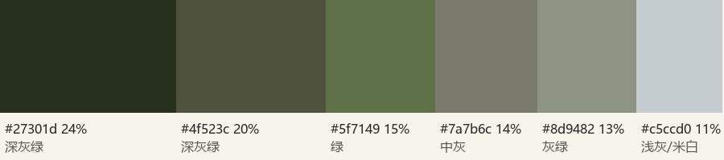

# 穿搭方案 · 箱根ガラスの森美術館 2026-09-28（雨天石造庭园 · 燕麦与深咖）

**场地主色**（Commons 12 张场地照抽样）：深灰绿 24%、灰绿 20%、绿 15%、中灰 14%、灰绿 13%、石灰 11%。灰绿单调、明度偏低，服装可以带暖色，靠明度分离。

**路线**：同系色（融）。服装取暖灰同明度层，深咖下装压住，砖红围巾在脸旁做一处点缀。

| 部位 | 方案 | 色 |
|---|---|---|
| 上装 | 米白棉衬衫，领子翻在开衫外 | 米白 #f1ece2 |
| 外层 | 燕麦色粗针织开衫，露台与展厅可脱 | 燕麦 #d9cfbc |
| 下装 | 深咖灯芯绒长裙，脚踝上 5 cm | 深咖 #4a3527 |
| 鞋 | 深棕乐福鞋，防水喷雾 | 深咖 |
| 配饰 | 砖红细围巾：阴天与吊灯厅用，晴天版收起 | 砖红 #b1443a（点缀） |
| 包 | 棕色皮质小包斜挎 | — |

分离度（ΔE 对场地前四主色）：燕麦 14、米白 15、深咖 16（偏近，靠明度拉开：亮两档 / 暗一档），砖红 52。

**替换**：雨天透明长柄伞 + 防水乐福，雨大改深咖阔腿裤；晴天去围巾，开衫换米白薄针织当反光板，草编帽压眼睛；冷加同色打底；Pola 备选平底靴、围巾收起。

**道具**：透明长柄伞、白色陶瓷咖啡杯（露台）、棕色小包。**妆发**：深棕及肩发松散半扎，连拍与转身张放下；奶油裸妆、杏色腮红、豆沙色唇，雨天补口红不补粉。

**避免**：细条纹与密格纹、大 logo、亮片与反光面料、纯白外套、细跟鞋。

**SNS 观察**：小红书出片帖多为浅色连衣裙、白衬衫配回廊逆光；深色系少，本组深咖下装能拉开。馆内无着装限制，展厅避免大包碰展柜。

逐张提醒见 `outfit.json` 的 `per_shot`（小抄穿搭页第 2 页）。
