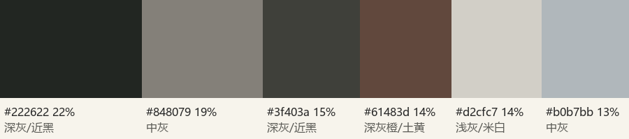

# 穿搭　一日一套 · 本白长裙 + 雾霾蓝开衫 + 焦糖皮件

场地前四色：深灰/近黑 #222622、中灰 #848079、深灰/近黑 #3f403a、深灰橙/土黄 #61483d。

路线：补色点缀（跳）+ 明度分离：新宿是灰黑楼面与米灰石材，台场傍晚是暖橙纸灯与蓝调天空；服装主体用本白提亮，雾霾蓝开衫呼应蓝调、与橙色烛光互补，焦糖皮件把暖色收在脚下与腰侧。

| 色 | 名称 | 部位 |
|---|---|---|
| #F8F6F0 | 本白 | 无袖长连衣裙 |
| #8FA6BD | 雾霾蓝 | 薄针织开衫（17:30 后穿上，白天搭肩或放包里） |
| #A0683A | 焦糖 | 平底凉鞋、小号斜挎包、细腰带扣 |

## 主方案

- top：本白色哑光棉麻无袖长连衣裙，浅 V 领
- layer：雾霾蓝薄针织开衫（白天搭肩，日落后穿上）
- bottom：裙长到脚踝上方约 5 cm，走动与转身有摆动
- shoes：焦糖色皮质平底凉鞋（沙滩可走，能走两小时）
- accessories：细金耳钉；同色细腰带
- bag：焦糖色小号皮质斜挎包（相机电池、存储卡、手机放这里）

全身 3 个主色，无点缀色。本白与新宿米灰楼面 ΔE 约 13（靠明度分离），与台场暗部、灯光差异大；长裙负责走动与连拍，蹲下点灯时先把裙摆收到膝后。

## 替换方案

- 转阴：开衫提前穿上，让脸旁多一块浅色；新宿改在店内多拍一张
- 冷/风大：开衫扣上，头发改半扎防乱；台场 18 时约 20 °C
- 沙滩：进沙滩前把凉鞋扣紧；坐沙滩时垫一块浅色手帕（不入镜）
- 裤装备选：若在 Alpen 买了合身的户外长裤，可在新宿段换成「本白上衣 + 雾霾蓝或燕麦色长裤」，台场仍换回长裙以保持夜景一致

## 道具与妆发

- 道具：浅色无字购物纸袋（Alpen 买完东西后）；长柄点火器（会场提供，以现场为准）；iPhone 14 Pro（实况与手电筒补光）
- 妆发：深棕长发低马尾、耳边留碎发（风大不乱）；奶油裸妆，杏色腮红，豆沙色唇；夜景前补一点高光在颧骨
- 避免：细条纹与密格纹、亮片与反光面料、大 logo、纯黑外套（夜里会和背景融在一起）、细跟鞋（沙滩）、宽大飘带与流苏（靠近烛火）

## 理由

- 新宿场地前四色是近黑、中灰、灰褐与米灰（palette），本白比米灰亮一档才不会被楼面吃掉
- 台场傍晚是暖橙烛光与冷蓝天空，本白长裙在灯阵里最显形（兔兔桃的白裙同款），雾霾蓝开衫在蓝调里不突兀
- 不带闪光灯：夜里靠纸灯从下方照亮，浅色衣服能把烛光反到脸上
- SNS 观察：海の灯まつり的出片帖里白色长裙最显形（S09 兔兔桃），深色上衣在灯阵里只剩脸（S07、S03）；台场露台与自由女神的帖子多为黑色系（S01、S02）。

## 逐张提醒

| 分镜 | 提醒 |
|---|---|
| 02 | 开衫搭在肩上，包挎在身后 |
| 04 | 举手同款：开衫收进包里，手臂露出来剪影更干净 |
| 06 | 倚栏：开衫搭肩，海风把裙摆带向一侧不用压 |
| 09 | 进沙滩前把凉鞋扣紧；伸手时裙摆别拖进水里 |
| 11 | 坐下前在沙上垫手帕（不入镜），裙摆向身前铺开 |
| 12 | 蹲下前把裙摆收到膝后 |
| 13 | 点灯时袖口与裙摆离纸灯 50 cm；先点灯再穿开衫 |
| 17 | 17:30 起穿上开衫，领口敞开露出 V 领 |
| 18 | 指尖特写：开衫袖口挽到手腕以上，离火远一点 |
| 21 | 开衫穿上，剪影里留出裙摆轮廓 |
| 23 | 全套穿好，包挎好去坐巴士 |
