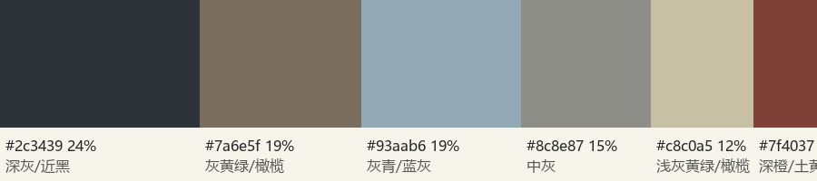

# 穿搭　晴日铁塔 · 米白与浅驼，一处番茄红

**路线**：邻近色（稳）+ 一处呼应：场地是晴空蓝、灰色街道与铁塔的国际橙；服装取与橙色相邻的暖中性色（米白、浅驼），番茄红小包在脸旁以外的位置呼应塔身

| 色 | 名称 | 部位 |
|---|---|---|
| `#efe8dc` | 米白 | 棉麻长款衬衫裙 |
| `#b99f7e` | 浅驼 | 短款薄风衣（17 时后穿） |
| `#4a3426` | 深棕 | 乐福鞋 / 细腰带 |
| `#c8452f` | 番茄红（点缀） | 小号皮质斜挎包 |

## 主方案

- top：米白色哑光棉麻长款衬衫裙，翻领，袖口挽到小臂，裙长到小腿中段；跳跃与坐护栏都不走光
- layer：浅驼色短款薄风衣，17 时前搭在臂弯或放包里，日落后风起、气温到 21 °C 时穿上敞开
- bottom：（连衣裙，无下装）
- shoes：深棕乐福鞋，全程步行约 2.8 km，有台阶与坡道
- accessories：深棕细腰带系在腰间，收出腰线
- bag：番茄红小号皮质斜挎包，解决手的位置，也是全组唯一的饱和色

全身 3 色 + 1 点缀。FL 外观会保住塔的橙与天空的蓝，服装靠明度与塔分开：米白比塔身白段暖、比天空亮；浅驼与塔下的灰墙、深色树冠拉开。夜景时米白衬衫裙在脸下方形成一块亮面，脸不会沉进背景。

## 替换方案

- 转阴：风衣全程穿上，番茄红包更显；塔身发灰时多拍 13、21 这类压缩塔身格栅的景别
- 雨天：透明长柄伞 + 深棕阔腿裤换掉长裙；07 跳跃与 05 长椅取消
- 冷：风衣内加一件米白薄针织，不加新颜色
- 灯光是夏季银白版：番茄红包在夜景里更跳，其余不变

## 道具与妆发

- 道具：番茄红小号皮质斜挎包；（可选）浅驼色风衣作道具搭在臂弯；电话亭的听筒（现场）
- 妆发：深棕色锁骨发自然内扣、侧分，傍晚风大时别一侧到耳后；清透薄底妆，脸颊暖杏色腮红，番茄红哑光唇（与包同色系），晴天下午先补防晒与吸油

## 避免

- 纯白（与塔身白段和夜间高光混在一起）
- 纯黑（夜景里人沉进背景）
- 细条纹与密格纹（摩尔纹）
- 亮片与缎面反光面料
- 大 logo
- 细跟鞋（坡道、台阶、跳跃）
- 超短裙（坐护栏、跳跃）

## 依据

- Commons 12 张场地照抽色：深灰/近黑 24%、灰黄绿 20%、灰青天空 20%、中灰 16%、浅灰黄 13%、深橙（塔身）8%；场地以灰为底，塔的橙是唯一高饱和色
- 小红书点点汇总的穿搭建议是米白、黑、灰、丝质裙装；抖音「林七七」建议露一点红色系；本组取米白做主体，红色只留在包上，夜景不用黑
- 强色背景（国际橙塔身）前避开纯白和纯黑，用米白与浅驼
- 傍晚到夜里要拍 4 张以上，脸旁需要亮面：翻领衬衫裙的领口与前襟承担这个作用

## 逐张提醒

| 分镜 | 提醒 |
|---|---|
| 01 赤羽橋 E21 · 出站看见铁塔（实况） | 风衣放包里，包斜挎在身前 |
| 02 赤羽橋路牌 · 护栏后全身（主图） | 主图：包在右胯，左手拎包带，右手搭护栏；袖口挽好 |
| 03 赤羽橋路牌 · 下摇揭示开场（短片） | 同 02 |
| 04 赤羽橋斑马线 · 长焦过马路（连拍） | 包斜挎在背后，走路时不晃到身前 |
| 05 芝公园长椅 · 仰靠闭眼七分 | 坐下先理裙摆盖住膝盖，包放在身侧长椅上 |
| 06 芝公园长椅 · 伸懒腰（实况） | 同 05 |
| 07 北海道ワイン台阶 · 跳跃低机位（连拍） | 跳之前把包推到背后，裙摆别夹在包带下 |
| 08 うかい右手公路 · 坐护栏半身 | 坐护栏前裙摆收拢在膝下，包放在腿上 |
| 09 うかい楼梯 · 倚墙仰拍 | 包推到背后，袖口挽到小臂，蹬墙那只脚的鞋底干净 |
| 10 うかい楼梯 · 排队时回头（实况） | 同 09 |
| 11 カレドタワー巷子 · 背影走向铁塔 | 右手拎包带，背影里露出一点番茄红 |
| 12 カレドタワー巷子 · 后跟（短片） | 同 11 |
| 13 カレドタワー巷口 · 回头近景 | 领口理平，一侧头发别到耳后，包不入画 |
| 14 カレドタワー巷子 · 抬头看塔（实况） | 同 13 |
| 15 交番坡道 · 上坡回眸（GR IV） | 17 时起风衣穿上敞开；GR 张提裙侧那只手露出袖口 |
| 16 塔脚栏杆 · 倚柱侧逆光七分 | 风衣敞开，一侧下摆搭在系留柱上 |
| 17 塔脚 · 点灯瞬间（实况） | 同 16 |
| 18 塔脚 · 四分之一环绕（短片） | 同 16 |
| 19 塔脚栏杆 · 指尖与格栅灯光特写 | 只露手与衬衫袖口（风衣袖口推上去一点） |
| 20 塔脚 · 灯光与发丝升格（短片） | 风衣领子立起一点，发丝不要别在耳后 |
| 21 增上寺大殿 · 蓝调铁塔半身（主图） | 主图：风衣敞开，番茄红包在身侧露一角，领口理平 |
| 22 增上寺 · 回头看镜头（短片） | 同 21 |
| 23 增上寺 · 石灯笼旁走过（实况） | 同 21 |
| 24 芝公园草坪 · 夜色全身 | 风衣脱下搭在臂弯，米白衬衫裙整块露出来作画面亮面 |
| 25 东麻布电话亭 · 夜色收尾（GR IV） | 风衣穿上，包在左胯；背影里露出包 |
| 26 电话亭 · 拿起听筒（实况） | 进电话亭前把包推到背后 |
| 27 电话亭 · 人走远（短片收尾） | 同 25 |

## SNS 穿搭观察

出片帖主流：秋冬长大衣 + 礼帽的男生街拍（庄与野、ATM.24），女生多为浅色长裙（Instagram 芝公园草坪）；10 月初东京白天 24 °C，大衣太热，本组换成衬衫裙 + 薄风衣，轮廓仍是长线条。增上寺境内不露肩、不过短为宜。
